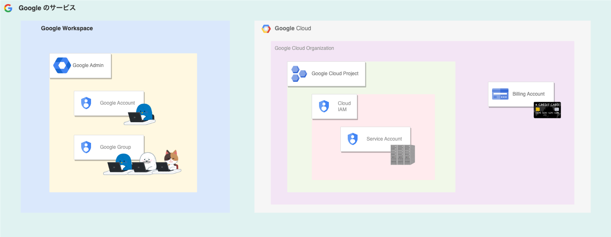
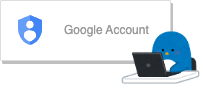
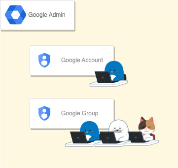
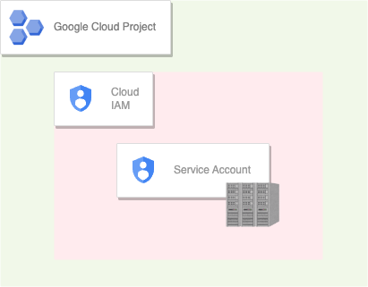
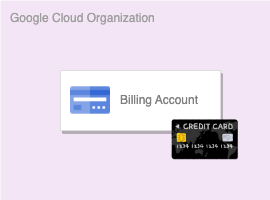

# Account

Google Cloud を扱う上で見ることがある **アカウント** についてまとめてみました

2023/09の時点での情報です

## 全体

### サマリー

アカウント | 用途 | 利用者 | 所属( どこに紐づくか )
:- | :- | :- | :-
Google Account | Google Cloud のリソースに対してアクション出来るように設定できる | 基本的には人 | Google Admin( in Google Workspace )
Google Group | 同上 | 同上 | 同上
Cloud Identity | 同上 | 同上 | 同上
Service Account | 同上 | プログラムやサーバーなどの特定の人を介さないもの | Google Cloud 
Billing Account | Google Cloud の課金について制御するように設定できる | 基本的には人 | Google Cloud 

## Google Account

- 概要
  - Google のサービスを利用する際に必要になるアカウント
  - Google Workspace および Cloud Identity Free/Premium にて、自分のドメインの Google アカウントを発行できる
    - 上記以外だと `@gmail.com` になる
  - 別で作成したアカウント( 例えば Yahoo 等 )を元にした Google Account を作成することも可能
- 作成および管理方法
  - Google Admin にてアカウント作成および管理が可能
- 参考リンク
  - https://www.google.com/account/about/

## Google Group

- 概要
  - 複数の Google アカウントを束ねるグループ
  - グループ固有のメールアドレスもグループ作成と同時に発行されるので、メーリングリストとしても利用可能
  - 基本的には同じドメインの Google アカウントのグループを作るが、別ドメインの Google アカウントを同一のグループに入れることも可能
- 作成および管理方法
  - Google Admin にてグループの作成および管理が可能
- 参考リンク
  - TBD

## Cloud Identity

- 概要
  - 同じドメインのアカウント全体を指すグループ
- 作成および管理方法
  - Google Workspace もしくは Cloud Identity Free/Premium を作成すると同時に利用可能になる
- 参考リンク
  - TBD

## Service Account

- 概要
  - プログラムおよびサーバ、特定の Google Cloud のサービスが使用するアカウント
  - 基本的には人は使わない
- 作成および管理方法
  - TBD
- 参考リンク
  - TBD

## Billing Account

- 概要
  - TBD
- 作成および管理方法
  - TBD
- 参考リンク
  - TBD

