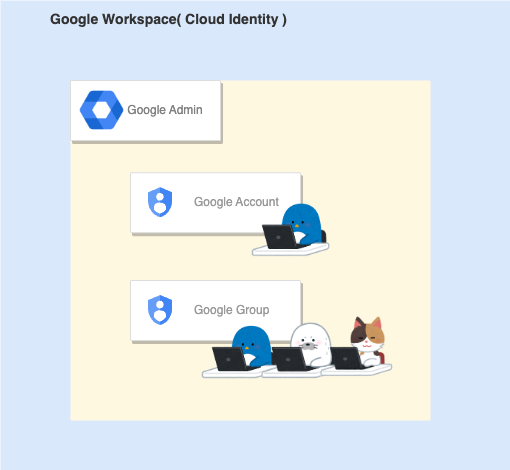

# Account

Google Cloud を扱う上で見ることがある **アカウント** についてまとめてみました

2023/09の時点での情報です

## 全体

## Google Account

- 概要
  - Google のサービスを利用する際に必要になるアカウント
  - Google Workspace および Cloud Identity Free/Premium にて、自分のドメインの Google アカウントを発行できる
    - 上記以外だと `@gmail.com` になる
  - 別で作成したアカウント( 例えば Yahoo 等 )を元にした Google Account を作成することも可能
- 作成および管理方法
  - Google Admin にてアカウント作成および管理が可能
- 参考リンク
  - https://www.google.com/account/about/

## Google Group

- 概要
  - 複数の Google アカウントを束ねるグループ
  - 個別メールアドレスも作成と同時に発行されるので、メーリングリストとしても利用可能
  - 基本的には同じドメインのアカウントのグループを作るが、別ドメインの Google アカウントを作成することも可能
- 作成および管理方法
  - Google Admin にてアカウント作成が可能
- 参考リンク
  - TBD

## Cloud Identity

同じドメインのアカウント全体を指すグループ

Google Workspace もしくは Cloud Identity Free/Premium を作成すると同時に利用可能になる

## Service Account

プログラムおよびサーバ、特定の Google Cloud のサービスが使用するアカウント

基本的には人は使わない

## Billing Account

