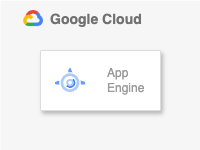

# App Engine

## 概要

TBD



## gcloud

+ API の有効化

```
gcloud beta services enable appengine.googleapis.com --project ${_gcp_pj_id}
```

## memo

IAP つけたい -> https://github.com/iganari/package-gcp/issues/231
