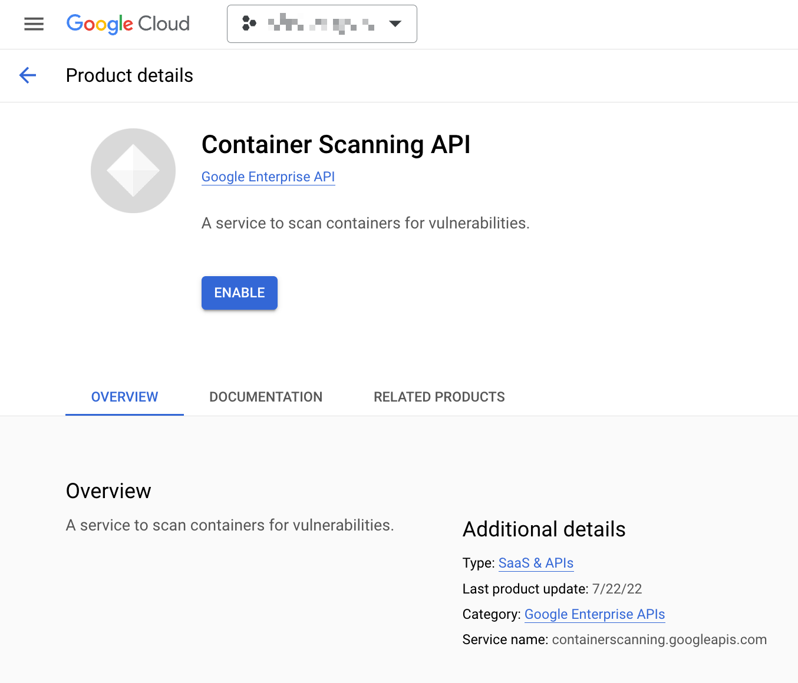
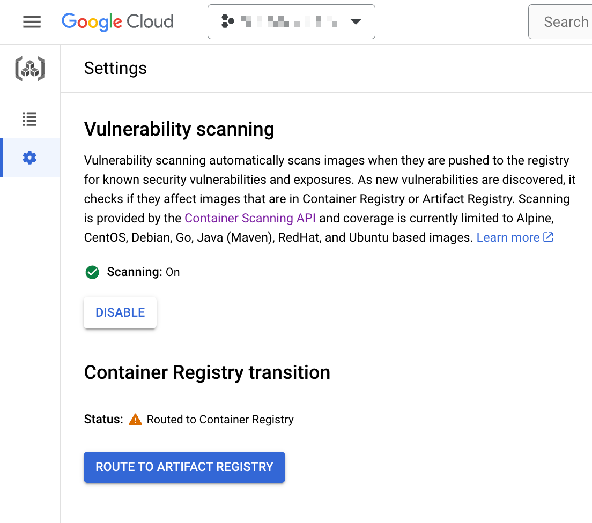
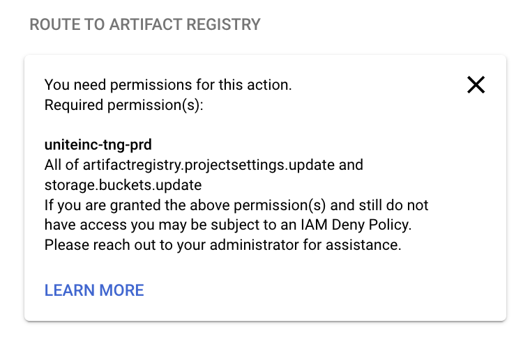
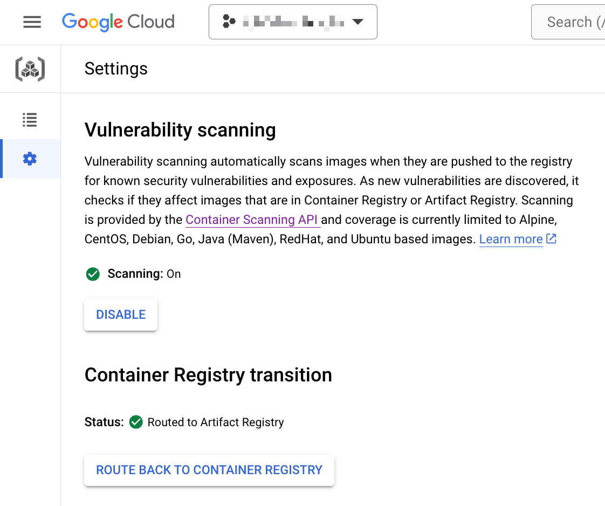

# Vulnerability scanning

## 概要

脆弱性スキャンを GCP 上で行ってくれるコンポーネント


+ 公式ブログ

```
Container Registry の脆弱性スキャンで安全な CI/CD パイプラインを
https://cloud.google.com/blog/ja/products/gcp/guard-against-security-vulnerabilities-with-container-registry-vulnerability-scanning
```

## 設定方法

### 1. API の有効

+ API の有効化
  + https://console.cloud.google.com/marketplace/product/google/containerscanning.googleapis.com

```
gcloud beta services enable containerscanning.googleapis.com --project "Your Google Cloud Project ID"
```





### Role を付与

+ 必要な Permmision
  + artifactregistry.projectsettings.update
  + storage.buckets.update
    + なぜか Owner が持っていない Permission

+ 必要最低限の Role
  + Artifact Registry Administrator (roles/artifactregistry.admin)
  + Storage Admin(roles/storage.admin)



### Cloud Console でクリック




hoge
