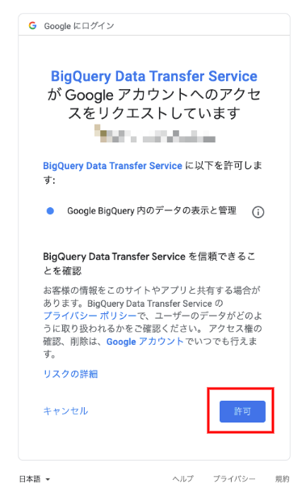
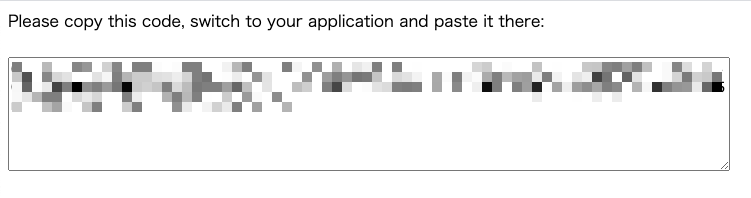
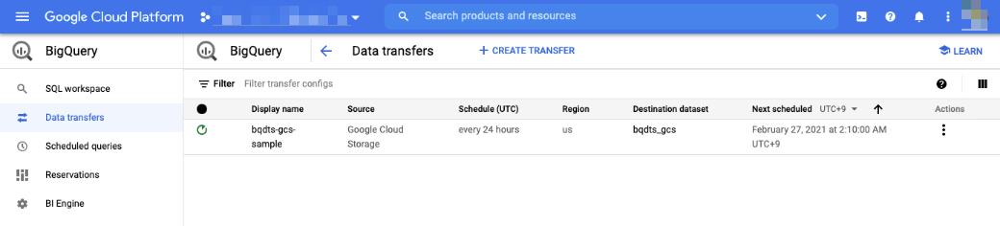

# Import BQ From GCS

## 公式ドキュメント

+ Cloud Storage の転送 | Cloud Storage transfers
  + https://cloud.google.com/bigquery-transfer/docs/cloud-storage-transfer
  + https://cloud.google.com/bigquery/docs/loading-data-cloud-storage-csv?hl=ja

```
BigQuery Data Transfer Service for Cloud Storage を使用すると、
Cloud Storage から BigQuery への定期的なデータ読み込みをスケジュールできます。
```

## やることリスト

1. GCP プロジェクトの作成
1. API を有効化する
1. サンプルデータを用意する
1. 保存先の BigQuery のデータセットとテーブルを作成する
1. Amazon S3 の URI、アクセスキー ID、シークレット アクセスキーを取得する

## 実際にやってみる

## BigQuery Data Transfer Service を有効にする

### GCP プロジェクトの作成

割愛

### API を有効化する

+ [BigQuery API](https://console.cloud.google.com/apis/library/bigquery.googleapis.com) を有効にする
+ [BigQuery Data Transfer API](https://console.cloud.google.com/apis/library/bigquerydatatransfer.googleapis.com) を有効にする

```
### gcloud で有効化する場合

gcloud beta services enable bigquery.googleapis.com --project ${_gcp_pj_id}
gcloud beta services enable bigquerydatatransfer.googleapis.com --project ${_gcp_pj_id}
```

### サンプルデータを用意する

+ GCS バケットを用意する

```
### 環境変数

export _gcp_pj_id="Your GCP Project ID"
export _gcs_bucket_name="${_gcp_pj_id}-bqdts-gcs"
```

+ GCP との認証をする

```
gcloud auth login -q
```

+ GCS バケットの作成

```
gsutil mb -p ${_gcp_pj_id} -c STANDARD -l ASIA-NORTHEAST1 gs://${_gcs_bucket_name}
```

+ 下記から CSV のサンプルデータを用意する

https://knowledge-ja.domo.com/Training/Self-Service_Training/Onboarding_Resources/Fun_Sample_Datasets

```
wget https://knowledge-ja.domo.com/@api/deki/files/5960/winemag-data-130k-v2.csv
```

+ 一行目だけ削除した CSV を作成する

```
sed -e '1d' winemag-data-130k-v2.csv > bqdts-gcs-data.csv
```

+ 行数の確認

```
cat winemag-data-130k-v2.csv | wc -l
cat bqdts-gcs-data.csv | wc -l
```
```
### 例

# cat winemag-data-130k-v2.csv | wc -l
129976
# cat bqdts-gcs-data.csv | wc -l
129975
```

+ サンプルデータを 10000 行毎に分けておく

```
bash

for i in {1..9}
  do 
    cat bqdts-gcs-data.csv | head -n ${i}0000 | tail -n 10000 > bqdts-gcs-data-0${i}.csv
  done
for i in {10..12}
  do 
    cat bqdts-gcs-data.csv | head -n ${i}000 | tail -n 10000 > bqdts-gcs-data-${i}.csv
  done
```
```
for i in `ls -1 | grep bqdts-gcs-data-`
  do
    cat ${i} | wc -l
  done
```


+ サンプルデータ( bqdts-gcs-data*.csv )を GCS に置く

```
gsutil cp bqdts-gcs-data*.csv gs://${_gcs_bucket_name}
```

+ 確認

```
gsutil ls gs://${_gcs_bucket_name}/
```

### 保存先の BigQuery のデータセットとテーブルを作成する

+ データセットを作る

```
bq --project_id ${_gcp_pj_id} \
  --location asia-northeast1 \
  mk bqdts_gcs
```

+ 確認

```
bq --project_id ${_gcp_pj_id} ls
```

+ ローカルテスト用のテーブルを作る

```
bq --project_id ${_gcp_pj_id} mk --table \
    bqdts_gcs.localsample \
    id:STRING,country:STRING,description:STRING,designation:STRING,points:STRING,price:STRING,province:STRING,region_1:STRING,region_2:STRING,taster_name:STRING,taster_twitter_handle:STRING,title:STRING,variety:STRING,winery:STRING
```

+ ローカルテスト用のテーブルにデータを入れていく
  + サンプルデータに一部カラムが足りない行があるため、このような処置を取っている

```
for i in {01..12}
  do
    echo "============= bq load bqdts-gcs-data-${i}.csv ============="
    bq --project_id ${_gcp_pj_id} load \
      --source_format=CSV \
      ${_gcp_pj_id}:bqdts_gcs.localsample \
      bqdts-gcs-data-${i}.csv
  done
```

### BQ から GCS 上の CSV を取ってくる設定をする 

+ ドキュメント
    + https://cloud.google.com/bigquery-transfer/docs/cloud-storage-transfer#setting_up_a_cloud_storage_transfer

+ GCS 用のテーブルを作る

```
bq --project_id ${_gcp_pj_id} mk --table \
    bqdts_gcs.gcssample \
    id:STRING,country:STRING,description:STRING,designation:STRING,points:STRING,price:STRING,province:STRING,region_1:STRING,region_2:STRING,taster_name:STRING,taster_twitter_handle:STRING,title:STRING,variety:STRING,winery:STRING
```

+ 環境変数をいれる
  + `bqdts-gcs-data-10.csv` のデータのみをいれる設定

```
export _data_source='google_cloud_storage'
export _name='bqdts-gcs-sample'
export _dataset_name='bqdts_gcs'
export _table_name='gcssample'
export _gcs_prm="{\"data_path_template\":\"gs://${_gcs_bucket_name}/bqdts-gcs-data-10.csv\", \"destination_table_name_template\":\"${_table_name}\",\"file_format\":\"CSV\"}"
```

+ コマンドを作成

```
echo bq mk \
  --transfer_config \
  --project_id ${_gcp_pj_id} \
  --data_source ${_data_source} \
  --display_name ${_name} \
  --target_dataset ${_dataset_name} \
  --params \'${_gcs_prm}\'

---> 出力されたものを実行する
```

+ 以下のように認証用の URL が発行されるので、 Web ブラウザにコピペする

```
https://www.gstatic.com/bigquerydatatransfer/oauthz/auth?client_id=xxxxxxxxxxxxx.apps.googleusercontent.com&scope=https://www.googleapis.com/auth/bigquery&redirect_uri=urn:ietf:wg:oauth:2.0:oob&response_type=version_info
Please copy and paste the above URL into your web browser and follow the instructions to retrieve a version_info.

Enter your version_info here:
```





---> これをコンソールにコピーして、実行する

+ 成功すると以下のようなメッセージが出る

```
Transfer configuration 'projects/xxxxxx/locations/us/transferConfigs/xxxxxxxxxxxxxxxxxxxxx' successfully created.
```

+ GCP コンソール で確認する




あとは BigQuery のデータセットの中のテーブルにデータが入っていれば、基本的な設定は完了です :)


## リソースの削除

+ データトランスファーサービスを削除する

```
一旦、GUIから実行する
```

+ テーブルを削除する

```
bq --project_id ${_gcp_pj_id} rm \
  --table \
  --force \
  ${_gcp_pj_id}:bqdts_gcs.localsample
```

+ [補足] 全テーブルを削除する

```
for i in `bq --project_id ${_gcp_pj_id} ls bqdts_gcs | grep TABLE | awk '{print $1}'` ; do bq --project_id ${_gcp_pj_id} rm --table --force ${_gcp_pj_id}:bqdts_gcs.${i} ; done
```

+ 確認

```
bq --project_id ${_gcp_pj_id} ls bqdts_gcs
```

+ データセットを削除する

```
bq --project_id ${_gcp_pj_id} rm \
  --force \
  ${_gcp_pj_id}:bqdts_gcs
```

+ GCS を削除

```
gsutil rm -r gs://${_gcs_bucket_name}
```
