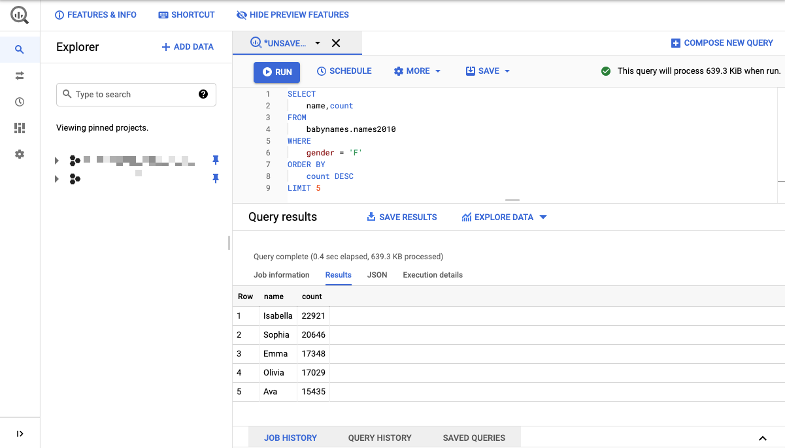
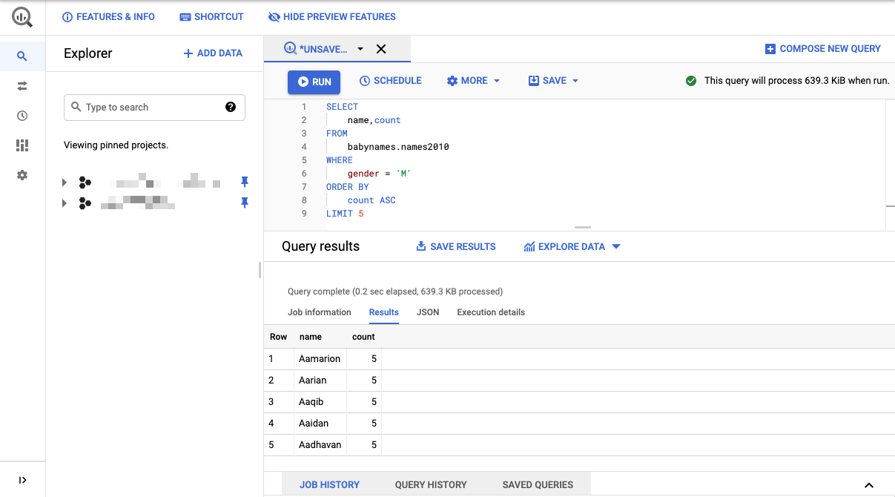

# Quick Start: CLI

## 公式ドキュメント

+ bq コマンドライン ツールの使用に関するクイックスタート
    + https://cloud.google.com/bigquery/docs/quickstarts/quickstart-command-line

## 環境変数

```
### 環境変数

export _gcp_pj_id='Your GCP Project ID'
```

## 公式のクイックスタート

```
bq コマンドライン ツールの使用に関するクイックスタート
https://cloud.google.com/bigquery/docs/quickstarts/quickstart-command-line
クイックスタート
https://cloud.google.com/bigquery/docs/quickstarts/quickstart-command-line#step_1_download_the_sample_data
```

## サンプルデータを BQ に入れる

+ サンプルデータをダウンロード

```
wget http://www.ssa.gov/OACT/babynames/names.zip
unzip names.zip
```

+ BQ のデータセットを作成

```
bq --project_id ${_gcp_pj_id} mk babynames
```

+ データセットの確認

```
bq --project_id ${_gcp_pj_id} ls
```
```
# bq --project_id ${_gcp_pj_id} ls
      datasetId
 -------------------
  babynames
```

+ テーブルの確認
  + まだデータは入れていないので空で良い

```
bq --project_id ${_gcp_pj_id} ls babynames
```
```
# bq --project_id ${_gcp_pj_id} ls babynames
#
```

+ テーブルをアップロードする
  + datasetID: `babynames`
  + テーブル ID: `names2010`
  + ソース: `yob2010.txt`
  + スキーマ: `name:string,gender:string,count:integer`

```
bq --project_id ${_gcp_pj_id} load babynames.names2010 yob2010.txt name:string,gender:string,count:integer
```
```
### 例

# bq --project_id ${_gcp_pj_id} load babynames.names2010 yob2010.txt name:string,gender:string,count:integer
Upload complete.
Waiting on bqjob_rb5ee854641b6bb4_000001779088954b_1 ... (0s) Current status: DONE
```

+ 確認

```
bq --project_id ${_gcp_pj_id} ls babynames
```
```
### 例

# bq --project_id ${_gcp_pj_id} ls babynames
   tableId    Type    Labels   Time Partitioning   Clustered Fields
 ----------- ------- -------- ------------------- ------------------
  names2010   TABLE
```

+ スキーマを確認

```
bq --project_id ${_gcp_pj_id} show babynames.names2010
```
```
### 例

# bq --project_id ${_gcp_pj_id} show babynames.names2010
Table xxxxxxxxxxxxxxxxxxxxxxxx:babynames.names2010

   Last modified         Schema         Total Rows   Total Bytes   Expiration   Time Partitioning   Clustered Fields   Labels
 ----------------- ------------------- ------------ ------------- ------------ ------------------- ------------------ --------
  11 Feb 19:00:10   |- name: string     34082        654659
                    |- gender: string
                    |- count: integer

```

## サンプルクエリを実行してみる

### 1. 最も人気のある女の子の名前を取得する

+ クエリを実行する

```
bq --project_id ${_gcp_pj_id} query "SELECT name,count FROM babynames.names2010 WHERE gender = 'F' ORDER BY count DESC LIMIT 5"
```
```
### 例

# bq --project_id ${_gcp_pj_id} query "SELECT name,count FROM babynames.names2010 WHERE gender = 'F' ORDER BY count DESC LIMIT 5"
Waiting on bqjob_r3288f2c19418e84f_00000177908b8185_1 ... (0s) Current status: DONE
+----------+-------+
|   name   | count |
+----------+-------+
| Isabella | 22921 |
| Sophia   | 20646 |
| Emma     | 17348 |
| Olivia   | 17029 |
| Ava      | 15435 |
+----------+-------+
```

+ GUI でもやってみる




### 2. 最も珍しい男の子の名前を取得する

+ 最も珍しい男の子の名前を取得するには、次のコマンドを実行します。ソースデータは出現数が 5 未満の名前を除外するので、最小数は 5 です。

```
bq --project_id ${_gcp_pj_id} query "SELECT name,count FROM babynames.names2010 WHERE gender = 'M' ORDER BY count ASC LIMIT 5"
```
```
### 例

# bq --project_id ${_gcp_pj_id} query "SELECT name,count FROM babynames.names2010 WHERE gender = 'M' ORDER BY count ASC LIMIT 5"
Waiting on bqjob_r53f157184f48da10_00000177908c5488_1 ... (0s) Current status: DONE
+----------+-------+
|   name   | count |
+----------+-------+
| Aaqib    |     5 |
| Aaidan   |     5 |
| Aadhavan |     5 |
| Aarian   |     5 |
| Aamarion |     5 |
+----------+-------+
```

+ GUI でもやってみる



## 削除

+ データセットを削除

```
bq --project_id ${_gcp_pj_id} rm -r babynames
```

+ 確認

```
bq --project_id ${_gcp_pj_id} ls
```

## まとめ

おわり :)
