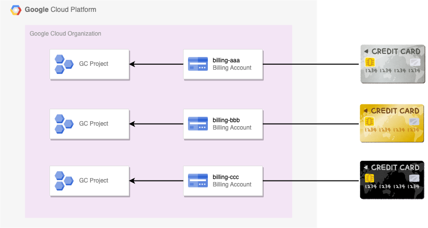
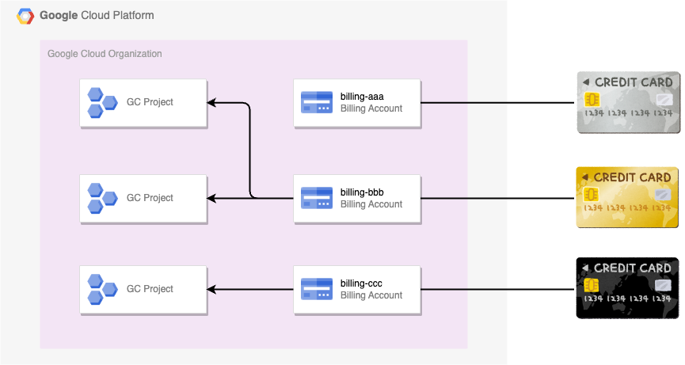
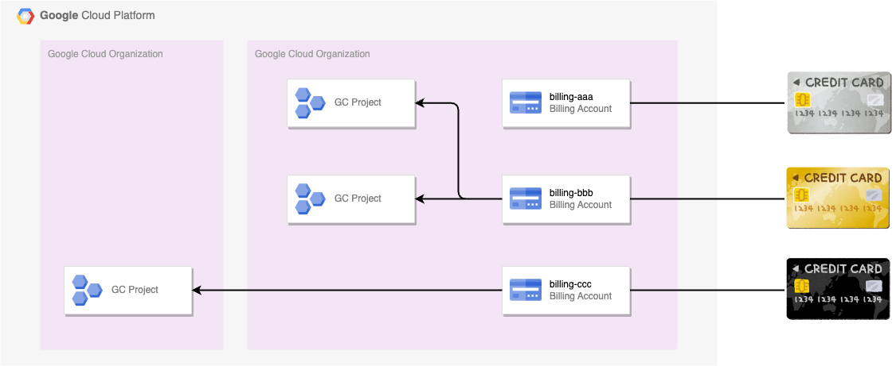

# Billing

## 概要

Google Cloud の費用の追跡と把握、料金の支払い、費用の最適化に役立つツールコレクション

公式ドキュメント ---> [About Cloud Billing](https://cloud.google.com/billing/docs/concepts)


[](https://www.youtube.com/watch?v=GpiQPym27II)

## 請求先アカウントの設計パターン

### 1. 請求先アカウントと Google Cloud Project が 1:1 のパターン



### 2. 請求先アカウントと Google Cloud Project が 1:n のパターン



### 3. 別の Google Cloud 組織の請求先アカウントと Google Cloud Project を紐づけるパターン



## 複数種類のアカウントについて

Google Cloud にはさまざまな **アカウント** があるので表と図でまとめました

名称 | 説明 | 所属する場所 | 使用もしくは制御するユーザ
:- | :- | :-| :- 
Google Account | Google Admin 上で作成するユーザ | Google Admin | 人
Service Account | hoge | Google Cloud Project | Google Cloud 上のコンピュートリソースやプログラム
Billing Account | クレジットカードなどの支払い情報を制御するリソース | Google Cloud Organization | Google Cloud Project <br>作成や紐付け自体は人がやる


## Export Cloud Billing について

+ 公式ドキュメント

```
# Cloud Billing データを BigQuery にエクスポートする
https://cloud.google.com/billing/docs/how-to/export-data-bigquery
```

+ :warning: 注意点

この設定は Google Cloud Project ではなく、請求先アカウントに紐づく

故に Google Cloud Project 毎に Export する BQ の Dataset を変えたい場合は、紐づけている請求先アカウントも変更しないといけない

また、 Export 先を複数設定することが **出来ない** ので注意する

## 請求される料金

### Cloud Monitoring

```
Cloud Monitoring
https://cloud.google.com/stackdriver/pricing#monitoring-costs

Cloud Monitoring の料金の概要
https://cloud.google.com/stackdriver/pricing#monitoring-pricing-summary
```
