# 同 GCP プロジェクト内で GCS から Pub/Sub を通じて Cloud Build を実行する

## 概要

Cloud Build が Pub/Sub 経由で実行出来るようになったので、GCS のイベントを通じて起動する

```
リリースノート
https://cloud.google.com/build/release-notes#March_10_2021
```


```
GCS にファイルを置くことをトリガーとして Cloud build を動かしたい場合
今ままで
GCS -> Pubsub -> functions -> Cloud Build 
から functionsがなくなる

pubsub からくるイベントをbuild でフィルタを付けることが出来る
functsion は Cloud Buold の API を叩くやつ

functiosn が減るので上記をコード管理する場合の工数も減る
```


## 構成

下記の構成を作る

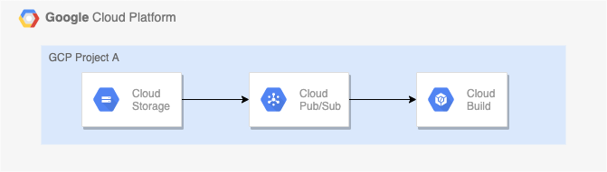

# 実際にやってみる

## GCS バケットの作成

```
### 環境変数

export _gcp_pj_id='Your GCP Project'
export _common='build-pubsub-gcs'
```

+ GCS バケットの作成

```
gsutil mb -p ${_gcp_pj_id} gs://${_gcp_pj_id}_${_common}
```

+ GCS バケットの確認

```
gsutil ls | grep ${_gcp_pj_id}_${_common}
```

## Pub/Sub 通知設定の作成


正しくは `Pub/Sub Notifications for Cloud Storage`

https://cloud.google.com/storage/docs/reporting-changes

+ GCP プロジェクトの設定

```
gcloud beta config set project ${_gcp_pj_id}
```

+ Pub/Sub 通知を作る

```
gsutil notification create -t from_gcs_${_common} -f json gs://${_gcp_pj_id}_${_common}
```

+ 確認
  + GCP コンソールからは確認出来ない(ので、gsutil コマンドで確認する)

```
gsutil notification list gs://${_gcp_pj_id}_${_common}
```

## Cloud Build Trigger の作成

※ 現状は gcloud コマンドでは出来ないので、GCP コンソールから作成する

設定 | 値 | スクリーンショット
:- | :- | :-
Name | `cbt-build-pubsub-gcs` (任意) | 
Event | `Pub/Sub message` を選択 | 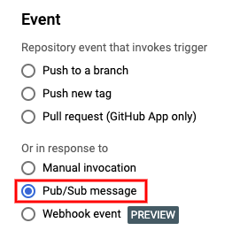
Subscription | `from_gcs_${_common}` を選択 <br>(前項で作成した Pub/Sub 通知) | 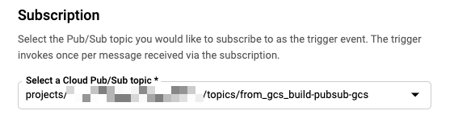
Source | `連携したい Repository 名` <br>(例: [iganari/package-gcp](https://github.com/iganari/package-gcp)) | 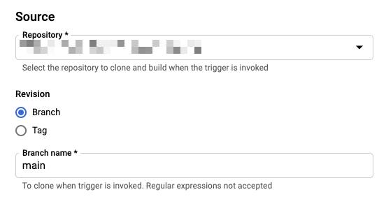
Configuration | `連携した Repository 内の cloudbuild.yaml の PATH` <br>(例: [builds/pubsub/gcs/cloudbuild.yaml](./cloudbuild.yaml)) | 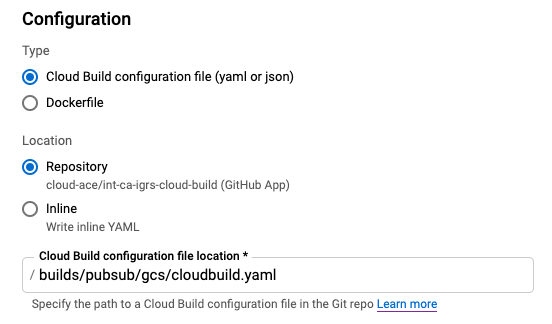
Advanced | Substitution Variables として以下を設定 <br> `_EVENT_TYPE` = `$(body.message.attributes.eventType)` <br> `_BUCKET_ID` = `$(body.message.attributes.bucketId)` <br> `_OBJECT_ID` = `$(body.message.attributes.objectId)` | 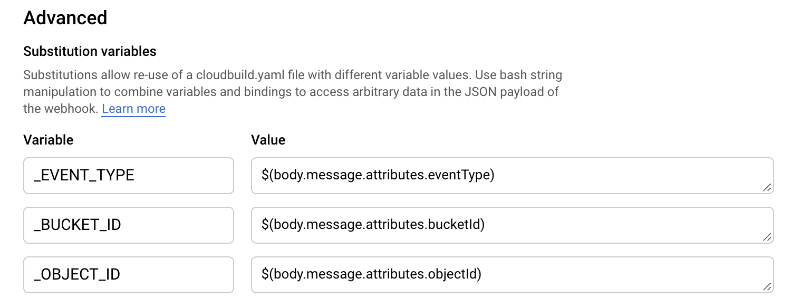

### 作成完了

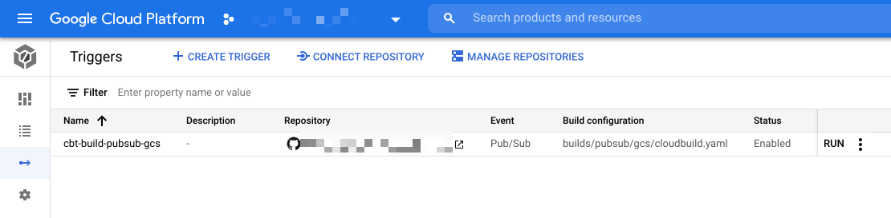

## 実行

### GCS にオブジェクトを追加する

+ GCS にアップロードするファイルを作成する

```
echo "this is Cloud Build Sample By iganari :)" > sample.txt
cat sample.txt
zip sample.zip sample.txt
```

+ GCS にアップロード

```
gsutil cp sample.txt gs://${_gcp_pj_id}_${_common}/
```

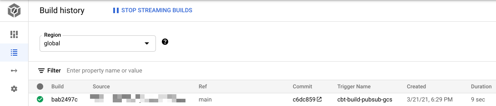

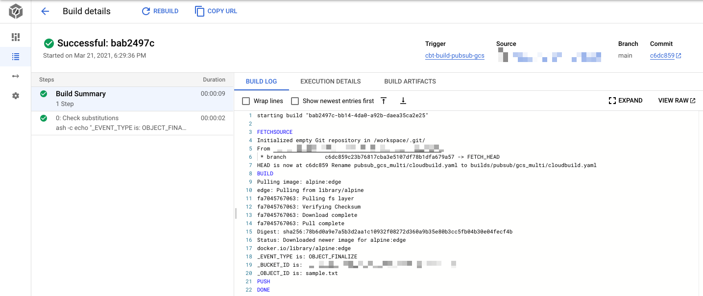


+ 以下の情報が取れているのが分かる

```
_EVENT_TYPE is: OBJECT_FINALIZE
_BUCKET_ID is: XXXXXXXXXXXXXXXXXXXXXx
_OBJECT_ID is: sample.txt
```

### GCS のオブジェクトを削除する


+ GCS のオブジェクトを削除する

```
gsutil rm gs://${_gcp_pj_id}_${_common}/sample.txt
```


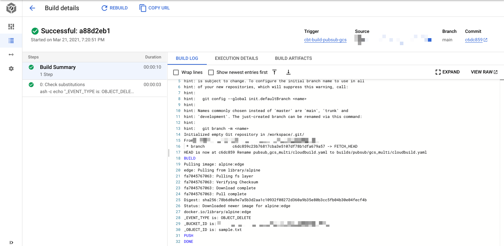

+ 以下の情報が取れているのが分かる

```
_EVENT_TYPE is: OBJECT_DELETE
_BUCKET_ID is: XXXXXXXXXXXXXXXXXXXXXx
_OBJECT_ID is: sample.txt
```

### GCS のオブジェクトを上書きする

`OBJECT_DELETE` と `OBJECT_FINALIZE` の 2 回のトリガ実行が起こる

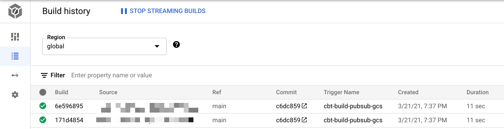


## Filter を使ってみる

`OBJECT_FINALIZE` の時のみ実行するようにする

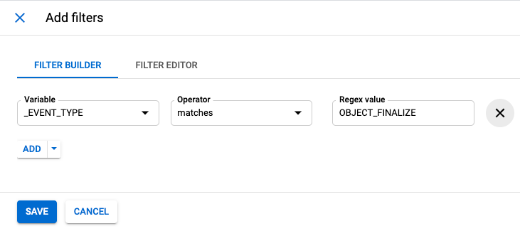

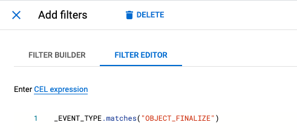


+ gcloud コマンドにて、事前にビルドログの確認

```
# gcloud beta builds list  --limit 3 --project ${_gcp_pj_id}
ID                                    CREATE_TIME                DURATION  SOURCE  IMAGES  STATUS
98348535-90f6-41d4-b94c-fddcb7b562a4  2021-03-21T01:11:52+00:00  11S       -       -       SUCCESS
d8061dfb-ea54-4589-8ab5-6e4fafb2ed1c  2021-03-21T00:54:24+00:00  10S       -       -       SUCCESS
f1d602d4-aeaa-446c-8bc5-3ba20b204cee  2021-03-21T00:53:18+00:00  11S       -       -       SUCCESS
```

+ GCS に再アップロードする

```
gsutil cp sample.txt gs://${_gcp_pj_id}_${_common}/
```

+ gcloud コマンドにて、事前にビルドログの確認
  + 1 回だけ実行されるはず。

```
# gcloud beta builds list  --limit 3 --project ${_gcp_pj_id}
ID                                    CREATE_TIME                DURATION  SOURCE  IMAGES  STATUS
48b13cc3-fd0c-4541-aaac-d1e53afcf902  2021-03-21T01:14:45+00:00  11S       -       -       SUCCESS   <------ 1回だけ実行された 
98348535-90f6-41d4-b94c-fddcb7b562a4  2021-03-21T01:11:52+00:00  11S       -       -       SUCCESS
d8061dfb-ea54-4589-8ab5-6e4fafb2ed1c  2021-03-21T00:54:24+00:00  10S       -       -       SUCCESS
```


# まとめ

Cloud Build の Pub/Sub トリガーを試してみた

今回試したのは Cloud Storage にオブジェクトが設置された時、削除された時、上書きされた時にちゃんと実行されるのか確認した

後は、オブジェクトのクラスが変更された時にちゃんと通知が来るのか知りたい

それはまた今度


## リソース削除

+ cloud build trigger を削除

```
gcloud alpha builds triggers delete cbt-build-pubsub-gcs \
  --project ${_gcp_pj_id}
```

+ Pub/Sub を削除

```
gcloud beta pubsub topics delete from_gcs_${_common} \
  --project ${_gcp_pj_id}
```

+ GCS バケットの削除

```
gsutil rm -r gs://${_gcp_pj_id}_${_common}
```


