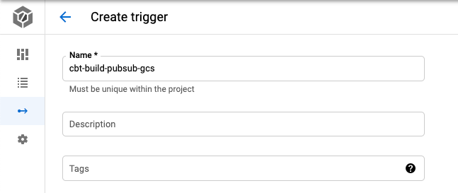

# 同 GCP プロジェクト内で GCS から Pub/Sub を通じて Cloud Build を実行する

## 概要

Cloud Build が Pub/Sub 経由で実行出来るようになったので、GCS のイベントを通じて起動する

```
リリースノート
https://cloud.google.com/build/release-notes#March_10_2021
```

## 構成

下記の構成を作る


# 実際にやってみる

## GCS バケットの作成

```
### 環境変数

export _gcp_pj_id='Your GCP Project'
export _common='build-pubsub-gcs'
```

+ GCS バケットの作成

```
gsutil mb -p ${_gcp_pj_id} gs://${_gcp_pj_id}_${_common}
```

+ GCS バケットの確認

```
gsutil ls | grep ${_gcp_pj_id}_${_common}
```

## Pub/Sub 通知設定の作成


正しくは `Pub/Sub Notifications for Cloud Storage`

https://cloud.google.com/storage/docs/reporting-changes

+ GCP プロジェクトの設定

```
gcloud beta config set project ${_gcp_pj_id}
```

+ Pub/Sub 通知を作る

```
gsutil notification create -t from_gcs_${_common} -f json gs://${_gcp_pj_id}_${_common}
```

+ 確認
  + GCP コンソールからは確認出来ない(ので、gsutil コマンドで確認する)

```
gsutil notification list gs://${_gcp_pj_id}_${_common}
```

## Cloud Build Trigger の作成

※ 現状は gcloud コマンドでは出来ないので、GCP コンソールから作成する

設定 | 値 | スクリーンショット
:- | :- | :-
Name | `cbt-build-pubsub-gcs` (任意) | 
Event | `Pub/Sub message` | 
Subscription | `from_gcs_${_common}` (前項で作成した Pub/Sub 通知) | 
Source | `連携したい Repository 名` (例: [iganari/package-gcp](https://github.com/iganari/package-gcp)) | 
Configuration | `連携した Repository 内の cloudbuild.yaml の PATH` (例: [builds/pubsub/gcs/cloudbuild.yaml](./cloudbuild.yaml)) | 


### Event


### Subscription


### Source


### Configuration


### Advanced


Variable | 	Value
:- | :-
`_EVENT_TYPE` | `$(body.message.attributes.eventType)`
`_BUCKET_ID`  | `$(body.message.attributes.bucketId)`
`_OBJECT_ID` | `$(body.message.attributes.objectId)`


## 実行

+ アップロードするファイルを作成する

```
echo "this is Cloud Build Sample By iganari :)" > sample.txt
cat sample.txt
zip sample.zip sample.txt
```

+ GCS にアップロード

``
gsutil cp sample.txt gs://${_gcp_pj_id}_${_common}/
```

```
_EVENT_TYPE is: OBJECT_FINALIZE
_BUCKET_ID is: XXXXXXXXXXXXXXXXXXXXXx
_OBJECT_ID is: sample.txt
```


+ 削除

```
gsutil rm gs://${_gcp_pj_id}_${_common}/sample.txt
```

```
_EVENT_TYPE is: OBJECT_DELETE
_BUCKET_ID is: XXXXXXXXXXXXXXXXXXXXXx
_OBJECT_ID is: sample.txt
```


+ 置き換え
---> `OBJECT_DELETE` と `OBJECT_FINALIZE` の 2 回のトリガ実行が起こる


あとは手でやってみる

Cloud Build を作ると subsclibreが出来る

gcb-hogehoge

filter はいらない


↑
イベントだけはとってもいいかもしれない


GCS にファイルを置くことをトリガーとして Cloud build を動かしたい場合
今ままで
GCS -> Pubsub -> functions -> Cloud Build 
から functionsがなくなる

pubsub からくるイベントをbuild でフィルタを付けることが出来る
functsion は Cloud Buold の API を叩くやつ

functiosn が減るので上記をコード管理する場合の工数も減る


# filter を使ってみる

`OBJECT_FINALIZE` の時のみ実行するようにする


+ GCS に再アップロード

``
gsutil cp sample.txt gs://${_gcp_pj_id}_${_common}/
```

```
# gcloud beta builds list  --limit 10 --project ${_gcp_pj_id}
ID                                    CREATE_TIME                DURATION  SOURCE  IMAGES  STATUS
98348535-90f6-41d4-b94c-fddcb7b562a4  2021-03-21T01:11:52+00:00  11S       -       -       SUCCESS
d8061dfb-ea54-4589-8ab5-6e4fafb2ed1c  2021-03-21T00:54:24+00:00  10S       -       -       SUCCESS
f1d602d4-aeaa-446c-8bc5-3ba20b204cee  2021-03-21T00:53:18+00:00  11S       -       -       SUCCESS
2dcaae89-e108-4185-a37f-0abce09dd731  2021-03-20T14:58:34+00:00  11S       -       -       SUCCESS
a201f17e-354f-4e6b-9ae9-015d1e11f901  2021-03-20T14:58:34+00:00  11S       -       -       SUCCESS
db7ec737-1d81-4370-9963-8a028cb8306f  2021-03-20T14:53:09+00:00  12S       -       -       SUCCESS
22cf081b-0c44-4929-848b-9551c9d2f6a6  2021-03-18T07:40:18+00:00  1M7S      -       -       SUCCESS
78c50c71-787d-40e6-8678-61cff5467706  2021-03-18T07:40:17+00:00  1M11S     -       -       SUCCESS
2d202962-3adf-4526-8074-4c7df5ef1099  2021-03-18T07:32:26+00:00  1M9S      -       -       SUCCESS
db275ca9-eb87-4d7c-aa12-5f9b0e47e799  2021-03-18T07:32:26+00:00  1M10S     -       -       SUCCESS
```


```
# gcloud beta builds list  --limit 10 --project ${_gcp_pj_id}
ID                                    CREATE_TIME                DURATION  SOURCE  IMAGES  STATUS
48b13cc3-fd0c-4541-aaac-d1e53afcf902  2021-03-21T01:14:45+00:00  11S       -       -       SUCCESS
98348535-90f6-41d4-b94c-fddcb7b562a4  2021-03-21T01:11:52+00:00  11S       -       -       SUCCESS
d8061dfb-ea54-4589-8ab5-6e4fafb2ed1c  2021-03-21T00:54:24+00:00  10S       -       -       SUCCESS
f1d602d4-aeaa-446c-8bc5-3ba20b204cee  2021-03-21T00:53:18+00:00  11S       -       -       SUCCESS
2dcaae89-e108-4185-a37f-0abce09dd731  2021-03-20T14:58:34+00:00  11S       -       -       SUCCESS
a201f17e-354f-4e6b-9ae9-015d1e11f901  2021-03-20T14:58:34+00:00  11S       -       -       SUCCESS
db7ec737-1d81-4370-9963-8a028cb8306f  2021-03-20T14:53:09+00:00  12S       -       -       SUCCESS
22cf081b-0c44-4929-848b-9551c9d2f6a6  2021-03-18T07:40:18+00:00  1M7S      -       -       SUCCESS
78c50c71-787d-40e6-8678-61cff5467706  2021-03-18T07:40:17+00:00  1M11S     -       -       SUCCESS
2d202962-3adf-4526-8074-4c7df5ef1099  2021-03-18T07:32:26+00:00  1M9S      -       -       SUCCESS
```

---> 一個だけ実行された

# まとめ

Cloud Build の Pub/Sub トリガーを試してみた

今回試したのは Cloud Storage にオブジェクトが設置された時、削除された時、上書きされた時にちゃんと実行されるのか確認した

後は、オブジェクトのクラスが変更された時にちゃんと通知が来るのか知りたい

それはまた今度


## リソース削除

+ cloud build trigger を削除

```
gcloud alpha builds triggers delete cbt-build-pubsub-gcs \
  --project ${_gcp_pj_id}
```

+ Pub/Sub を削除

```
gcloud beta pubsub topics delete from_gcs_${_common} \
  --project ${_gcp_pj_id}
```

+ GCS バケットの削除

```
gsutil rm -r gs://${_gcp_pj_id}_${_common}
```


