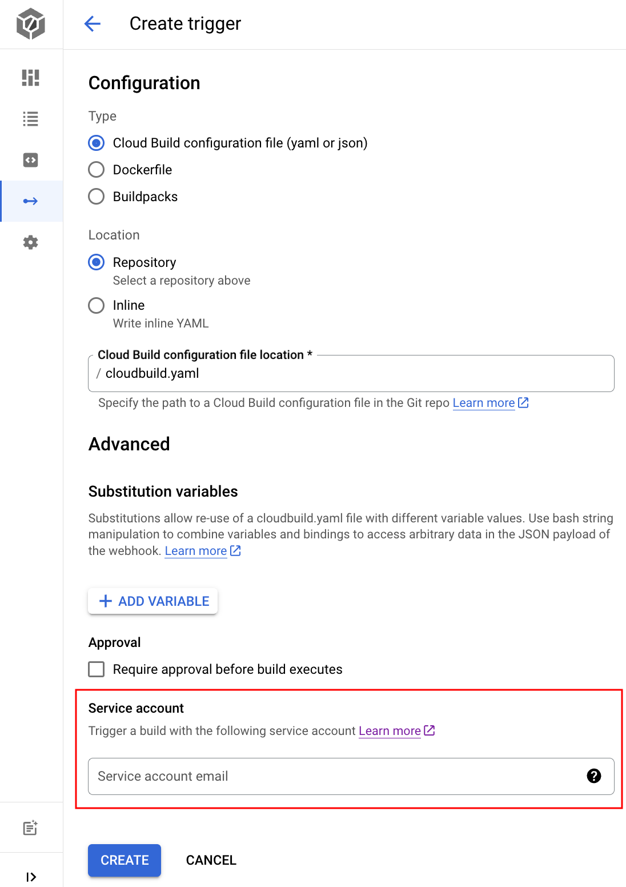

# Servcie Account について

## 概要

Cloud Build Trigger 毎に Service Account を設定することが出来る

例えば、Cloud Build Trigger 上でやる作業的に強い権限が必要(もしくは権限がほとんど要らない)な場合、Cloud Build Trigger をセキュアに運用するためには Trigger に一律な Role ではなく、Trigger 毎に Service Account を作成し、適正な Role のみを設定したほうが良い

Service Account を特別設定しない場合は Cloud Build のデフォルトの Service Account ( `{ GCP Project Number }@cloudbuild.gserviceaccount.com` ) が割り当てられる

```
### ビルドトリガーの作成と管理
https://cloud.google.com/build/docs/automating-builds/create-manage-triggers

### ユーザーが作成したバケットへのビルドログの保存
https://cloud.google.com/build/docs/securing-builds/store-manage-build-logs#store-custom-bucket
```

## 必要な Role まとめ

説明 | 対応する Role
:- | :-
Cloud Build のログを Logging に出す | Logs Writer( `roles/logging.logWriter` )
Cloud Build のログを GCS に出す | Storage Admin( `roles/storage.admin` )
Artifact Registry にイメージを PUSH する | Artifact Registry Writer( `roles/artifactregistry.writer` )
Cloud Run にデプロイする | Cloud Run Developer( `roles/run.developer` )
Cloud Run の認証を設定する | Service Account User( `roles/iam.serviceAccountUser` )

+ 公式ドキュメント
  + https://cloud.google.com/build/docs/securing-builds/configure-user-specified-service-accounts
  + https://cloud.google.com/build/docs/securing-builds/store-manage-build-logs

### 注意点

個別の Service Account を設定する場合、デフォルトの Cloud Build Trigger のログを書き出す GCS Bucket が使えない。これはその GCS Bucket が Google 管理の場所にあるため。

故に個別の Service Account を使う場合は、Cloud Build Trigger のログを溜める GCS Bucket から用意する必要がある

## やってみる

### 0. 準備

```
export _gc_pj_id='Your Google Cloud Project ID'
export _common='pkg-gcp-run'
export _region='asia-northeast1'
```

+ Google Clou と認証する

```
gcloud auth login --no-launch-browser
```

+ API の有効化

```
gcloud beta services enable cloudbuild.googleapis.com --project ${_gc_pj_id}
```

### 1. リソース作成

+ GCS Bucket の作成
  + cloudbuild.yaml で GCS Bucket を指定する

```
WIP
```

+ Service Account の作成

```
gcloud beta iam service-accounts create sa-${_common}-cloudbuild \
  --description="Cloud Build Trigger 毎に Service Account を付与する" \
  --display-name="sa-${_common}-cloudbuild" \
  --project ${_gc_pj_id}
```

+ Service Account の確認

```
gcloud beta iam service-accounts describe sa-${_common}-cloudbuild@${_gc_pj_id}.iam.gserviceaccount.com --project ${_gc_pj_id} --format json
```

+ Role を付与する

```
gcloud beta projects add-iam-policy-binding ${_gc_pj_id} \
  --member="serviceAccount:sa-${_common}-cloudbuild@${_gc_pj_id}.iam.gserviceaccount.com" \
  --role="roles/iam.serviceAccountUser" \
  --project ${_gc_pj_id}


gcloud beta projects add-iam-policy-binding ${_gc_pj_id} \
  --member="serviceAccount:sa-${_common}-cloudbuild@${_gc_pj_id}.iam.gserviceaccount.com" \
  --role="roles/logging.logWriter" \
  --project ${_gc_pj_id}

gcloud beta projects add-iam-policy-binding ${_gc_pj_id} \
  --member="serviceAccount:sa-${_common}-cloudbuild@${_gc_pj_id}.iam.gserviceaccount.com" \
  --role="roles/storage.admin" \
  --project ${_gc_pj_id}
```

+ Trigger 作成時に Service Account を設定する



## memo

GCS は作る？