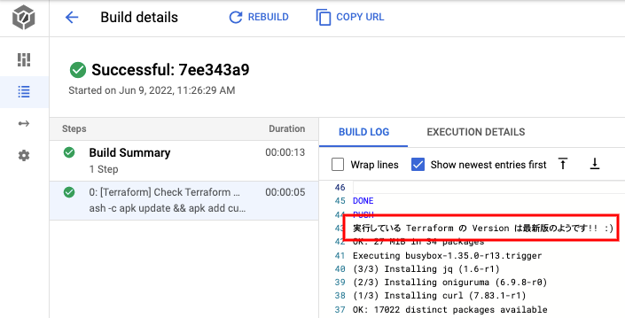

# Terraform にまつわるサンプル

## Terraform のバージョンチェック

最新か否かは https://github.com/hashicorp/terraform/releases で判断しています

```
## やっていること

export _this_tf_ver=$(terraform version | awk 'NR==1 {print $2}')
export _latest_tf_ver=$(curl -s https://api.github.com/repos/hashicorp/terraform/releases/latest | jq -r .tag_name)

if [ "${_this_tf_ver}" == "${_latest_tf_ver}" ]; then
  echo '実行している Terraform の Version は最新版のようです!! :)'
else
  echo '実行している Terraform の Version は最新版ではありません。 Terraform の Version を確認してください。---> https://github.com/hashicorp/terraform/releases' && exit 1
fi
```

### OK パターン ( 実行している Terraform が最新である場合 )



### NG パターン ( 実行している Terraform が最新ではない場合 )


