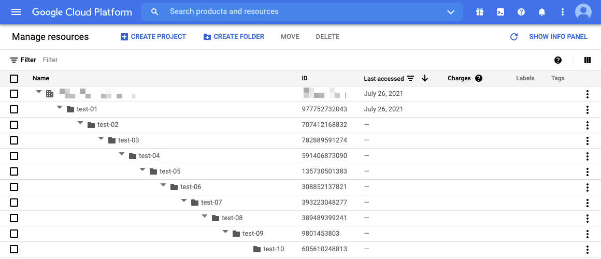
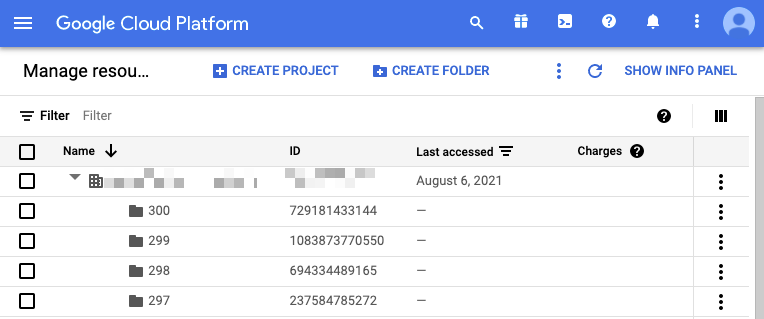
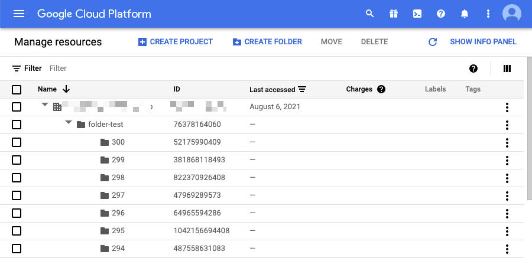
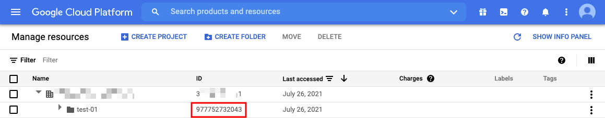

# Manage resources

## 概要

GCP は `組織` を作ることが出来、組織の配下に `フォルダ` を作ることが出来ます

GCP リソースを実際に運用するのは、大抵は Google Cloud Project の中です(組織に紐づくリソースもあります)

Google Cloud Project は `組織` の直下、もしくは `フォルダ` の配下に配置することが出来ます

`組織` を作らないと `フォルダ` も作れません。この場合は `野良の` Google Cloud Project となります

## 公式ドキュメントおよびイメージ

[Resource hierarchy (リソース階層)](https://cloud.google.com/resource-manager/docs/cloud-platform-resource-hierarchy)

[Creating and managing Folders (フォルダの作成と管理)](https://cloud.google.com/resource-manager/docs/creating-managing-folders)


## 注意点

### フォルダのネストの上限は 10 個

+ Web ブラウザから確認



+ 11 個目のフォルダを作ろうとすると以下のようなエラーが出る

```
# gcloud resource-manager folders create --display-name test-11 --folder 605610248813

Waiting for [operations/cf.8759230411087616215] to finish...failed.
ERROR: (gcloud.resource-manager.folders.create) Operation [cf.8759230411087616215] failed: 9: The folder operation violates height constraints.
```

### 組織直下の子フォルダの上限は 300 個

+ Web ブラウザから確認



+ CLI で確認

```
# gcloud resource-manager folders list --organization {Organization ID}
DISPLAY_NAME  PARENT_NAME                            ID
231           organizations/{Organization ID}  1001034393417
117           organizations/{Organization ID}  1004121055097
.
.
.
```
```
# gcloud resource-manager folders list --organization {Organization ID} | grep {Organization ID} | wc -l
300
```

+ 301 個目のフォルダを作ろうとするとエラーになる

```
# gcloud resource-manager folders create --display-name 301 --organization {Organization ID}

Waiting for [operations/cf.5754303482127393954] to finish...failed.
ERROR: (gcloud.resource-manager.folders.create) Operation [cf.5754303482127393954] failed: 9: The folder operation violates fanout constraints.
```

### フォルダ直下の子フォルダの上限は 300 個

+ Web ブラウザから確認



+ CLI で確認

```
# gcloud resource-manager folders list --folder 76378164060
DISPLAY_NAME  PARENT_NAME                     ID
179           folders/76378164060  1004204842702
229           folders/76378164060  1008564563089
.
.
.
```
```
# gcloud resource-manager folders list --folder 76378164060 | grep 76378164060 | wc -l
300
```

+ 301 個目のフォルダを作ろうとするとエラーになる

```
# gcloud resource-manager folders create --display-name 301 --folder 76378164060

Waiting for [operations/cf.5097355409447013929] to finish...failed.
ERROR: (gcloud.resource-manager.folders.create) Operation [cf.5097355409447013929] failed: 9: The folder operation violates fanout constraints.
```

## 実際に作ってみる

+ 手順
  + [Creating and managing Folders | Creating folders](https://cloud.google.com/resource-manager/docs/creating-managing-folders?hl=en#creating-folders)

### 組織の直下にフォルダを作る場合

+ 組織の直下にフォルダを作る基本コマンド

```
gcloud resource-manager folders create \
   --display-name {DISPLAY_NAME} \
   --organization {ORGANIZATION_ID}
```

+ `ORGANIZATION_ID` は以下のように確認出来ます


### 特定のフォルダの下にフォルダを作る場合

+ 特定のフォルダの下にフォルダを作る基本コマンド

```
gcloud resource-manager folders create \
   --display-name {DISPLAY_NAME} \
   --folder {FOLDER_ID}
```

+ `FOLDER_ID` は以下のように確認出来ます



## フォルダのリストを表示

基本的には `直下のフォルダ` しか確認することが出来ません

### 組織の配下を確認する

+ 基本コマンド

```
gcloud resource-manager folders list --organization {Organization ID}
```

### 特定のフォルダの配下を確認する

```
gcloud resource-manager folders list --folder {Folder ID}
```

```
### 例

# gcloud resource-manager folders list --folder 977752732043
DISPLAY_NAME  PARENT_NAME                     ID
test-02       folders/977752732043  707412168832


# gcloud resource-manager folders list --folder 707412168832
DISPLAY_NAME  PARENT_NAME                     ID
test-03       folders/707412168832  782889591274
```

## フォルダを削除

+ 基本コマンド

```
gcloud resource-manager folders delete {Folder ID}
```
```
### 例

# gcloud resource-manager folders delete 605610248813
Deleted [<Folder
 createTime: '2021-07-26T05:47:10.925Z'
 displayName: 'test-10'
 lifecycleState: LifecycleStateValueValuesEnum(DELETE_REQUESTED, 2)
 name: 'folders/605610248813'
 parent: 'folders/9801453803'>].


# gcloud resource-manager folders delete 9801453803
Deleted [<Folder
 createTime: '2021-07-26T05:46:34.334Z'
 displayName: 'test-09'
 lifecycleState: LifecycleStateValueValuesEnum(DELETE_REQUESTED, 2)
 name: 'folders/9801453803'
 parent: 'folders/389489399241'>].


# gcloud resource-manager folders delete 389489399241
Deleted [<Folder
 createTime: '2021-07-26T05:46:11.730Z'
 displayName: 'test-08'
 lifecycleState: LifecycleStateValueValuesEnum(DELETE_REQUESTED, 2)
 name: 'folders/389489399241'
 parent: 'folders/393223048277'>].
```