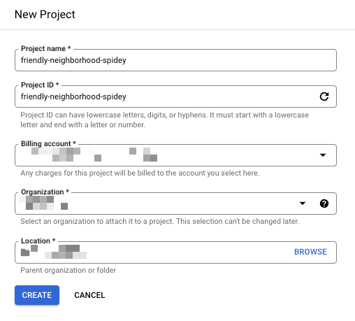

# Google Cloud プロジェクトの作成

## Google Cloud プロジェクトの作成

## 必要な Role

+ Google Cloud プロジェクトを作成する権限
  + Project Creator( プロジェクト作成者 )
    + `roles/resourcemanager.projectCreator`
    + 組織配下でもいいし、フォルダ配下でも良い
    + 組織直下でつけると、組織の名前が見える
    + フォルダにつけると、フォルダ配下が見えるし、そのフォルダ配下のフォルダを見れる

https://cloud.google.com/resource-manager/docs/creating-managing-projects?hl=en

test
