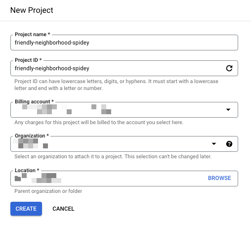

# Google Cloud プロジェクトの作成

## Google Cloud プロジェクトの作成

## 必要な Role

+ Google Cloud プロジェクトを作成する権限
  + Project Creator( プロジェクト作成者 )
    + `roles/resourcemanager.projectCreator`
    + 組織配下でもいいし、フォルダ配下でも良い

+ Google Cloud 組織直下に Google Cloud Project を作る時の追加 Role
  + Organization Administrator( TBD )
    + `roles/resourcemanager.organizationAdmin`
    + この Role は強すぎるので、 特定のフォルダの配下にのみ作成できるようにした方が良さそう
+ Google Cloud フォルダ配下に Google Cloud Project を作る時の追加 Role
  + Folder Editor( TBD )
    + `roles/resourcemanager.folderEditor`

test
