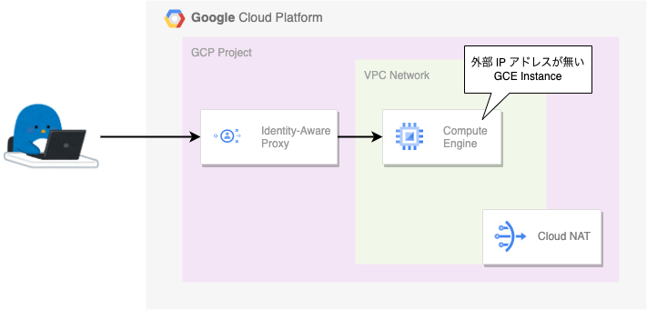

# Identity-Aware Proxy (IAP)

## 公式ドキュメント

https://cloud.google.com/iap/docs/concepts-overview

## 概要

+ [VM Instance が Linux の場合](./linux/)
+ [VM Instance が Windows Server の場合](./windows)

## まとめ

本来、外部 IP アドレスが付いていない GCE へは外部からアクセス出来ませんが、IAP 越しに接続することで SSH ログインおよび RDP ログインすることが出来ることが分かりました :raised_hands:

IAP を使用することで GCE へのログインもよりセキュアに実施していきましょう

Have fun! :)
