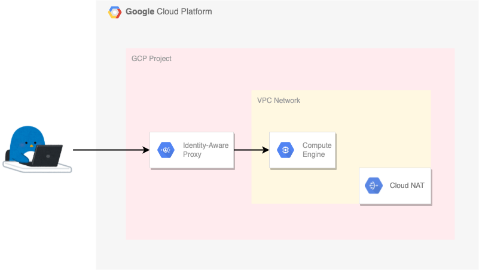
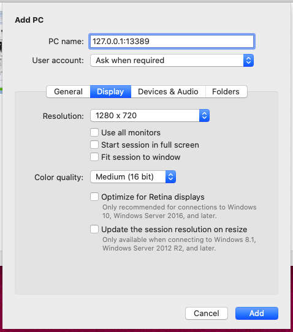
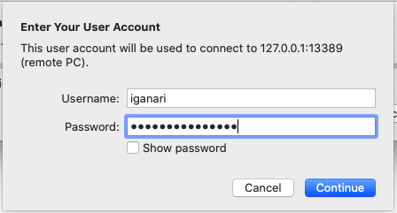
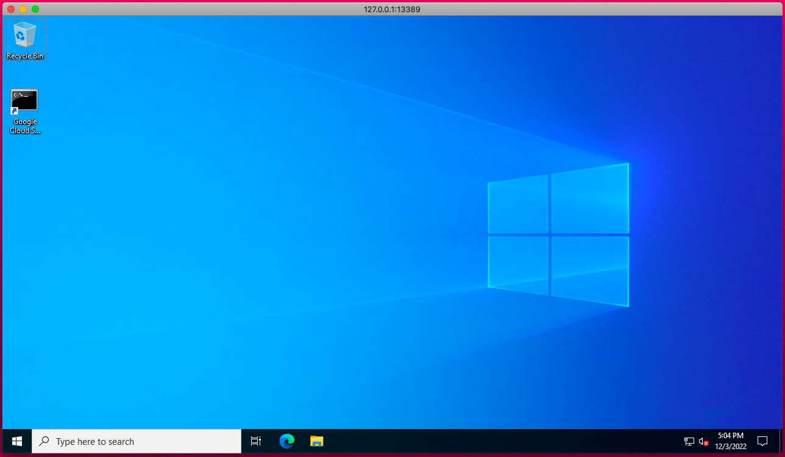

# IAP for TCP forwarding to GCE

## 概要

IAP 越しに外部 IP アドレスが無い GCE にログインします



+ 参考 URL
  + [Setting up IAP for Compute Engine](https://cloud.google.com/iap/docs/tutorial-gce)
  + [Enabling IAP for Compute Engine](https://cloud.google.com/iap/docs/enabling-compute-howto)
  + [Using IAP for TCP forwarding](https://cloud.google.com/iap/docs/using-tcp-forwarding)

## 準備

※ GCP を操作できる Google アカウントが必要です

```
export _gcp_pj_id='Your GCP Project ID'

export _common='iap-test'
export _region='asia-northeast1'
export _zone='asia-northeast1-c'
export _sub_network_range='10.146.0.0/20'
```

+ GCP との認証

```
gcloud auth login --no-launch-browser -q
```

+ GCP にログインした情報からアカウント名だけ抽出する

```
export _your_gcp_account_name=$(gcloud auth list --filter=status:ACTIVE --format="value(account)" | awk -F\@ '{print $1}')
echo ${_your_gcp_account_name}
```

## ネットワークの作成

<details>
<summary>Details</summary>

+ VPC ネットワークの作成

```
gcloud beta compute networks create ${_common}-network \
  --subnet-mode=custom \
  --project ${_gcp_pj_id}
```

+ サブネットの作成

```
gcloud beta compute networks subnets create ${_common}-subnets \
  --network ${_common}-network \
  --region ${_region} \
  --range ${_sub_network_range} \
  --enable-private-ip-google-access \
  --project ${_gcp_pj_id}
```

+ Firewall Rule の作成
  + IAP のレンジなど ---> [package-gcp/networking/firewalls](../../../networking/firewalls)

```
### 内部通信は全部許可する
gcloud beta compute firewall-rules create ${_common}-allow-internal-all \
  --network ${_common}-network \
  --direction=INGRESS \
  --action ALLOW \
  --rules tcp:0-65535,udp:0-65535,icmp \
  --source-ranges ${_sub_network_range} \
  --priority=1000 \
  --project ${_gcp_pj_id}


### IAP からの SSH と ICMP を許可する
gcloud beta compute firewall-rules create ${_common}-allow-iap-ssh \
  --network ${_common}-network \
  --direction=INGRESS \
  --action ALLOW \
  --rules tcp:22,icmp \
  --source-ranges=35.235.240.0/20 \
  --target-tags ${_common}-allow-ssh \
  --priority=1010 \
  --project ${_gcp_pj_id}


### IAP からの RDP と ICMP を許可する
gcloud beta compute firewall-rules create ${_common}-allow-iap-rdp \
  --network ${_common}-network \
  --direction=INGRESS \
  --action ALLOW \
  --rules tcp:3389,icmp \
  --source-ranges=35.235.240.0/20 \
  --target-tags ${_common}-allow-rdp \
  --priority=1010 \
  --project ${_gcp_pj_id}
```

+ Cloud NAT で使用する IP Address の予約

```
gcloud beta compute addresses create ${_common}-nat-ip \
  --region ${_region} \
  --project ${_gcp_pj_id}
```

+ Cloud NAT で使用する Cloud Router を作成

```
gcloud beta compute routers create ${_common}-nat-router \
  --network ${_common}-network \
  --region ${_region} \
  --project ${_gcp_pj_id}
```

+ Cloud NAT の作成

```
gcloud beta compute routers nats create ${_common}-nat \
  --router-region ${_region} \
  --router ${_common}-nat-router \
  --nat-all-subnet-ip-ranges \
  --nat-external-ip-pool ${_common}-nat-ip \
  --project ${_gcp_pj_id}
```

</details>

## IAM の設定

<details>
<summary>Details</summary>

+ Create Service Account of VM

```
gcloud beta iam service-accounts create ${_common} \
  --display-name ${_common} \
  --project ${_gcp_pj_id}
```

+ [WIP] IAP を使用するための Role を付与

```
# gcloud beta projects add-iam-policy-binding ${_gcp_pj_id} \
#   --member=user:${_your_gcp_account} \
#   --role=roles/iap.tunnelResourceAccessor
```

</details>

## GCE Instance の作成

静的外部 IP アドレスが付いていない GCE インスタンスの作成します

### Linux ( Ubuntu ) の GCE インスタンスの場合

<details>
<summary>Details</summary>

```
export _vm_type='e2-medium'
export _os_family='ubuntu-os-cloud'
export _os_image='ubuntu-2204-jammy-v20221201'
export _boot_disk_size='30'
```
```
gcloud beta compute instances create ${_common}-linux \
  --zone ${_zone} \
  --machine-type ${_vm_type} \
  --network-interface=subnet=${_common}-subnets,no-address \
  --tags=${_common}-allow-ssh \
  --service-account=${_common}@${_gcp_pj_id}.iam.gserviceaccount.com \
  --scopes https://www.googleapis.com/auth/cloud-platform \
  --image-project=${_os_family} \
  --image=${_os_image} \
  --boot-disk-size ${_boot_disk_size} \
  --shielded-secure-boot \
  --shielded-vtpm \
  --shielded-integrity-monitoring \
  --reservation-affinity=any \
  --project ${_gcp_pj_id}
```

</details>

### Windows Server の GCE インスタンスの場合

<details>
<summary>Details</summary>

```
export _vm_type='e2-medium'
export _os_family='windows-cloud'
export _os_image='windows-server-2022-dc-v20221109'
export _boot_disk_size='50'
```
```
gcloud beta compute instances create ${_common}-win \
  --zone ${_zone} \
  --machine-type ${_vm_type} \
  --network-interface=subnet=${_common}-subnets,no-address \
  --tags=${_common}-allow-rdp \
  --service-account=${_common}@${_gcp_pj_id}.iam.gserviceaccount.com \
  --scopes https://www.googleapis.com/auth/cloud-platform \
  --image-project=${_os_family} \
  --image=${_os_image} \
  --boot-disk-size ${_boot_disk_size} \
  --shielded-secure-boot \
  --shielded-vtpm \
  --shielded-integrity-monitoring \
  --reservation-affinity=any \
  --project ${_gcp_pj_id}
```

</details>

## 接続確認

作成した VM に IAP 越しにログインします

### Linux ( Ubuntu ) の GCE インスタンスに SSH ログインする場合 〜Tunneling SSH connections〜

<details>
<summary>Details</summary>

+ gcloud コマンド経由で SSH ログインする

```
gcloud beta compute ssh ${_your_gcp_account_name}@${_common}-linux --tunnel-through-iap --zone ${_zone} --project ${_gcp_pj_id}
```
```
### 例

$ gcloud beta compute ssh ${_your_gcp_account_name}@${_common}-linux --tunnel-through-iap --zone ${_zone} --project ${_gcp_pj_id}

Welcome to Ubuntu 22.04.1 LTS (GNU/Linux 5.15.0-1025-gcp x86_64)
Last login: Fri Dec  2 23:30:07 2022 from 35.235.242.49

iganari@iap-test-linux:~$
```

+ OS の確認

```
$ cat /etc/os-release
PRETTY_NAME="Ubuntu 22.04.1 LTS"
NAME="Ubuntu"
VERSION_ID="22.04"
VERSION="22.04.1 LTS (Jammy Jellyfish)"
VERSION_CODENAME=jammy
ID=ubuntu
ID_LIKE=debian
HOME_URL="https://www.ubuntu.com/"
SUPPORT_URL="https://help.ubuntu.com/"
BUG_REPORT_URL="https://bugs.launchpad.net/ubuntu/"
PRIVACY_POLICY_URL="https://www.ubuntu.com/legal/terms-and-policies/privacy-policy"
UBUNTU_CODENAME=jammy
```
```
$ uname -a
Linux iap-test-linux 5.15.0-1025-gcp #32-Ubuntu SMP Wed Nov 23 21:46:01 UTC 2022 x86_64 x86_64 x86_64 GNU/Linux
```

---> IAP 越しに パブリック IP アドレスが無い GCE( Linux ) に SSH ログインすることが出来ました :)

</details>

### Windows Server の GCE インスタンスに RDP ログインする場合 〜Tunneling RDP connections〜

<details>
<summary>Details</summary>

+ Windows Server の ID とパスワードを作る

```
gcloud beta compute reset-windows-password ${_common}-win --zone ${_zone} --user=iganari --project ${_gcp_pj_id}
```
```
### 例
$ gcloud beta compute reset-windows-password ${_common}-win --zone ${_zone} --user=iganari --project ${_gcp_pj_id}

password: ********    # <----- 本来は表示されます
username: iganari
```

+ gcloud コマンドで TCP tunnel を作る
  + 例) GCE Instance の 3389 ポートと localhost の 13389 を繋ぐ

```
gcloud beta compute start-iap-tunnel ${_common}-win 3389 --local-host-port=localhost:13389 --zone ${_zone} --project ${_gcp_pj_id}
```
```
### 例

% gcloud beta compute start-iap-tunnel ${_common}-win 3389 --local-host-port=localhost:13389 --zone ${_zone} --project ${_gcp_pj_id}

Testing if tunnel connection works.
Listening on port [13389].


```

+ terminal はこのままで Microsoft Remote Desktop から RDP 接続をする








---> IAP 越しに パブリック IP アドレスが無い GCE( Windows Server ) に SSH ログインすることが出来ました :)

</details>

### Windows Server の GCE インスタンスに RDP ログインする場合 〜IAP Desktop〜

<details>
<summary>Details</summary>

[IAP Desktop](https://github.com/GoogleCloudPlatform/iap-desktop/) を使う


</details>


## まとめ

本来、外部 IP アドレスが付いていない GCE へは外部からアクセス出来ませんが、IAP 越しに接続することで SSH ログインおよび RDP ログインすることが出来ることが分かりました :raised_hands:

IAP を使用することで GCE へのログインもよりセキュアに実施していきましょう

Have fun! :)

### リソースの削除

<details>
<summary>Details</summary>

+ GCE の削除

```
gcloud beta compute instances delete ${_common}-linux \
  --zone ${_zone} \
  --project ${_gcp_pj_id} -q
```
```
gcloud beta compute instances delete ${_common}-win \
  --zone ${_zone} \
  --project ${_gcp_pj_id} -q
```

+ Cloud NAT の削除

```
gcloud beta compute routers nats delete ${_common}-nat \
  --router-region ${_region} \
  --router ${_common}-nat-router \
  --project ${_gcp_pj_id} -q
```

+ Cloud Router の削除

```
gcloud beta compute routers delete ${_common}-nat-router \
  --region ${_region} \
  --project ${_gcp_pj_id} -q
```

+ Cloud NAT 用の外部 IP アドレスを削除

```
gcloud beta compute addresses delete ${_common}-nat-ip \
  --region ${_region} \
  --project ${_gcp_pj_id} -q
```

+ Firewall Rule の削除

```
gcloud beta compute firewall-rules delete ${_common}-allow-internal-all \
  --project ${_gcp_pj_id} -q

gcloud beta compute firewall-rules delete ${_common}-allow-iap-ssh \
  --project ${_gcp_pj_id} -q
```

+ サブネットの削除

```
gcloud beta compute networks subnets delete ${_common}-subnets \
  --region ${_region} \
  --project ${_gcp_pj_id} -q
```

+ VPC ネットワークの作成

```
gcloud beta compute networks delete ${_common}-network \
  --project ${_gcp_pj_id} -q
```

</details>

## 最終更新日

2022/12/03
