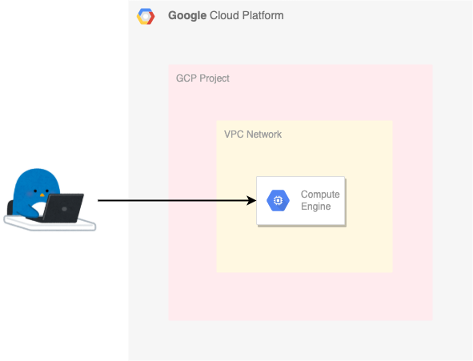
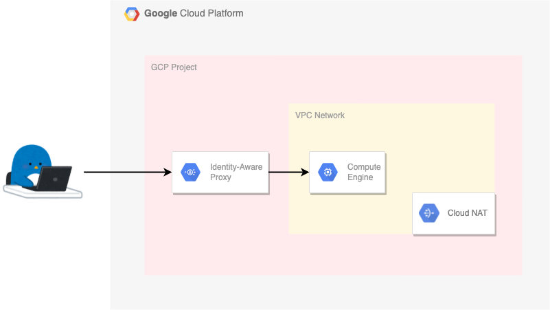

# VM instances

## 外部 IP アドレスがついた VM instance

VM instance に直接的に外部 IP アドレスが付いている状態

一番オーソドックスではあるが、Security 的には非推奨

## 外部 IP アドレスがついていない VM instance

VM instance に直接的に外部 IP アドレスが付いていない状態

IAP トンネル越しにログインする

※ 推奨構成 ※

## [公開鍵の登録 (プロジェクトレベル/VMレベル)](./ssh-keys) 

SSH する際の公開鍵を CLI を用いて登録する

## コマンド

WIP

## その他

WIP
