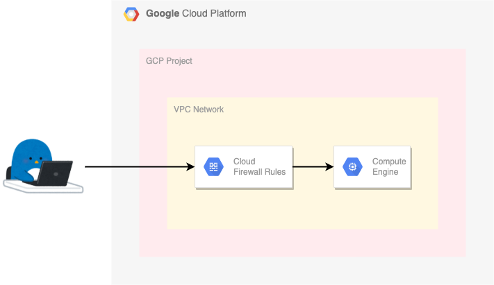

# 外部 IP アドレスがついた VM instance



## 実際に構築する

+ Google Cloud に認証を通す

```
gcloud auth login --no-launch-browser -q
```

```
### Env

export _gcp_pj_id='Your GCP Project ID'

export _common='external-ip'
export _region='asia-northeast1'
export _zone='asia-northeast1-b'
export _sub_network_range='172.16.0.0/12'

export _my_ip='Your Home IP Address'
export _other_ip='Your other IP Address'
```

+ API を enable 化します

```
gcloud beta services enable compute.googleapis.com --project ${_gcp_pj_id}
```

+ VPC Network の作成します

```
gcloud beta compute networks create ${_common}-network \
  --subnet-mode=custom \
  --project ${_gcp_pj_id}
```

+ サブネットの作成
  + `限定公開の Google アクセス` を On にしておく

```
gcloud beta compute networks subnets create ${_common}-subnets \
  --network ${_common}-network \
  --region ${_region} \
  --range ${_sub_network_range} \
  --enable-private-ip-google-access \
  --project ${_gcp_pj_id}
```

+ Firewall

```
### 内部通信
gcloud beta compute firewall-rules create ${_common}-allow-internal-all \
  --network ${_common}-network \
  --action ALLOW \
  --rules tcp:0-65535,udp:0-65535,icmp \
  --source-ranges ${_sub_network_range} \
  --target-tags ${_common}-allow-internal-all \
  --project ${_gcp_pj_id}

### SSH
gcloud beta compute firewall-rules create ${_common}-allow-ssh \
  --network ${_common}-network \
  --action ALLOW \
  --rules tcp:22,icmp \
  --source-ranges ${_my_ip},${_other_ip} \
  --target-tags ${_common}-allow-ssh \
  --project ${_gcp_pj_id}
```

+ IP Address の予約

```
gcloud beta compute addresses create ${_common}-ip \
  --region ${_region} \
  --project ${_gcp_pj_id}
```

+ VM Instance のパブリックイメージの検索
  + https://cloud.google.com/compute/docs/images

```
gcloud beta compute images list --filter="name~'^ubuntu-minimal-.*?'" --project ${_gcp_pj_id}
```

+ VM Instance の作成

```
export _os_project='ubuntu-os-cloud'
export _os_image='ubuntu-minimal-2204-jammy-v20230112a'
```
```
gcloud beta compute instances create ${_common}-vm \
  --zone ${_zone} \
  --machine-type e2-small \
  --subnet ${_common}-subnets \
  --address ${_common}-ip \
  --tags=${_common}-allow-internal-all,${_common}-allow-ssh \
  --image-project ${_os_project} \
  --image ${_os_image} \
  --boot-disk-size 30GB \
  --project ${_gcp_pj_id}
```

## ログイン

```
gcloud auth list --filter=status:ACTIVE --format="value(account)"

export _account=$(gcloud auth list --filter=status:ACTIVE --format="value(account)" | awk -F\@ '{print $1}')
echo ${_account}
```

```
gcloud beta compute ssh ${_account}@${_common}-vm --zone ${_zone} --project ${_gcp_pj_id}
```

---> これでログイン出来るはずです :)
