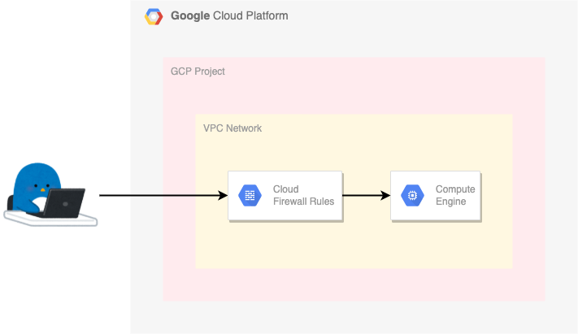

# 外部 IP アドレスがついた VM instance



## 0. 準備

+ Google Cloud に認証を通す

```
gcloud auth login --no-launch-browser -q
```

```
### Env

export _gc_pj_id='Your Google Cloud Project ID'

export _common='pkg-gcp'
export _region='asia-northeast1'
export _zone=`echo ${_region}-b`
export _sub_network_range='10.146.0.0/20'

export _my_ip='Your Home IP Address'
export _other_ip='Your other IP Address'
```

+ API を有効化

```
gcloud beta services enable compute.googleapis.com --project ${_gc_pj_id}
```

## 1. Service Account の作成

+ GCE Instance 用の Service Account の作成

```
gcloud beta iam service-accounts create ${_common}-sa \
  --description="${_common}-sa for Package GCP" \
  --display-name="${_common}-sa" \
  --project ${_gc_pj_id}
```

## 2. ネットワークの作成

+ VPC Network の作成

```
gcloud beta compute networks create ${_common}-network \
  --subnet-mode=custom \
  --project ${_gc_pj_id}
```

+ サブネットの作成
  + `限定公開の Google アクセス` を On にしておく

```
gcloud beta compute networks subnets create ${_common}-subnets \
  --network ${_common}-network \
  --region ${_region} \
  --range ${_sub_network_range} \
  --enable-private-ip-google-access \
  --project ${_gc_pj_id}
```

+ Firewall Rule の作成

```
### 内部通信は全て許可する
gcloud beta compute firewall-rules create ${_common}-allow-internal-all \
  --network ${_common}-network \
  --action ALLOW \
  --rules tcp:0-65535,udp:0-65535,icmp \
  --source-ranges ${_sub_network_range} \
  --project ${_gc_pj_id}

### SSH 用
gcloud beta compute firewall-rules create ${_common}-allow-ssh \
  --network ${_common}-network \
  --action ALLOW \
  --rules tcp:22,icmp \
  --source-ranges ${_my_ip},${_other_ip} \
  --target-service-accounts ${_common}-sa@${_gc_pj_id}.iam.gserviceaccount.com \
  --project ${_gc_pj_id}
```

+ 外部 IP Address の予約

```
gcloud beta compute addresses create ${_common}-ip \
  --region ${_region} \
  --project ${_gc_pj_id}
```

## 3. 外部 IP アドレスがついた VM instance の作成

+ GCE Instance のパブリックイメージの検索
  + https://cloud.google.com/compute/docs/images

```
### 例: Ubuntu のイメージを探すコマンド
gcloud beta compute images list --filter="name~'^ubuntu-minimal-.*?'" --project ${_gc_pj_id}
```

+ 環境変数を設定

```
export _boot_project='ubuntu-os-cloud'
export _boot_image='ubuntu-minimal-2204-jammy-v20231213b'
export _boot_size='30'

export _machine_type='e2-small'
export _vm_provisioning_model='STANDARD'   ### STANDARD/SPOT  <--- Spot VM
export _maintenance_policy='MIGRATE'       ### MIGRATE/TERMINATE
```

+ VM Instance の作成

```
gcloud beta compute instances create ${_common}-vm \
  --zone ${_zone} \
  --machine-type ${_machine_type} \
  --network-interface=address=${_common}-ip,stack-type=IPV4_ONLY,subnet=${_common}-subnets \
  --maintenance-policy ${_maintenance_policy} \
  --provisioning-model ${_vm_provisioning_model} \
  --service-account=${_common}-sa@${_gc_pj_id}.iam.gserviceaccount.com \
  --scopes=https://www.googleapis.com/auth/cloud-platform \
  --create-disk=auto-delete=yes,boot=yes,image=projects/${_boot_project}/global/images/${_boot_image},mode=rw,size=${_boot_size},type=projects/${_gc_pj_id}/zones/${_zone}/diskTypes/pd-standard \
  --shielded-secure-boot \
  --shielded-vtpm \
  --shielded-integrity-monitoring \
  --project ${_gc_pj_id}
```

## 4. VM instance に SSH ログインする

+ アカウント名を取得

```
gcloud auth list --filter=status:ACTIVE --format="value(account)"

export _account=$(gcloud auth list --filter=status:ACTIVE --format="value(account)" | awk -F\@ '{print $1}')
echo ${_account}
```

+ VM instance に SSH ログインする

```
gcloud beta compute ssh ${_account}@${_common}-vm \
  --zone ${_zone} \
  --project ${_gc_pj_id}
```
```
### 例

$ gcloud beta compute ssh ${_account}@${_common}-vm \
  --zone ${_zone} \
  --project ${_gc_pj_id}


Welcome to Ubuntu 22.04.3 LTS (GNU/Linux 6.2.0-1019-gcp x86_64)

 * Documentation:  https://help.ubuntu.com
 * Management:     https://landscape.canonical.com
 * Support:        https://ubuntu.com/advantage

This system has been minimized by removing packages and content that are
not required on a system that users do not log into.

To restore this content, you can run the 'unminimize' command.

Expanded Security Maintenance for Applications is not enabled.

0 updates can be applied immediately.

Enable ESM Apps to receive additional future security updates.
See https://ubuntu.com/esm or run: sudo pro status


The list of available updates is more than a week old.
To check for new updates run: sudo apt update

The programs included with the Ubuntu system are free software;
the exact distribution terms for each program are described in the
individual files in /usr/share/doc/*/copyright.

Ubuntu comes with ABSOLUTELY NO WARRANTY, to the extent permitted by
applicable law.

igarashi.toru@pkg-gcp-vm:~$ 
```

---> SSH ログインが出来れば成功です :)

## 99. クリーンアップ

+ VM Instance の削除

```
gcloud beta compute instances delete ${_common}-vm \
  --zone ${_zone} \
  --project ${_gc_pj_id}
```

+ 外部 IP Address の削除

```
gcloud beta compute addresses delete ${_common}-ip \
  --region ${_region} \
  --project ${_gc_pj_id}
```

+ Firewall Rule の削除

```
### 内部通信用
gcloud beta compute firewall-rules delete ${_common}-allow-internal-all \
  --project ${_gc_pj_id}

### SSH 用
gcloud beta compute firewall-rules delete ${_common}-allow-ssh \
  --project ${_gc_pj_id}
```

+ サブネットの削除

```
gcloud beta compute networks subnets delete ${_common}-subnets \
  --region ${_region} \
  --project ${_gc_pj_id}
```

+ VPC Network の削除

```
gcloud beta compute networks delete ${_common}-network \
  --project ${_gc_pj_id}
```

+ Service Account の削除

```
gcloud beta iam service-accounts delete ${_common}-sa@${_gc_pj_id}.iam.gserviceaccount.com \
  --project ${_gc_pj_id}
```
