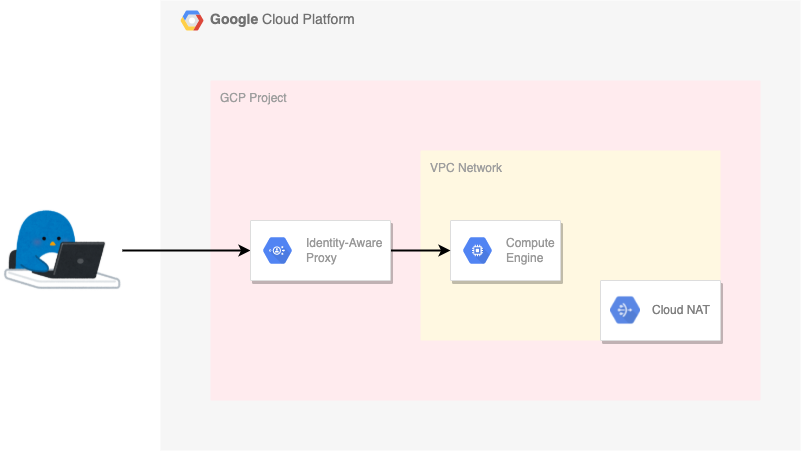

# 外部 IP アドレスがついていない VM instance



参考ドキュメント

[Setting up IAP for Compute Engine](https://cloud.google.com/iap/docs/tutorial-gce)

[Enabling IAP for Compute Engine](https://cloud.google.com/iap/docs/enabling-compute-howto)

## Prepare command

+ gcloud

## Prepare env

+ Auth GCP

```
gcloud auth login -q
```

## Create Instance

+ Setting env

```
export _gcp_pj_id='Your GCP Project ID'

export _common='pkg-gcp-gce'
export _region='asia-northeast1'
export _sub_network_range='10.146.0.0/20'
```

+ Create VPC Network

```
gcloud beta compute networks create ${_common}-network \
  --subnet-mode=custom \
  --project ${_gcp_pj_id}
```

+ Create Subnet

```
gcloud beta compute networks subnets create ${_common}-subnets \
  --network ${_common}-network \
  --region ${_region} \
  --range ${_sub_network_range} \
  --enable-private-ip-google-access \
  --project ${_gcp_pj_id}
```

+ Create Firewall Rules

```
### Allow ALL Traffic inside the VPC Network
gcloud beta compute firewall-rules create ${_common}-allow-internal-all \
  --network ${_common}-network \
  --action ALLOW \
  --rules tcp:0-65535,udp:0-65535,icmp \
  --source-ranges ${_sub_network_range} \
  --project ${_gcp_pj_id}

### Allow Traffic from IAP
gcloud beta compute firewall-rules create ${_common}-allow-iap \
  --network ${_common}-network \
  --action ALLOW \
  --rules tcp:22 \
  --source-ranges 35.235.240.0/20 \
  --target-tags ${_common}-allow-iap \
  --project ${_gcp_pj_id}

### Allow Traffic from GCLB
gcloud beta compute firewall-rules create ${_common}-allow-lb \
  --network ${_common}-network \
  --action ALLOW \
  --rules tcp:80 \
  --source-ranges 35.191.0.0/16,130.211.0.0/22 \
  --target-tags ${_common}-allow-lb \
  --project ${_gcp_pj_id}
```

+ Create Cloud NAT

```
### External IP Address
gcloud beta compute addresses create ${_common}-nat-ip \
  --region ${_region} \
  --project ${_gcp_pj_id}

### Cloud Router
gcloud beta compute routers create ${_common}-nat-router \
  --network ${_common}-network \
  --region ${_region} \
  --project ${_gcp_pj_id}

### Cloud NAT
gcloud beta compute routers nats create ${_common}-nat \
  --router-region ${_region} \
  --router ${_common}-nat-router \
  --nat-all-subnet-ip-ranges \
  --nat-external-ip-pool ${_common}-nat-ip \
  --project ${_gcp_pj_id}
```

+ Create Service Account of VM

```
gcloud beta iam service-accounts create ${_common} \
  --display-name ${_common} \
  --project ${_gcp_pj_id}
```

+ Add Role to Service Account of VM

```
### WIP
# gcloud beta projects add-iam-policy-binding ${_gcp_pj_id} \
#   --member="serviceAccount:${_common}@${_gcp_pj_id}.iam.gserviceaccount.com" \
#   --role=roles/cloudsql.admin
```

+ Create Instance of Do Not Having External IP Addresss

```
export _my_machine_type='e2-medium'
export _boot_disk='30'

export _my_os_pj='ubuntu-os-cloud'
export _my_os='ubuntu-2104-hirsute-v20211119'
```
```
gcloud beta compute instances create ${_common}-vm \
  --zone ${_region}-b \
  --machine-type ${_my_machine_type} \
  --network-interface=subnet=${_common}-subnets,no-address \
  --tags=${_common}-allow-iap,${_common}-allow-lb \
  --service-account=${_common}@${_gcp_pj_id}.iam.gserviceaccount.com \
  --scopes https://www.googleapis.com/auth/cloud-platform \
  --image-project ${_my_os_pj} \
  --image ${_my_os} \
  --boot-disk-size ${_boot_disk} \
  --shielded-secure-boot \
  --project ${_gcp_pj_id}
```

+ Check User Role
  + IAP-secured Web App User ( `roles/iap.httpsResourceAccessor` )
  + Compute OS Login ( `roles/compute.osLogin` )
  + Compute Instance Admin (v1) ( `roles/compute.instanceAdmin.v1` ) / Compute Instance Admin (beta) ( `roles/compute.instanceAdmin` )
  + Service Account User ( `roles/iam.serviceAccountUser` )

```
gcloud beta projects get-iam-policy ${_gcp_pj_id}
```

+ Login to VM
  + ref: WIP

```
gcloud beta compute ssh $(gcloud auth list --filter=status:ACTIVE --format="value(account)" | awk -F\@ '{print $1}')@${_common}-vm \
  --tunnel-through-iap \
  --zone ${_region}-b \
  --project ${_gcp_pj_id}
```

## Delete All

+ Delete instance

```
gcloud beta compute instances delete ${_common}-vm --zone ${_region}-b --project ${_gcp_pj_id} -q
```

+ Delete Service Account

```
gcloud beta iam service-accounts delete ${_common}@${_gcp_pj_id}.iam.gserviceaccount.com \
  --project ${_gcp_pj_id} -q
```

+ Create Cloud NAT

```
gcloud beta compute routers nats delete ${_common}-nat \
  --router-region ${_region} \
  --router ${_common}-nat-router \
  --project ${_gcp_pj_id} -q

gcloud beta compute routers delete ${_common}-nat-router \
  --region ${_region} \
  --project ${_gcp_pj_id} -q

gcloud beta compute addresses delete ${_common}-nat-ip \
  --region ${_region} \
  --project ${_gcp_pj_id} -q
```

+ Delete Firewall Rules

```
gcloud beta compute firewall-rules delete ${_common}-allow-internal-all \
  --project ${_gcp_pj_id} -q


gcloud beta compute firewall-rules delete ${_common}-allow-iap \
  --project ${_gcp_pj_id} -q


gcloud beta compute firewall-rules delete ${_common}-allow-lb \
  --project ${_gcp_pj_id} -q
```

+ Delete subnet

```
gcloud beta compute networks subnets delete ${_common}-subnets \
  --region ${_region} \
  --project ${_gcp_pj_id} -q
```

+ Delete VPC network

```
gcloud beta compute networks delete ${_common}-network \
  --project ${_gcp_pj_id} -q
```


That's all :)
