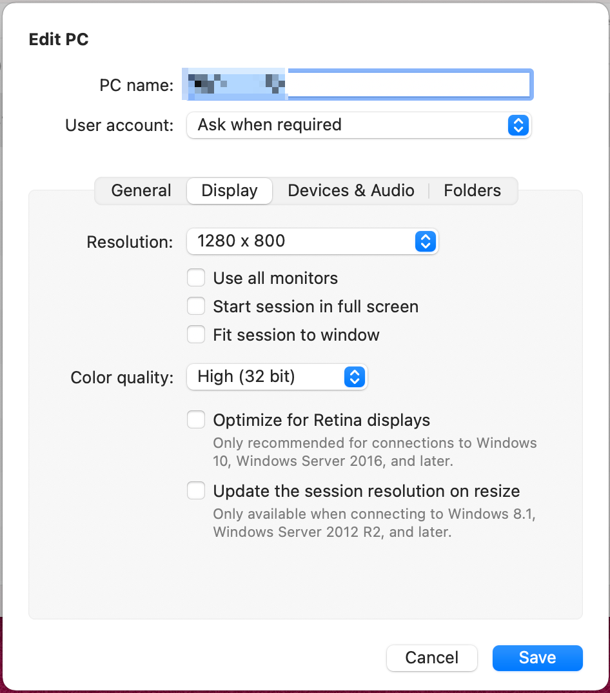
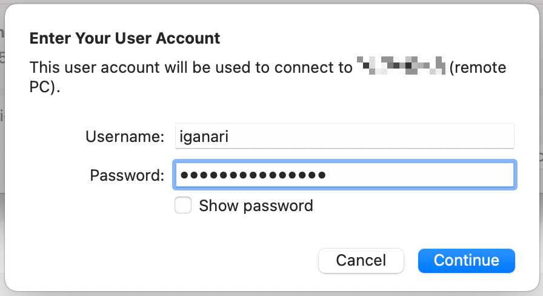
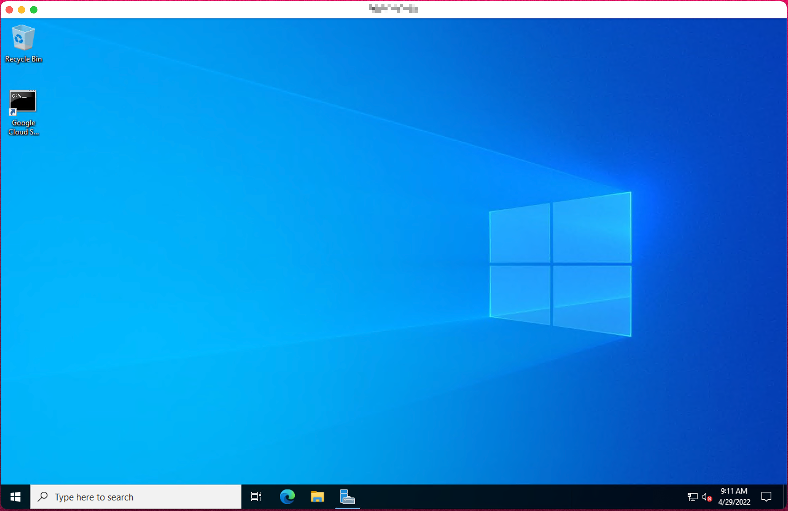
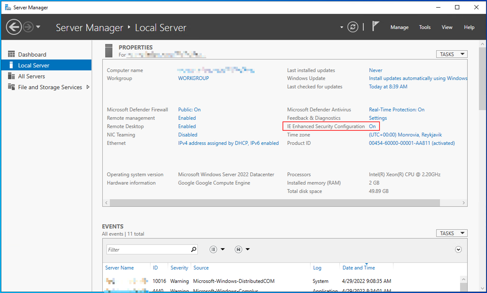
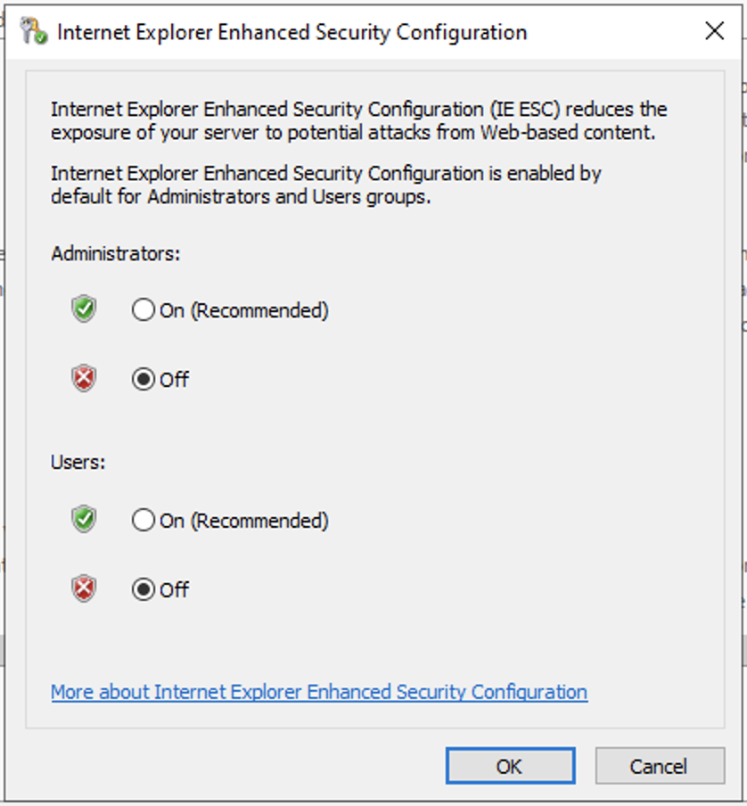
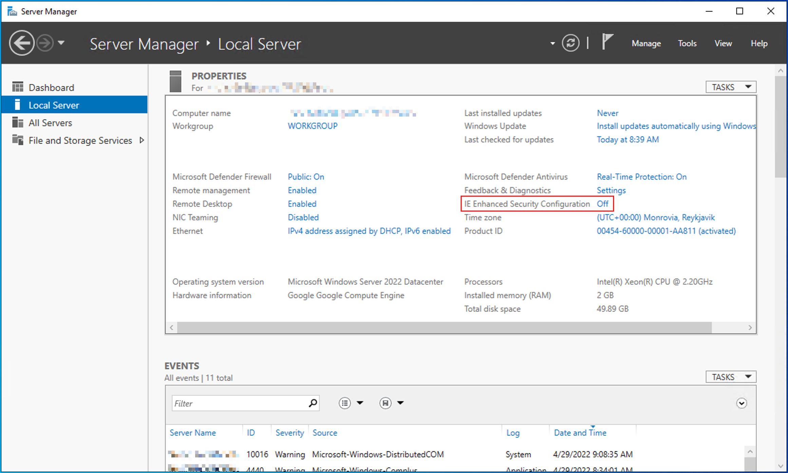

# VM Instance で Windows を作る

## VM Instance 作成

+ GCP と認証する

```
gcloud auth application-default login --no-launch-browser -q
```

```
### Env
export _gcp_pj_id='Your GCP Project ID'

export _common='pkg-gcp'
export _region='asia-northeast1'
export _sub_network_range='172.16.0.0/12'
export _my_ip='Your Home IP'
export _bastion_vm_ip='xxx.xxx.xxx.xxx'
```

+ API を enable

```
gcloud beta services enable compute.googleapis.com --project ${_gcp_pj_id}
```

+ VPC Network の作成

```
gcloud beta compute networks create ${_common}-network \
  --subnet-mode=custom \
  --project ${_gcp_pj_id}
```

+ サブネットの作成

```
gcloud beta compute networks subnets create ${_common}-subnets \
  --network ${_common}-network \
  --region ${_region} \
  --enable-private-ip-google-access \
  --range ${_sub_network_range} \
  --project ${_gcp_pj_id}
```

+ Firewall

```
### 内部通信
gcloud beta compute firewall-rules create ${_common}-allow-internal-all \
  --network ${_common}-network \
  --action ALLOW \
  --rules tcp:0-65535,udp:0-65535,icmp \
  --source-ranges ${_sub_network_range} \
  --target-tags ${_common}-allow-internal-all \
  --project ${_gcp_pj_id}

### RDP
gcloud beta compute firewall-rules create ${_common}-allow-rdp \
  --network ${_common}-network \
  --action ALLOW \
  --rules tcp:3389,icmp \
  --source-ranges ${_my_ip},${_bastion_vm_ip} \
  --target-tags ${_common}-allow-rdp \
  --project ${_gcp_pj_id}
```

+ IP Address の予約

```
gcloud beta compute addresses create ${_common}-ip \
  --region ${_region} \
  --project ${_gcp_pj_id}
```

+ VM Instance の作成
  + デスクトップが重くなるので、普通くらいのインスタンスタイプ `e2-standard-2` を使用している

```
export _vm_image_pj='windows-cloud'
export _vm_image='windows-server-2022-dc-v20230216'
export _vm_type='e2-standard-2'
export _vm_boot_size='50GB'

gcloud beta compute instances create ${_common}-vm \
  --zone ${_region}-b \
  --machine-type ${_vm_type} \
  --subnet ${_common}-subnets \
  --address ${_common}-ip \
  --tags=${_common}-allow-internal-all,${_common}-allow-rdp \
  --image ${_vm_image} \
  --image-project ${_vm_image_pj} \
  --boot-disk-size ${_vm_boot_size} \
  --project ${_gcp_pj_id}
```

## Windows のログインパスワードを作成

+ gcloud コマンドにて作成
  + https://cloud.google.com/compute/docs/instances/windows/generating-credentials#gcloud

```
export _user_name='iganari'

gcloud beta compute reset-windows-password ${_common}-vm \
  --zone ${_region}-b \
  --user ${_user_name} \
  --project ${_gcp_pj_id} \
  -q
```
```
### 例

$ gcloud beta compute reset-windows-password ${_common}-vm \
  --zone ${_region}-b \
  --user iganari \
  --project ${_gcp_pj_id} \
  -q

Resetting and retrieving password for [iganari] on [your_gce_instance_name]
Updated [https://www.googleapis.com/compute/beta/projects/your_gcp_pj_id/zones/asia-northeast1-b/instances/your_gce_instance_name].
ip_address: your_external_ip_address
password:   your_rdp_password
username:   iganari
```

## RDP でログイン

やること | スクリーンショット
:- | :-
RDP 接続 | 
ユーザ、パスワード | 
ログイン成功 | 

## memo

+ IE Security を停止

<details>
<summary>Details</summary>

Server Manager を確認 | 
IE Enhanced Security Configuration で off にする| 
Server Manager を確認 | 

</details>
