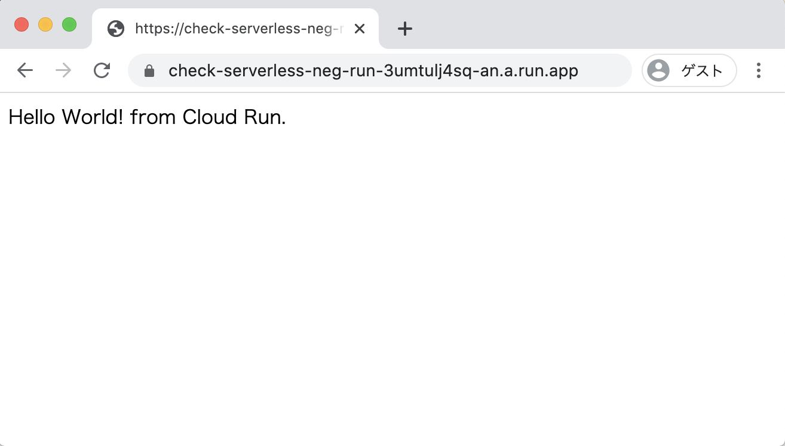
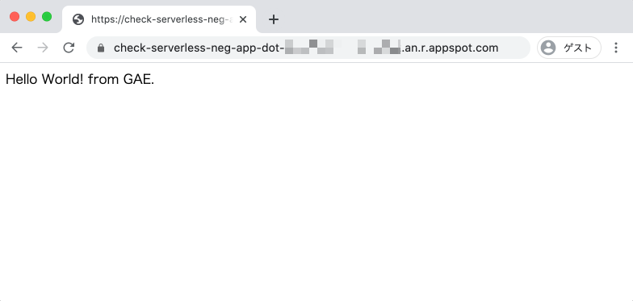

# Serverless NEG

## Document

Serverless network endpoint groups overview

+ https://cloud.google.com/load-balancing/docs/negs/serverless-neg-concepts

Setting up serverless NEGs

+ https://cloud.google.com/load-balancing/docs/negs/setting-up-serverless-negs?hl=en

## Prepare gcloud command

+ GCP authentication.

```
gcloud auth login -q
```

+ Setting GCP Project on Console.

```
### New Setting
export _pj_id='Your GCP Project ID'
export _common='check-serverless-neg'

### export _pj_id='ca-igarashi-test-v5v2'
```
```
gcloud config set project ${_pj_id}
```

## Create Sample Cloud Run

+ Official Document
  + https://cloud.google.com/run/docs/quickstarts/build-and-deploy?hl=en

+ Build your container image using Cloud Build

```
cd cloudrun
gcloud builds submit --tag gcr.io/${_pj_id}/${_common}-run
```

+ Deploy to Cloud Run

```
gcloud run deploy ${_common}-run \
    --image gcr.io/${_pj_id}/${_common}-run \
    --platform managed \
    --region asia-northeast1 \
    --allow-unauthenticated
```
```
### Ex.

# gcloud run deploy ${_common}-run \
>     --image gcr.io/${_pj_id}/${_common}-run \
>     --platform managed \
>     --region asia-northeast1 \
>     --allow-unauthenticated
Deploying container to Cloud Run service [check-serverless-neg-run] in project [ca-igarashi-test-v5v2] region [asia-northeast1]
✓ Deploying new service... Done.
  ✓ Creating Revision...
  ✓ Routing traffic...
  ✓ Setting IAM Policy...
Done.
Service [check-serverless-neg-run] revision [check-serverless-neg-run-00001-lut] has been deployed and is serving 100 percent of traffic at https://check-serverless-neg-run-3umtulj4sq-an.a.run.app
```

+ Check Web Blawser

```
---> https://check-serverless-neg-run-3umtulj4sq-an.a.run.app
```



```
cd -
```

## Create Sample Google App Engine

+ Official Document
  + https://cloud.google.com/appengine/docs/standard/python3/quickstart

```
cd appengine
```

+ Create yaml from sample

```
cat app.yaml.sample | sed "s/YOUR_SERVICE/${_common}-app/g" > app.yaml
```

+ Deploy App Engine

```
gcloud app deploy
```

+ Check App Engine URL

```
gcloud app browse -s ${_common}-app
```
```
### Ex.

# gcloud app browse -s ${_common}-app
Did not detect your browser. Go to this link to view your app:
https://check-serverless-neg-app-dot-[~~~~~~~~~~].an.r.appspot.com
```



```
cd -
```

## Prepare External IP Address

+ Reserving an External IP Address

```
gcloud compute addresses create ${_common}-example-ip \
    --ip-version=IPV4 \
    --global
```

+ Check External IP Address

```
gcloud compute addresses describe ${_common}-example-ip \
    --format="get(address)" \
    --global
```
```
### Ex.

# gcloud compute addresses describe ${_common}-example-ip \
>     --format="get(address)" \
>     --global
34.107.216.140
```

## Creating the External HTTP(S) Load Balancer

+ Create Cloud Run's Serverless NEG 

```
gcloud beta compute network-endpoint-groups create ${_common}-serverless-neg-run \
    --region=asia-northeast1 \
    --network-endpoint-type=SERVERLESS  \
    --cloud-run-service=${_common}-run
```

+ Create App Engine's Serverless NEG 

```
gcloud beta compute network-endpoint-groups create ${_common}-serverless-neg-app \
    --region=asia-northeast1 \
    --network-endpoint-type=SERVERLESS  \
    --app-engine-service=${_common}-app
```

+ Check network-endpoint-groups
  + :warning: Right now, we can't see Serverless NEG in the console

```
gcloud beta compute network-endpoint-groups list
```
```
### Ex.

# gcloud beta compute network-endpoint-groups list
NAME                                     LOCATION         ENDPOINT_TYPE  SIZE
check-serverless-neg-serverless-neg-app  asia-northeast1  SERVERLESS     0
check-serverless-neg-serverless-neg-run  asia-northeast1  SERVERLESS     0
```

+ Create backend service

```
gcloud compute backend-services create ${_common}-backend-service-app \
    --global
```
```
gcloud compute backend-services create ${_common}-backend-service-run \
    --global
```

+ Check Backend Service

```
gcloud compute backend-services list
```
```
### Ex.

# gcloud compute backend-services list
NAME                                      BACKENDS  PROTOCOL
check-serverless-neg-backend-service-app            HTTP
check-serverless-neg-backend-service-run            HTTP
```

+ Add the serverless NEG as a backend to the backend service

```
gcloud beta compute backend-services add-backend ${_common}-backend-service-run \
    --global \
    --network-endpoint-group=${_common}-serverless-neg-run \
    --network-endpoint-group-region=asia-northeast1
```
```
gcloud beta compute backend-services add-backend ${_common}-backend-service-app \
    --global \
    --network-endpoint-group=${_common}-serverless-neg-app \
    --network-endpoint-group-region=asia-northeast1
```

+ Check

```
gcloud compute backend-services list
```
```
### Ex.

# gcloud compute backend-services list
NAME                                      BACKENDS                                                                       PROTOCOL
check-serverless-neg-backend-service-app  asia-northeast1/networkEndpointGroups/check-serverless-neg-serverless-neg-app  HTTP
check-serverless-neg-backend-service-run  asia-northeast1/networkEndpointGroups/check-serverless-neg-serverless-neg-run  HTTP
```


+ Create a URL map
  + to route incoming requests to the check-serverless-neg-backend-service backend service

```
gcloud compute url-maps create ${_common}-url-map \
    --default-service ${_common}-backend-service-run
```
```
gcloud compute url-maps add-path-matcher ${_common}-url-map \
    --path-matcher-name=${_common}-path-matcher \
    --path-rules "/app=check-serverless-neg-backend-service-app" \
    --default-service=check-serverless-neg-backend-service-run
```

+ Check URL Map

```
gcloud compute url-maps list
```
```
### Ex.

# gcloud compute url-maps list
NAME                          DEFAULT_SERVICE
check-serverless-neg-url-map  backendServices/check-serverless-neg-backend-service-run
```

## create cert

+ To create a Google-managed SSL certificate resource called www-ssl-cert

```
export _my_domain=$(echo ${_common}.hejda.org)
```
```
gcloud compute ssl-certificates create ${_common}-www-ssl-cert \
    --domains ${_my_domain}
```

+ Check 

```
gcloud compute ssl-certificates list
```
```
### Ex.

# gcloud compute ssl-certificates list
NAME                               TYPE     CREATION_TIMESTAMP             EXPIRE_TIME  MANAGED_STATUS
check-serverless-neg-www-ssl-cert  MANAGED  2020-07-26T00:35:54.246-07:00               PROVISIONING
    check-serverless-neg.hejda.org: PROVISIONING
```


:warning: サブ自分で設定しておく -> 先にやっていおく


+ Create a target HTTPS proxy to route requests to your URL map

```
gcloud compute target-https-proxies create ${_common}-https-proxy \
    --ssl-certificates=${_common}-www-ssl-cert \
    --url-map=${_common}-url-map
```

+ Create a global forwarding rule to route incoming requests to the proxy

```
gcloud compute forwarding-rules create ${_common}-https-content-rule \
    --address=${_common}-example-ip \
    --target-https-proxy=${_common}-https-proxy \
    --global \
    --ports=443
```

+ Check global forwarding rule

```
gcloud compute forwarding-rules list
```
```
### Ex.

# gcloud compute forwarding-rules list
NAME                                     REGION  IP_ADDRESS      IP_PROTOCOL  TARGET
check-serverless-neg-https-content-rule          34.107.216.140  TCP          check-serverless-neg-https-proxy
```

## Check Web blawser


## Delete Resource

```
gcloud compute forwarding-rules delete ${_common}-https-content-rule --global
```
```
gcloud compute target-https-proxies delete ${_common}-https-proxy
```

```
gcloud compute ssl-certificates delete ${_common}-www-ssl-cert 
```
```
gcloud compute url-maps delete ${_common}-url-map 
```
```
gcloud compute backend-services delete ${_common}-backend-service \
    --global
```
```

gcloud beta compute network-endpoint-groups delete ${_common}-serverless-neg \
    --region=asia-northeast1 
```

```
gcloud compute addresses delete ${_common}-example-ip \
    --global
```


WIP


