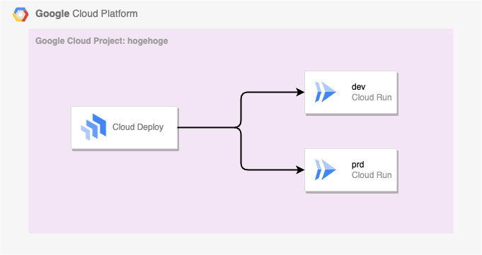

# Cloud Deploy

## 概要

```
Google Cloud Deploy の概要
https://cloud.google.com/deploy/docs/overview
```
```
クイックスタート: アプリケーションをデプロイする
https://cloud.google.com/deploy/docs/deploy-app-gke
```


## API の有効化

```
export _gcp_pj_id='Your GC Project ID'

gcloud beta services enable clouddeploy.googleapis.com --project ${_gcp_pj_id}
```

## コンテンツ

### [Google Cloud Deploy を使用してアプリを Cloud Run にデプロイする](./quickstart-deploy-app-run)



### Google Cloud Deploy を使用してアプリを複数の Google Cloud Project の Cloud Run にデプロイする

ハンズオンレポ


## Youtube

```
Cloud Deploy で始める継続的デリバリーの継続的改善
https://www.youtube.com/watch?v=0cB4Di8-ffE
```
