# Google Cloud Deploy を使用してアプリを Cloud Run にデプロイする

## 概要

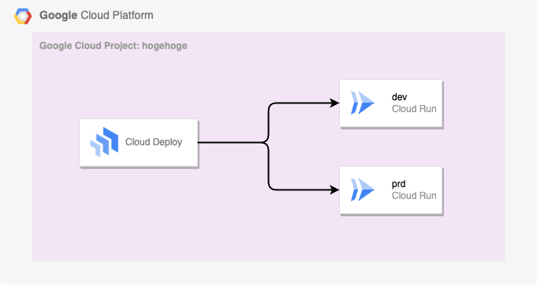

Cloud Deploy の公式クイックスタートを少しアレンジしてまとめてます

+ 変更点は以下
  + Service Account がデフォルトで作成されている Service Account を使用するようになっているので、セキュアになるように Service Account を別途用意する

```
Google Cloud Deploy を使用してアプリを Cloud Run にデプロイする
https://cloud.google.com/deploy/docs/deploy-app-run
```

## やってみる

## 1. API の有効化

+ 環境変数の設定をする

```
### GC Project ID を設定しておく
export _gcp_pj_id='Your Google Cloud Project ID'


### 共通の文言を設定しておく
export _common='pkg-gcp-deploy'
export _region='asia-northeast1'
```

+ Cloud Deploy の API を有効化する

```
gcloud beta services enable clouddeploy.googleapis.com --project ${_gcp_pj_id}
gcloud beta services enable run.googleapis.com --project ${_gcp_pj_id}
```

## 2. Service Account の作成

+ Cloud Deploy 用の Service Account を作成する

```
gcloud beta iam service-accounts create ${_common}-sa-deploy \
  --description="Cloud Deploy 用" \
  --display-name="${_common}-sa-deploy" \
  --project ${_gcp_pj_id}
```

+ 上記で作成した Service Account に以下の Role を付与する
  + Role: **Cloud Deploy Runner**( `roles/clouddeploy.jobRunner` )
  + Role: **Service Account User**( `roles/iam.serviceAccountUser` )
  + Role: **Cloud Run Developer**( `roles/run.developer` )

```
### Cloud Deploy Runner
gcloud beta projects add-iam-policy-binding ${_gcp_pj_id} \
  --member="serviceAccount:${_common}-sa-deploy@${_gcp_pj_id}.iam.gserviceaccount.com" \
  --role="roles/clouddeploy.jobRunner"

### Service Account User
gcloud beta projects add-iam-policy-binding ${_gcp_pj_id} \
  --member="serviceAccount:${_common}-sa-deploy@${_gcp_pj_id}.iam.gserviceaccount.com" \
  --role="roles/iam.serviceAccountUser"

### Cloud Run Developer
gcloud beta projects add-iam-policy-binding ${_gcp_pj_id} \
  --member="serviceAccount:${_common}-sa-deploy@${_gcp_pj_id}.iam.gserviceaccount.com" \
  --role="roles/run.developer"
```

+ Cloud Run 用の Service Account を作成する

```
gcloud beta iam service-accounts create ${_common}-sa-run \
  --description="Cloud Run 用" \
  --display-name="${_common}-sa-run" \
  --project ${_gcp_pj_id}
```

## 3. Skaffold の設定ファイルの作成

+ Google Cloud Deploy 用の Skaffold の設定ファイルの作成する
  + ファイルネームは `${_common}-skaffold.yaml`
  + 記載方法などは https://cloud.google.com/deploy/docs/using-skaffold/getting-started-skaffold を参照

```
cat << __EOF__ > ${_common}-skaffold.yaml
apiVersion: skaffold/v3alpha1
kind: Config
metadata: 
  name: ${_common}
profiles:
- name: dev
  manifests:
    rawYaml:
    - ${_common}-dev.yaml
- name: prd
  manifests:
    rawYaml:
    - ${_common}-prd.yaml
deploy:
  cloudrun: {}

__EOF__
```

## 4. Cloud Run サービスの準備

+ Cloud Run のサービスの設定ファイルを作成する
  + 書き方の詳細は [Cloud Run YAML Reference](https://cloud.google.com/run/docs/reference/yaml/v1) を参照

+ Dev の Cloud Run のサービス用の設定ファイル

```
cat << __EOF__ > ${_common}-dev.yaml
apiVersion: serving.knative.dev/v1
kind: Service
metadata:
  name: ${_common}-dev
spec:
  template:
    metadata:
      annotations:
        autoscaling.knative.dev/minScale: 0
        autoscaling.knative.dev/maxScale: 2
    spec:
      serviceAccountName: ${_common}-sa-run@${_gcp_pj_id}.iam.gserviceaccount.com
      containers:
      - image: ${_common}-app-image
        resources:
          limits:
            cpu: 1
            memory: 1Gi

__EOF__
```

+ Prd の Cloud Run のサービス用の設定ファイル

```
cat << __EOF__ > ${_common}-prd.yaml
apiVersion: serving.knative.dev/v1
kind: Service
metadata:
  name: ${_common}-prd
spec:
  template:
    metadata:
      annotations:
        autoscaling.knative.dev/minScale: 0
        autoscaling.knative.dev/maxScale: 5
    spec:
      serviceAccountName: ${_common}-sa-run@${_gcp_pj_id}.iam.gserviceaccount.com
      containers:
      - image: ${_common}-app-image

__EOF__
```

## 5. デリバリーパイプラインとターゲットの作成

### 5-1. Cloud Deploy の設定ファイル

+ Cloud Deploy 自体の設定ファイルを作成する
  + 書き方の詳細は [Delivery pipeline and target configuration](https://cloud.google.com/deploy/docs/config-files) を参照

```
cat << __EOF__ > ${_common}-clouddeploy.yaml
apiVersion: deploy.cloud.google.com/v1
kind: DeliveryPipeline
metadata:
  name: ${_common}-pipeline
description: "main application pipeline"
serialPipeline:
  stages:
  - targetId: run-dev
    profiles: [dev]
  - targetId: run-prd
    profiles: [prd]
---

apiVersion: deploy.cloud.google.com/v1
kind: Target
metadata:
  name: run-dev
description: "Cloud Run development service"
requireApproval: false
run:
  location: projects/${_gcp_pj_id}/locations/${_region}
executionConfigs:
- usages:
  - RENDER
  - DEPLOY
  - VERIFY
  serviceAccount: ${_common}-sa-deploy@${_gcp_pj_id}.iam.gserviceaccount.com
  executionTimeout: 7200s
---

apiVersion: deploy.cloud.google.com/v1
kind: Target
metadata:
  name: run-prd
description: "Cloud Run production service"
requireApproval: true
run:
  location: projects/${_gcp_pj_id}/locations/${_region}
executionConfigs:
- usages:
  - RENDER
  - DEPLOY
  - VERIFY
  serviceAccount: ${_common}-sa-deploy@${_gcp_pj_id}.iam.gserviceaccount.com
  executionTimeout: 7200s
__EOF__
```

### 5-2. Cloud Deploy のサービスに登録

+ パイプラインとターゲットを Google Cloud Deploy サービスに登録( デプロイ )する

```
gcloud beta deploy apply \
  --file ${_common}-clouddeploy.yaml \
  --region ${_region} \
  --project ${_gcp_pj_id}
```

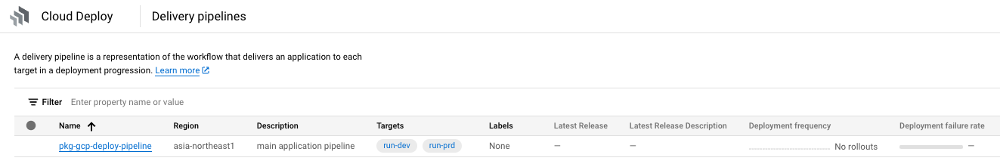

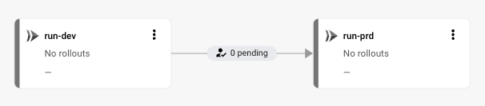

### 5-3. 注意点

Cloud Run の spec などを修正した場合は `${_common}-clouddeploy.yaml` をデプロイする必要がある

仮に差分が無い場合でもエラーは出ないので、毎回実施しても問題は無さそう

## 6. リリースパイプラインを作成

### 6-1. Cloud Deploy のリリースパイプラインを作成

+ リリースパイプラインを作成する
  + :fire: リリースパイプラインはユニークである必要があるため suffix に時間をつける

```
export _first_time=`date +"%Y%m%d%H%M"`
```
```
gcloud beta deploy releases create release-pipeline-${_first_time} \
  --skaffold-file ${_common}-skaffold.yaml \
  --delivery-pipeline ${_common}-pipeline \
  --images=${_common}-app-image=gcr.io/cloudrun/hello \
  --region ${_region} \
  --project ${_gcp_pj_id}
```

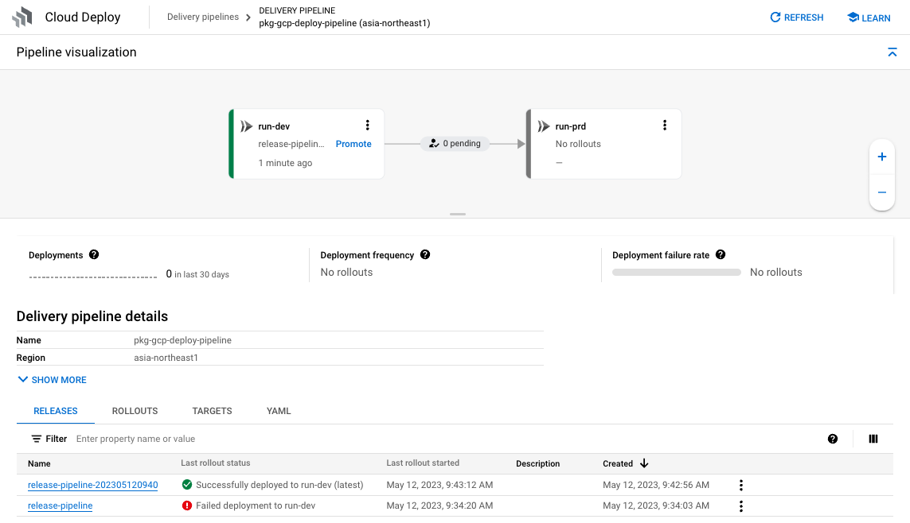


### 6-2. Cloud Run を確認

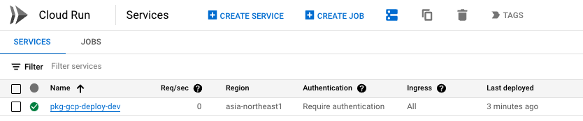

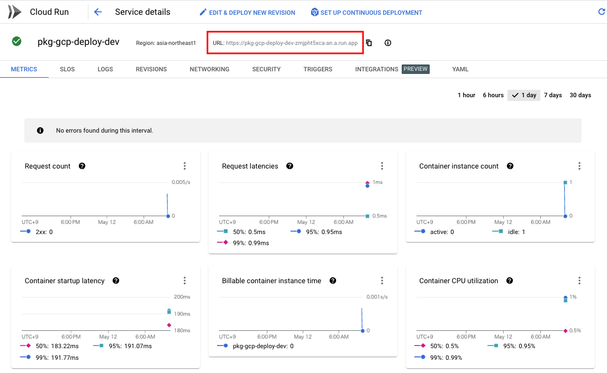


+ 開発者の Google アカウントに Role: **Cloud Run Invoker** を付与する

```
export _dev_account='Develoer Account Email'
```
```
gcloud beta run services add-iam-policy-binding ${_common}-dev \
  --region ${_region} \
  --member="user:${_dev_account}" \
  --role='roles/run.invoker' \
  --project ${_gcp_pj_id}
```

### 6-3. 

:warning: ここの作業は開発者がやる作業です。詳しくは [Cloud Run を ID トークンによる簡易認証で見てみる](https://iganari.hatenablog.com/entry/2022/02/12/173547) を参照してください

+ 開発者の ID トークンの確認をする

```
gcloud beta auth print-identity-token ${_dev_account}
```
```
$ gcloud beta auth print-identity-token ${_dev_account}
xxxxxxxxxxxxxxxxxx
```

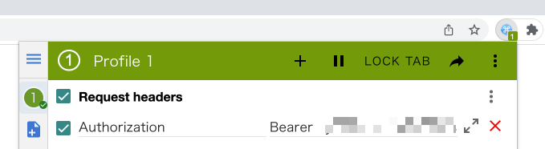

+ 開発者の Web ブラウザで Cloud Run を確認する

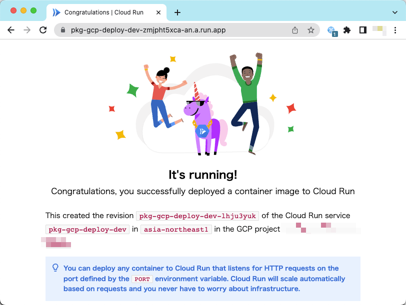

## 7. リリースパイプラインを昇格する

### 7-1. 本番環境に昇格

6 の工程で開発環境の Cloud Run に問題が無ければ、本番環境の Cloud Run に昇格( プロモート )する

ただし、ワークフローのように **承認が必要** な設定をしている( 設定は `${_common}-clouddeploy.yaml` のところの `requireApproval` )

```
gcloud beta deploy releases promote \
  --release release-pipeline-${_first_time} \
  --delivery-pipeline ${_common}-pipeline \
  --region ${_region} \
  --to-target run-prd \
  --project ${_gcp_pj_id}
```
```
### 例

$ gcloud beta deploy releases promote \
  --release release-pipeline-${_first_time} \
  --delivery-pipeline ${_common}-pipeline \
  --region ${_region} \
  --to-target run-prd \
  --project ${_gcp_pj_id}

Promoting release release-pipeline-202305120940 to target run-prd.

Do you want to continue (Y/n)?  Y

Creating rollout projects/xxxxxxxxxxxx/locations/asia-northeast1/deliveryPipelines/pkg-gcp-deploy-pipeline/releases/release-pipeline-202305120940/rollouts/release-pipeline-202305120940-to-run-prd-0001 in target run-prd
Waiting for rollout creation operation to complete...done.                                                                                                                                                                     
The rollout is pending approval.
```

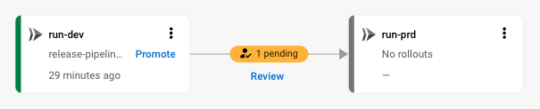

### 7-2. Web ブラウザ上で昇格作業をする

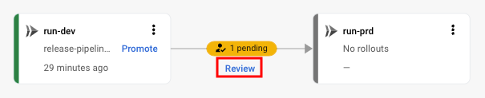

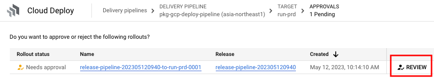

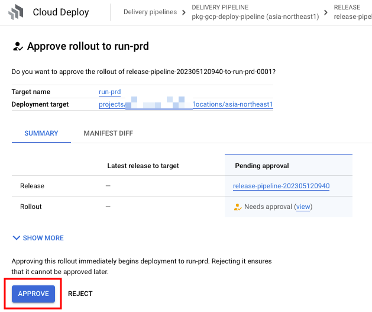

### 7-3. 本番環境にデプロイが実施される

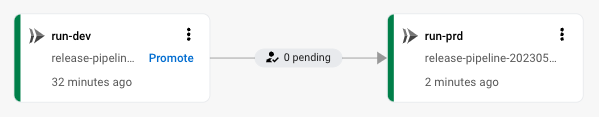

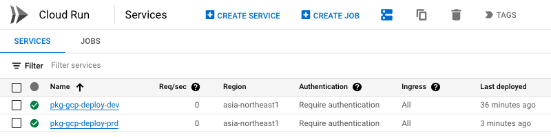

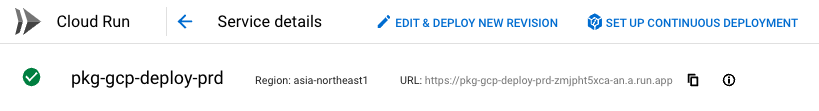


## 8. 本番環境の Cloud Run の確認

Cloud Run に初めてデプロイする場合は Auth の設定をする必要がある

本番環境は一般公開の設定をする

+ `allUsers` に Role: **Cloud Run Invoker** を付与する

```
gcloud beta run services add-iam-policy-binding ${_common}-prd \
  --region ${_region} \
  --member="allUsers" \
  --role="roles/run.invoker" \
  --project ${_gcp_pj_id}
```

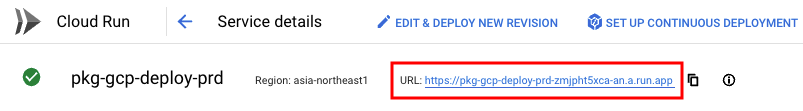

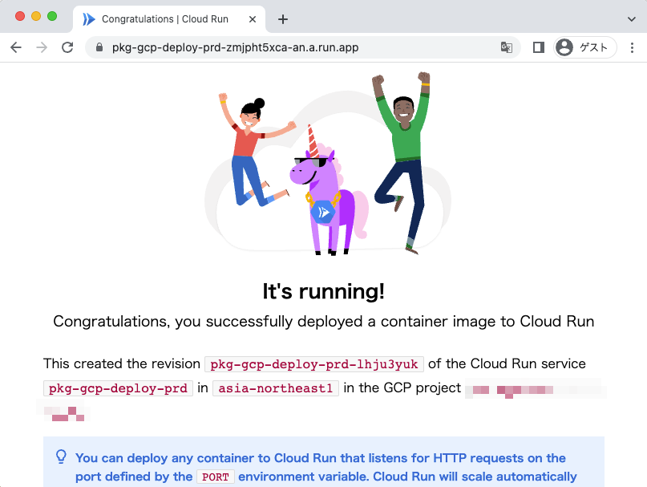

---> これで本番環境にもデプロイ出来ました :)

## 99. クリーンアップ

<details>
<summary>Details</summary>

Cloud Run のサービスを削除

```
### Dev の Cloud Run
gcloud beta run services delete ${_common}-dev \
  --region ${_region} \
  --project ${_gcp_pj_id} \
  -q

### Prd の Cloud Run
gcloud beta run services delete ${_common}-prd \
  --region ${_region} \
  --project ${_gcp_pj_id} \
  -q
```

+ Cloud Deploy のリソースを削除
  + デリバリー パイプライン、ターゲット、リリース、ロールアウト

```
gcloud beta deploy delete \
  --file ${_common}-clouddeploy.yaml \
  --region ${_region} \
  --project ${_gcp_pj_id} \
  --force
```

+ 手元の設定ファイルの削除

```
rm -i ${_common}-dev.yaml
rm -i ${_common}-prd.yaml
rm -i ${_common}-clouddeploy.yaml
rm -i ${_common}-skaffold.yaml
```

+ Role の削除

```
gcloud beta projects remove-iam-policy-binding ${_gcp_pj_id} \
  --member="serviceAccount:${_common}-sa-deploy@${_gcp_pj_id}.iam.gserviceaccount.com" \
  --role="roles/clouddeploy.jobRunner"


gcloud beta projects remove-iam-policy-binding ${_gcp_pj_id} \
  --member="serviceAccount:${_common}-sa-deploy@${_gcp_pj_id}.iam.gserviceaccount.com" \
  --role="roles/iam.serviceAccountUser"


gcloud beta projects remove-iam-policy-binding ${_gcp_pj_id} \
  --member="serviceAccount:${_common}-sa-deploy@${_gcp_pj_id}.iam.gserviceaccount.com" \
  --role="roles/run.developer"
```


+ Service Account の削除

```
gcloud beta iam service-accounts delete ${_common}-sa-deploy@${_gcp_pj_id}.iam.gserviceaccount.com \
  --project ${_gcp_pj_id} \
  -q

gcloud beta iam service-accounts delete ${_common}-sa-run@${_gcp_pj_id}.iam.gserviceaccount.com \
  --project ${_gcp_pj_id} \
  -q
```

</details>
