# Windows Server から Filestore をマウントする

## 公式ドキュメント

https://cloud.google.com/filestore/docs/mounting-fileshares#windows

## 概要

同じ Zone 、異なる Zone の合計 3 つの VM instances から、1 つの Filestore をマウントします 

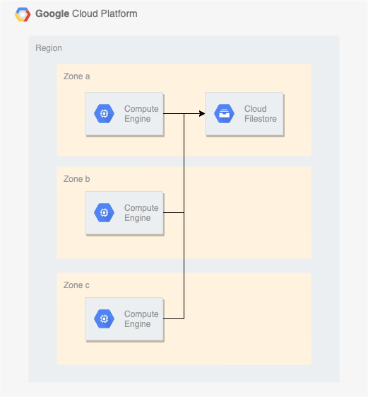

## 環境変数

```
### 環境変数
export _gcp_pj_id='Your GCP Project ID'
export _my_ip='Your IP Address of Home'
export _common='mount-win'
export _region='asia-northeast1'
```

## GCP との認証

```
gcloud auth login -q
```

## ネットワークの作成

+ VPC ネットワークの作成します

```
gcloud beta compute networks create ${_common}-network \
  --subnet-mode=custom \
  --project ${_gcp_pj_id}
```

+ サブネットの作成します

```
gcloud beta compute networks subnets create ${_common}-subnets \
  --network ${_common}-network \
  --region ${_region} \
  --range 10.146.0.0/20 \
  --project ${_gcp_pj_id}
```

+ Firewall Rule の作成します

```
### RDP を許可
gcloud beta compute firewall-rules create ${_common}-allow-rdp \
  --network ${_common}-network \
  --source-ranges=${_my_ip} \
  --allow tcp:3389,icmp \
  --target-tags ${_common}-allow-rdp \
  --project ${_gcp_pj_id}
```

+ Windows が使用するパブリック IP アドレスを作成します

```
### Zone A
gcloud beta compute addresses create ${_common}-ip-a \
    --region ${_region} \
    --project ${_gcp_pj_id}

### Zone B
gcloud beta compute addresses create ${_common}-ip-b \
    --region ${_region} \
    --project ${_gcp_pj_id}

### Zone C
gcloud beta compute addresses create ${_common}-ip-c \
    --region ${_region} \
    --project ${_gcp_pj_id}
```

## VM instances の作成

+ Windows Server を使用して VM instances を作成します

```
### Zone A
gcloud beta compute instances create ${_common}-vm-a \
  --zone ${_region}-a \
  --machine-type n1-standard-1 \
  --subnet ${_common}-subnets \
  --address ${_common}-ip-a \
  --tags ${_common}-allow-rdp \
  --image windows-server-2019-dc-v20210413 \
  --image-project windows-cloud \
  --project ${_gcp_pj_id}

### Zone B
gcloud beta compute instances create ${_common}-vm-b \
  --zone ${_region}-b \
  --machine-type n1-standard-1 \
  --subnet ${_common}-subnets \
  --address ${_common}-ip-b \
  --tags ${_common}-allow-rdp \
  --image windows-server-2019-dc-v20210413 \
  --image-project windows-cloud \
  --project ${_gcp_pj_id}

### Zone C
gcloud beta compute instances create ${_common}-vm-c \
  --zone ${_region}-c \
  --machine-type n1-standard-1 \
  --subnet ${_common}-subnets \
  --address ${_common}-ip-c \
  --tags ${_common}-allow-rdp \
  --image windows-server-2019-dc-v20210413 \
  --image-project windows-cloud \
  --project ${_gcp_pj_id}
```

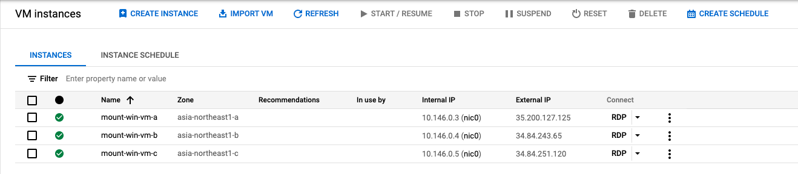

## Filestore の作成

https://cloud.google.com/sdk/gcloud/reference/beta/filestore/instances/create

```
### 環境変数
export _instance_id='mount-to-windonws' # Instance ID
export _share_name='mount2win'          # File share name
export _tier='BASIC_HDD'                # Instance type & Storage type
export _capacity='1TB'                  # Allocate capacity


### 作成
gcloud beta filestore instances create ${_instance_id} \
  --description "Mount Filestore from Windons Server" \
  --tier=${_tier} \
  --network=name=${_common}-network \
  --zone=${_region}-a \
  --file-share=name=${_share_name},capacity=${_capacity} \
  --async \
  --project ${_gcp_pj_id}
```

+ 確認コマンド( `--async` オプションを使ったので。 )

```
watch -n 5 gcloud beta filestore instances list --project ${_gcp_pj_id}
```

+ gcloud コマンドで情報を確認します

```
gcloud beta filestore instances describe ${_instance_id} --zone=${_region}-a --project ${_gcp_pj_id} --format="json"
```

+ `NFS mount point` は以下のようになります

```
{IP Address}:{File share name}
```

+ Firestore のマウントパスを gcloud コマンドから作成します
  + jq コマンドも使用します

```
echo $(gcloud beta filestore instances describe mount-to-windonws --zone=${_region}-a --project ${_gcp_pj_id} --format="json" | jq .networks[].ipAddresses[] -r):/${_share_name}
```
```
### 例

# echo $(gcloud beta filestore instances describe mount-to-windonws --zone=${_region}-a --project ${_gcp_pj_id} --format="json" | jq .networks[].ipAddresses[] -r):/${_share_name}

10.90.57.210:/mount2win
```

+ GUI からも確認出来ます
  + `NFS mount point` の項です

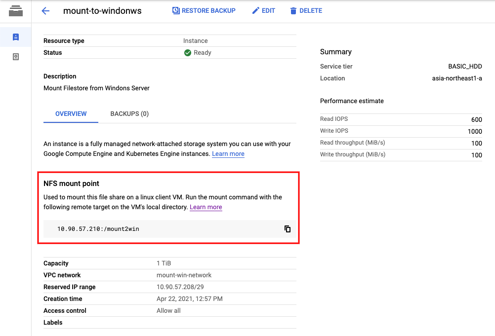

## Windows サーバにリモートデスクトップログイン

+ GUI から RDP 接続用のユーザとパスワードを設定します

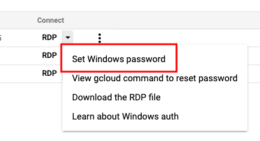

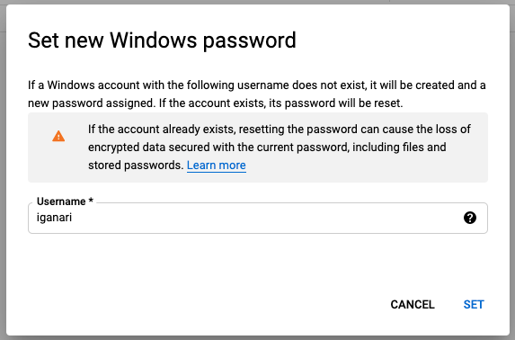

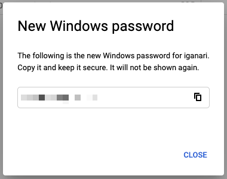

+ Windows にリモートデスクトップログインします

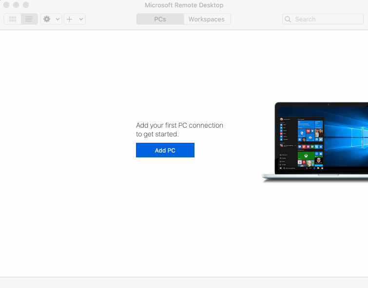

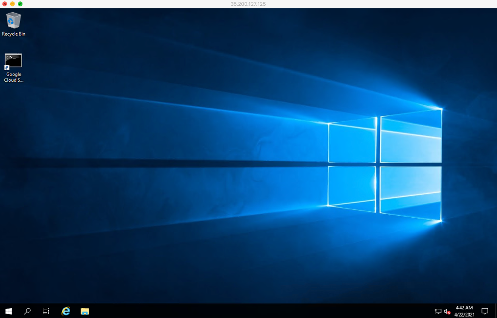

## Windows サーバで Filestore をマウントする

[Mounting file shares on Compute Engine clients | Windows](https://cloud.google.com/filestore/docs/mounting-fileshares?hl=en#windows) に沿って作業をしていきます

+ PowerShell を Administrator として起動し、以下のコマンドを実行します

```
Install-WindowsFeature -Name NFS-Client
```

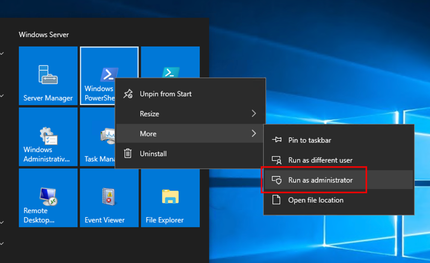

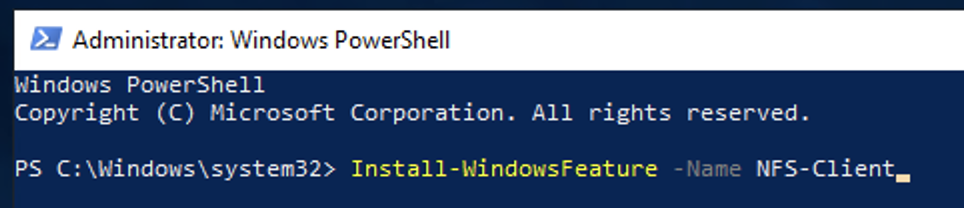

+ GCP のコンソールから VM を stop -> start します

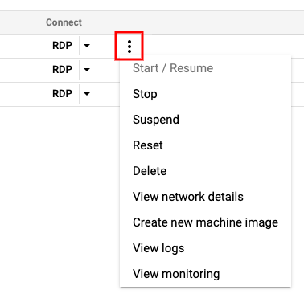

+ 再度、PowerShell を Administrator として起動し、以下のコマンドを実行します

```
New-ItemProperty -Path "HKLM:\SOFTWARE\Microsoft\ClientForNFS\CurrentVersion\Default" `
    -Name "AnonymousUid" -Value "0" -PropertyType DWORD
```
```
New-ItemProperty -Path "HKLM:\SOFTWARE\Microsoft\ClientForNFS\CurrentVersion\Default" `
    -Name "AnonymousGid" -Value "0" -PropertyType DWORD
```

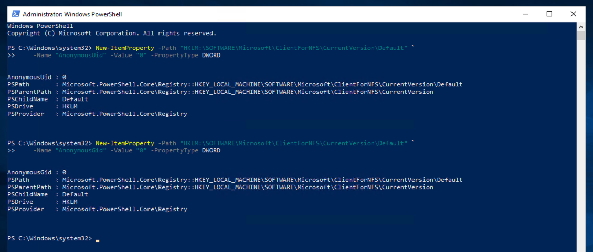

+ 同様に PowerShell にて、以下のコマンドを実行します

```
nfsadmin client stop
```
```
nfsadmin client start
```

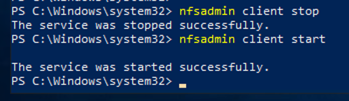

---> PowerShell での作業は完了したので閉じましょう

+ Command Prompt を開き、Firestore をマウントするために以下のコマンドを実行します
  + 先程メモした `NFS mount point` を使用します

```
mount {IP Address}:{File share name} {Windows 上のドライブ名}:
```
```
### 例

mount 10.90.57.210:/mount2win Z:
```

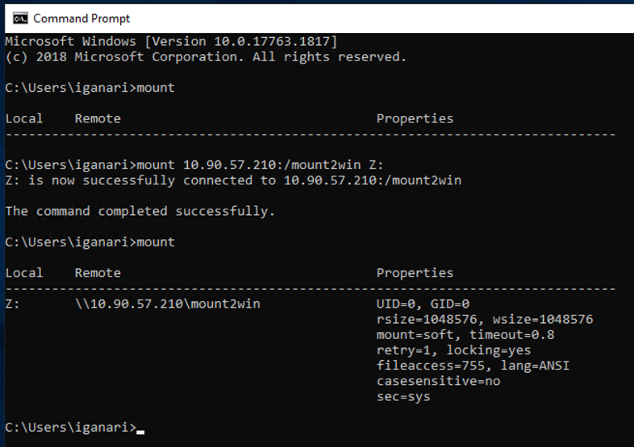

+ File Explorer からも見ることが出来ました

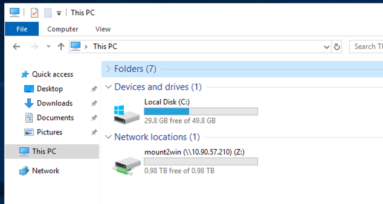

+ 同じ作業を `vm-b` と `vm-c` にも実行します
  + 割愛

---> これで構築作業は完了です :)

## 書き込みテスト

`vm-a` で作成したファイルを `vm-b` や `vm-c` で読み込みや書き込みが出来るか確認してみます

+ `vm-a` でファイルを作成します

```
date /t > Z:mount-test-from-vm-a
```

+ 確認します

```
type Z:mount-test-from-vm-a
```

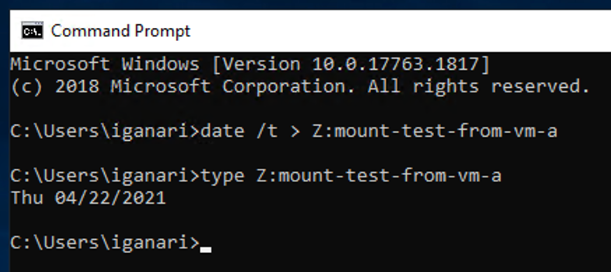

+ `vm-b` で `vm-a` で作成したファイルに追記します

```
echo "add from B" >> Z:mount-test-from-vm-a
```

+ 確認します

```
type Z:mount-test-from-vm-a
```

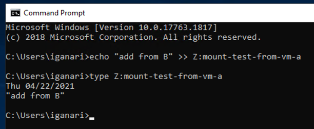

+ `vm-c` で `vm-a` で作成したファイルに追記します

```
echo "add from C" >> Z:mount-test-from-vm-a
```

+ 確認します

```
type Z:mount-test-from-vm-a
```

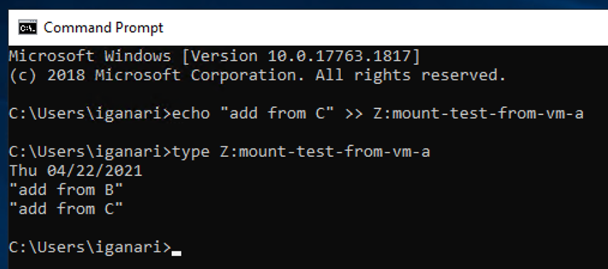

+ 最後に `vm-a` から確認します

```
type Z:mount-test-from-vm-a
```

+ 確認します

```
C:\Users\iganari>type Z:mount-test-from-vm-a
Thu 04/22/2021
"add from B"
"add from C"

C:\Users\iganari>
```

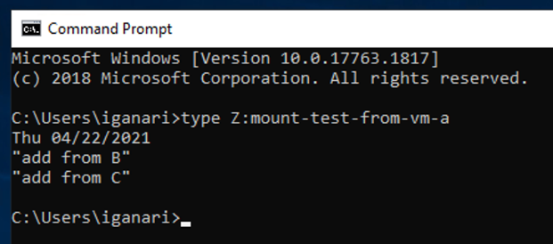

---> 3つの VM instances から Filestore 上の 1 つファイルに読み書き出来ることが分かりました :)

## マウントテスト

+ `vm-a` にて、Filestore 上に以下のようにディレクトリを作成します

```
C:\Users\iganari>dir Z:
 Volume in drive Z has no label.
 Volume Serial Number is F06E-5E0C

 Directory of Z:\

04/22/2021  03:59 AM    <DIR>          lost+found
04/22/2021  05:48 AM    <DIR>          point-b
04/22/2021  05:51 AM    <DIR>          .
04/22/2021  05:48 AM    <DIR>          point-c
04/22/2021  05:51 AM    <DIR>          ..
               0 File(s)         32,768 bytes
               5 Dir(s)  1,081,101,139,968 bytes free

C:\Users\iganari>
```

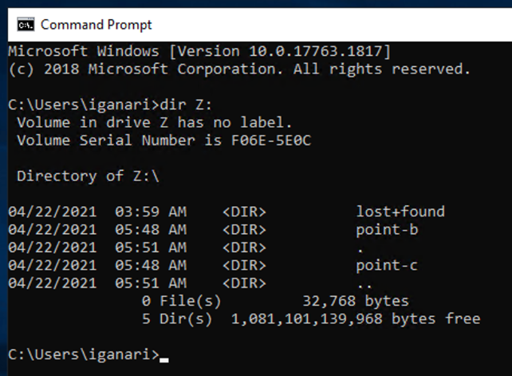

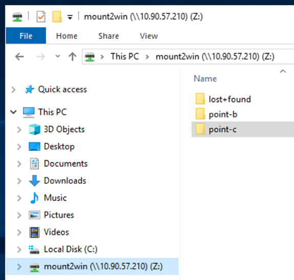

+ それぞれのディレクトリの下にファイルを作っておきます

```
echo "" >> Z:point-b/only-vm-b
echo "" >> Z:point-c/only-vm-c
```

+ `vm-b` にて、マウントの付替えをします

```
umount Z:
```
```
mount 10.90.57.210:/mount2win/point-b Z:
```
```
dir Z:
```

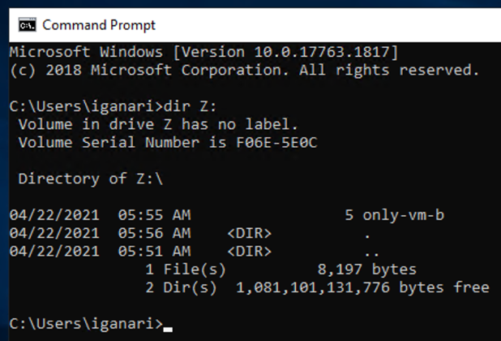


+ `vm-c` にて、マウントの付替えをします

```
umount Z:
```
```
mount 10.90.57.210:/mount2win/point-c Z:
```
```
dir Z:
```

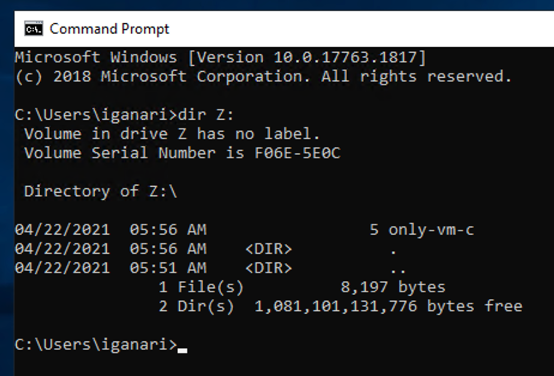

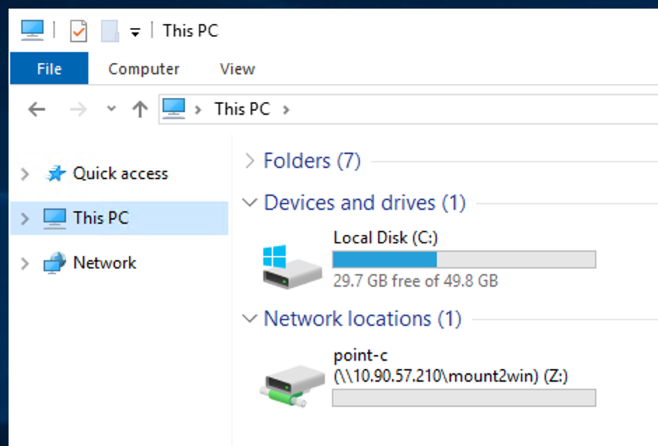

---> これで 3 つの VM instances から 1 つの Filestore に対してことなる PATH でマウントすることが出来ました :)

## まとめ

VM instances 上に構築した Windows Server から Filestore をマウントすることが出来ました :)

ファイル共有などはこれで出来そうですね ;)

## リソースの削除

+ VM instances の削除

```
gcloud beta compute instances delete ${_common}-vm-a \
  --zone ${_region}-a \
  --project ${_gcp_pj_id} -q

gcloud beta compute instances delete ${_common}-vm-b \
  --zone ${_region}-b \
  --project ${_gcp_pj_id} -q

gcloud beta compute instances delete ${_common}-vm-c \
  --zone ${_region}-c \
  --project ${_gcp_pj_id} -q
```

+ IP アドレスの削除

```
gcloud beta compute addresses delete ${_common}-ip-a \
  --region ${_region} \
  --project ${_gcp_pj_id} -q

gcloud beta compute addresses delete ${_common}-ip-b \
  --region ${_region} \
  --project ${_gcp_pj_id} -q

gcloud beta compute addresses delete ${_common}-ip-c \
  --region ${_region} \
  --project ${_gcp_pj_id} -q
```

+ Filestore の削除

```
gcloud beta filestore instances delete ${_instance_id} \
  --zone=${_region}-a \
  --project ${_gcp_pj_id} -q
```

+ Firewall Rule の削除

```
gcloud beta compute firewall-rules delete ${_common}-allow-rdp \
  --project ${_gcp_pj_id} -q
```

+ サブネットの削除

```
gcloud beta compute networks subnets delete ${_common}-subnets \
  --region ${_region} \
  --project ${_gcp_pj_id}  -q
```

+ VPC ネットワークの削除

```
gcloud beta compute networks delete ${_common}-network \
  --project ${_gcp_pj_id}  -q
```

## 最終更新日

2021/04/23
