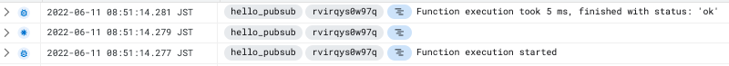
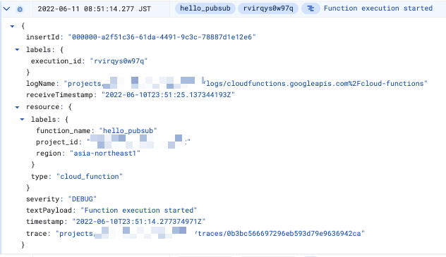
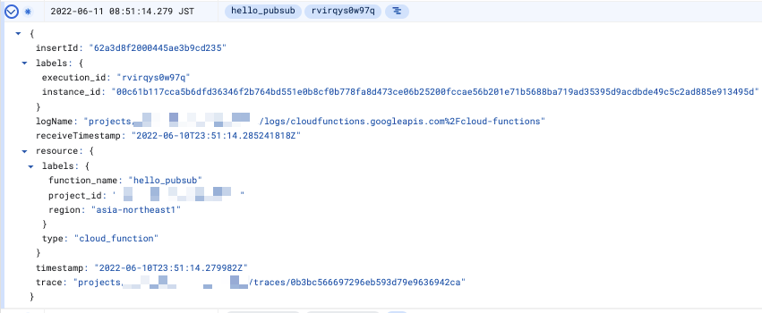
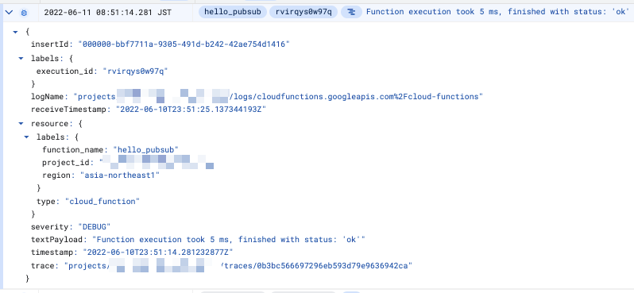
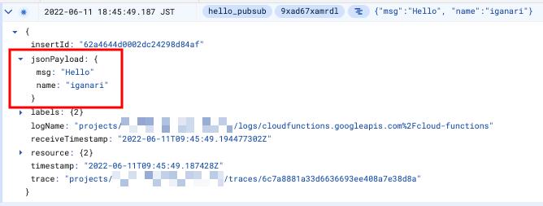

# Python | Basic

## 概要

```
GitHub
https://github.com/GoogleCloudPlatform/python-docs-samples/tree/main/functions/pubsub
```

## やってみる

+ 環境変数を設定

```
export _gcp_pj_id='Your GCP Project ID'
export _region='asia-northeast1'
export _common='python-basic'
```

+ Pub/Sub Topic を作成します

```
gcloud beta pubsub topics create ${_common}-topic --project ${_gcp_pj_id}
```

+ Cloud Functions のデプロイ

```
gcloud beta functions deploy hello_pubsub \
  --entry-point hello_pubsub \
  --region ${_region} \
  --runtime python39 \
  --source ./src \
  --trigger-topic ${_common}-topic \
  --allow-unauthenticated \
  --project ${_gcp_pj_id}
```

## 1. Pub/Sub 経由でメッセージの送信 ( 空の JSON )

+ CLI で Topic にメッセージを送る

```
gcloud beta pubsub topics publish ${_common}-topic \
  --message="{}" \
  --project ${_gcp_pj_id}
```









## 2. Pub/Sub 経由でメッセージの送信 ( 値が入っている JSON )

+ CLI で Topic にメッセージを送る

```
gcloud beta pubsub topics publish ${_common}-topic \
  --message="{\"name\": \"iganari\", \"msg\": \"Hello\"}" \
  --project ${_gcp_pj_id}
```



## リソースの削除

+ Cloud Functions の削除

```
gcloud beta functions delete hello_pubsub \
  --region ${_region} \
  --project ${_gcp_pj_id} \
  -q
```

+ Pub/Sub Topic を作成します

```
gcloud beta pubsub topics delete ${_common}-topic --project ${_gcp_pj_id}
```
