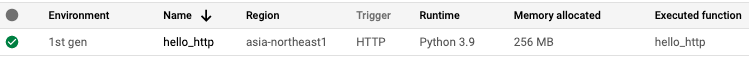
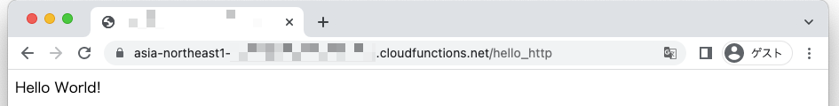
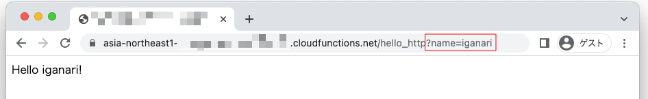

# Basic なサンプル

## 概要

```
GCP ドキュメント
https://cloud.google.com/functions/docs/create-deploy-http-python
```
```
GitHub
https://github.com/GoogleCloudPlatform/python-docs-samples/blob/HEAD/functions/helloworld/main.py
```

## デプロイ

+ 環境変数を設定

```
export _gcp_pj_id='Your GCP Project ID'
export _region='asia-northeast1'
```

+ デプロイ

```
gcloud beta functions deploy hello_http \
  --region ${_region} \
  --runtime python39 \
  --source ./src \
  --trigger-http \
  --allow-unauthenticated \
  --project ${_gcp_pj_id}
```

+ Web ブラウザで確認する

```
### 基本的な URL
https://${_region}-${_gcp_pj_id}.cloudfunctions.net/hello_http


### GET パラメータを使う
https://${_region}-${_gcp_pj_id}.cloudfunctions.net/hello_http?name='iganari'
```







+ 基本的な使い方

```
curl -m 70 -X POST https://asia-northeast1-ca-igarashi-test-2022q2.cloudfunctions.net/hello_http \
-H "Content-Type:application/json" \
-d '{}'
```
```
### 例

$ curl -m 70 -X POST https://asia-northeast1-ca-igarashi-test-2022q2.cloudfunctions.net/hello_http \
-H "Content-Type:application/json" \
-d '{}'
Hello World!
```

+ GET パラメータを使う

```
curl -m 70 -X POST https://asia-northeast1-ca-igarashi-test-2022q2.cloudfunctions.net/hello_http \
-H "Content-Type:application/json" \
-d '{"name" : "iganari"}'
```
```
### 例

$ curl -m 70 -X POST https://asia-northeast1-ca-igarashi-test-2022q2.cloudfunctions.net/hello_http \
-H "Content-Type:application/json" \
-d '{"name" : "iganari"}'
Hello iganari!
```

## リソースの削除

```
gcloud beta functions delete hello_http \
  --region ${_region} \
  --project ${_gcp_pj_id}
```
