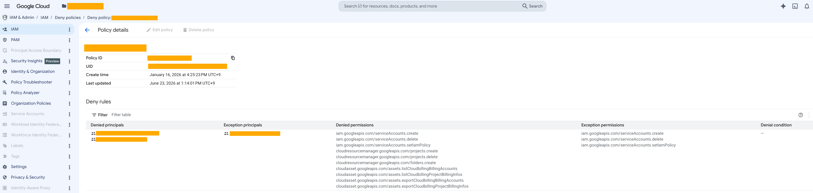

# IAM の Deny

## 概要

公式 Doc -> https://docs.cloud.google.com/iam/docs/deny-overview

## 以下、めも

- 設定単位
  - 組織、フォルダ、プロジェクトで設定可能
  - 設定はポリシーの継承の対象
- Alloy と Deny だと Deny が勝つ
  - 例
    - Service Account の作成のパーミッションの Deny がある場合、Service Account Admin ロールを持っていても Service Account を作成することは出来ない
- Deny の 例外を設定することができる
  - Deny ルールの中で `例外のプリンシパル` と `例外のパーミッションを設定することができる`
  - つまり
    - 複数の Google Group を Deny にいれた後に、その中の 1 つの Google Group もしくは Google アカウントだけ、Deny の例外 = 許可の状態にできる
    - コンディションも設定できる

