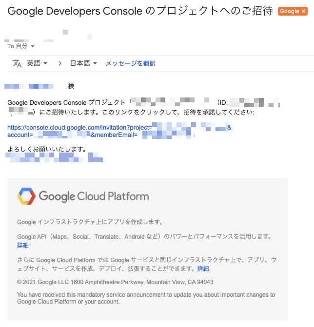

# Google Developers Console のプロジェクトへのご招待

+ 招待メールの作成

```
export gcp_pj_id='GCP Peoject ID'
export _your_address='Owner に招待した Google Address'


https://console.cloud.google.com/invitation?project=[gcp_pj_id]]&account=[_your_address]&memberEmail=[_your_address]
```

+ 実際のメール


