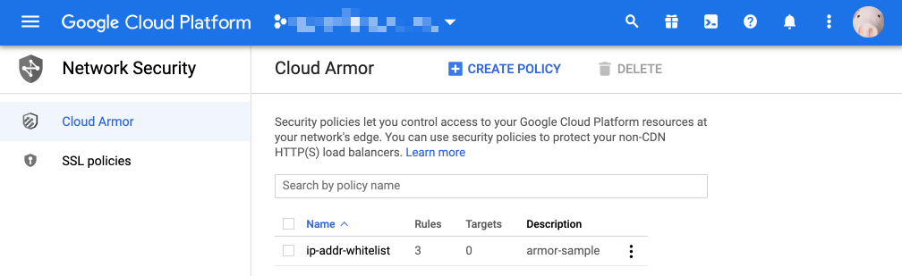
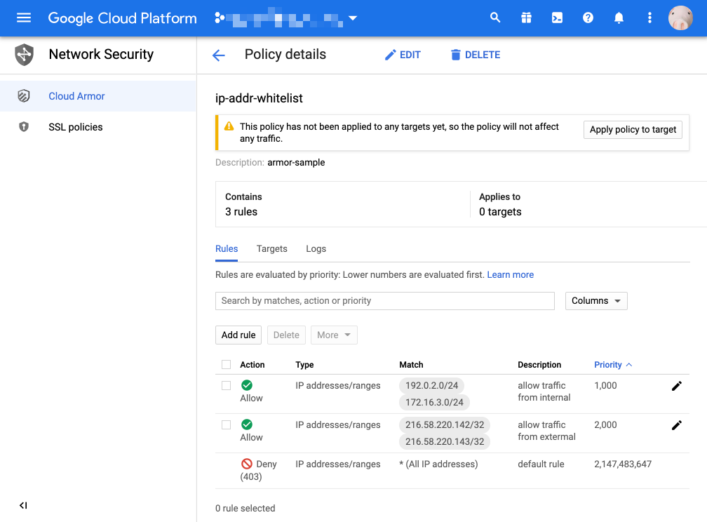

# Cloud Armor を試す

## 注意

:warning: 2020/11 現在の情報を元に記載しています

## やりたいこと

+ GKE のセキュリティを高めたい

## 出来ること

+ Cloud Armor の機能の 1 つに `IP アドレス制限` があるので、それを使います
  + Cloud Armor の機能は他にもあり、 IP アドレス制限は機能の 1 つでしかないです
+ Cloud Armor の IP アドレス制限を GKE 上の Service につけることが出来ます
  + ingress の Service 単位で Cloud Armor の設定をつけることが出来ます

## 設定

1. Cloud Armor の設定
1. manifest で BackendConfig の設定を作成
1. manifest で Service に annotations を追加
1. 確認

## Cloud Armor の設定

+ コマンドラインで Cloud Armor を作成します

```
### 環境変数

export _armor_name='ip-addr-whitelist'
export _project='Your GCP Project ID'

```
```
### Cloud Armor を作成します

gcloud beta compute security-policies create ${_armor_name} \
    --description "armor-sample" \
    --project ${_project}
```
```
### 基本 deny の設定します

gcloud compute security-policies rules update 2147483647 \
    --security-policy ${_armor_name} \
    --action "deny-403" \
    --project ${_project}
```
```
### 許可したい IP アドレスを設定(例として、インターナルとイクスターナル(適当)を許可)します

gcloud compute security-policies rules create 1000 \
    --security-policy ${_armor_name} \
    --description "allow traffic from internal" \
    --src-ip-ranges "192.0.2.0/24,172.16.3.0/24" \
    --action "allow"

gcloud compute security-policies rules create 2000 \
    --security-policy ${_armor_name} \
    --description "allow traffic from extermal" \
    --src-ip-ranges "216.58.220.142/32,216.58.220.143/32" \
    --action "allow"
```

+ GCP コンソールで確認
  + ナビゲーションメニューから `NETWORKING` >> `Network Security` >> `Cloud Armor` と遷移すします
  + この状態ではどのリソースに対しても適用されていないため、 `Apply policy to target` が出ています






## manifest で BackendConfig の設定を作成

+ manifests を作ります
  + k8s.yaml](./k8s.yaml) に同梱

```
apiVersion: cloud.google.com/v1beta1
kind: BackendConfig
metadata:
  name: backend-config-sample
  namespace: default
spec:
  securityPolicy:
    name: "ip-addr-whitelist"
```

## manifest で Service に annotations を追加

+ 例として nginx を使用します

+ manifests を作成します
  + k8s.yaml](./k8s.yaml) に同梱します

```
apiVersion: apps/v1
kind: Deployment
metadata:
  name: nginx-deployment
  namespace: default
  labels:
    app: nginx
    env: sample
spec:
  replicas: 1
  selector:
    matchLabels:
      app: nginx
      env: sample
  template:
    metadata:
      labels:
        app: nginx
        env: sample
    spec:
      containers:
      - name: nginx
        image: nginx
        ports:
        - containerPort: 80

---

apiVersion: v1
kind: Service
metadata:
  name: nginx-service
  namespace: default
  labels:
    app: nginx
    env: sample
  annotations:
    beta.cloud.google.com/backend-config: '{
      "ports": {
        "8080":"backend-config-sample"
      }
    }'
spec:
  type: NodePort
  selector:
    app: nginx
    env: sample
  ports:
    - port: 8080
      targetPort: 80

---

apiVersion: extensions/v1beta1
kind: Ingress
metadata:
  name: nginx-ingress
  namespace: default
  labels:
    app: nginx
    env: sample
spec:
  rules:
  - http:
      paths:
      - path: /*
        backend:
          serviceName: nginx-service
          servicePort: 8080

```

+ 作成した manifests を apply コマンドで反映させます

```
kubectl apply -f k8s.yaml
```

## 確認

### アクセスを許可した IP アドレスからアクセスした場合


### アクセスを許可していない IP アドレスからアクセスした場合


### Cloud Armor 上に出ていた警告が消えている

+ GKE でアタッチしたため警告が消えます


## 参考

+ https://cloud.google.com/kubernetes-engine/docs/how-to/ingress-features?hl=en#cloud_armor
+ https://cloud.google.com/kubernetes-engine/docs/how-to/ingress-features?hl=en#exercise

# まとめ

Have fun !! :raised_hands: 
