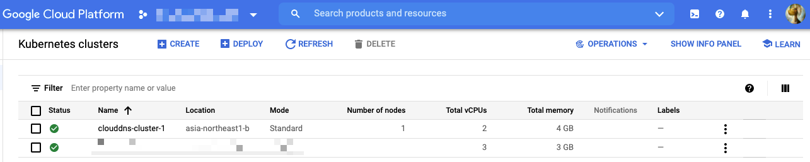
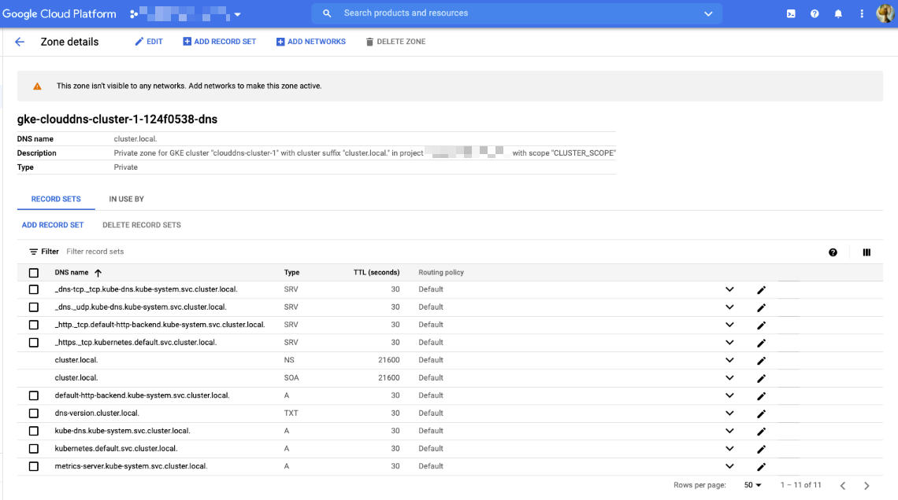

# Cluster scope DNS

## アーキテクチャ


## やってみる

### 準備

+ GCP との認証

```
gcloud auth login -q
```

+ 環境変数

```
export _common='clouddns-cluster'
export _gcp_pj_id='Your GCP Project ID'
export _region='asia-northeast1'
export _sub_network_range='10.146.0.0/20'


export _gcp_pj_id='ca-igarashi-test-2021q3'
```

+ API の有効化

```
gcloud beta services enable compute.googleapis.com --project ${_gcp_pj_id}
gcloud beta services enable container.googleapis.com --project ${_gcp_pj_id}
gcloud beta services enable dns.googleapis.com --project ${_gcp_pj_id}
```

### GKE クラスタの作成

+ ネットワークを作成します

```
### VPC 作成
gcloud beta compute networks create ${_common}-network \
  --subnet-mode=custom \
  --project ${_gcp_pj_id}

### サブネット作成
gcloud beta compute networks subnets create ${_common}-subnets \
  --network ${_common}-network \
  --region ${_region} \
  --range ${_sub_network_range} \
  --project ${_gcp_pj_id}

### 内部通信はすべて許可
gcloud beta compute firewall-rules create ${_common}-allow-internal-all \
  --network ${_common}-network \
  --action ALLOW \
  --rules tcp:0-65535,udp:0-65535,icmp \
  --source-ranges ${_sub_network_range} \
  --target-tags ${_common}-allow-internal-all \
  --project ${_gcp_pj_id}
```

+ クラスタの新規作成します
  + Cloud DNS を使うオプションをつけます
    + `--cluster-dns clouddns --cluster-dns-scope cluster`
  + クラスタバージョンではなく、リリースチャンネルを指定します
    + `--release-channel "rapid"`

```
gcloud beta container clusters create ${_common}-1 \
  --cluster-dns clouddns --cluster-dns-scope cluster \
  --zone ${_region}-b \
  --release-channel "rapid" \
  --enable-ip-alias \
  --network ${_common}-network \
  --subnetwork ${_common}-subnets \
  --cluster-ipv4-cidr "/17" \
  --services-ipv4-cidr "/22" \
  --num-nodes 1 \
  --project ${_gcp_pj_id}
```


---> Cloud DNS が出来ている

### Cloud DNS の確認

+ 分かること
  + DNS name `cluster.local.`
  + Type `Private`
  + VPC network は選択されていない






### pod を置く

+ GKE と認証します

```
gcloud beta container clusters get-credentials ${_common}-1 \
  --zone ${_region}-b \
  --project ${_gcp_pj_id}
```

+ Deployment と Service をデプロイ

```
kubectl apply -f test-pod-a.yaml
```

+ Service の IP アドレスを確認する

```
kubectl get svc
```
```
# kubectl get svc
NAME              TYPE        CLUSTER-IP      EXTERNAL-IP   PORT(S)   AGE
clouddns-test-a   ClusterIP   10.222.128.29   <none>        80/TCP    12m
```

## 名前引きの確認

+ Pod の中から名前引きが出来るか確認する

```
kubectl run --rm -i check-name --image gcr.io/google-samples/hello-app:2.0 --restart=Never -- nslookup clouddns-test-a
```
```
### 例

# kubectl run --rm -i check-name --image gcr.io/google-samples/hello-app:2.0 --restart=Never -- nslookup clouddns-test-a
Server:         169.254.169.254
Address:        169.254.169.254:53

Non-authoritative answer:
*** Can't find clouddns-test-a.default.svc.cluster.local: No answer

Non-authoritative answer:
Name:   clouddns-test-a.default.svc.cluster.local
Address: 10.222.128.29

** server can't find clouddns-test-a.svc.cluster.local: NXDOMAIN

** server can't find clouddns-test-a.svc.cluster.local: NXDOMAIN

** server can't find clouddns-test-a.cluster.local: NXDOMAIN

** server can't find clouddns-test-a.cluster.local: NXDOMAIN

** server can't find clouddns-test-a.google.internal: NXDOMAIN

** server can't find clouddns-test-a.google.internal: NXDOMAIN

** server can't find clouddns-test-a.c.[your_gcp_pj_id].internal: NXDOMAIN

** server can't find clouddns-test-a.c.[your_gcp_pj_id].internal: NXDOMAIN

pod "check-name" deleted
pod default/check-name terminated (Error)
```

+ より詳細に Pod の中から名前引きが出来るか確認する

```
kubectl run --rm -i check-name --image gcr.io/google-samples/hello-app:2.0 --restart=Never -- nslookup clouddns-test-a.default.svc.cluster.local
```
```
### 例

# kubectl run --rm -i check-name --image gcr.io/google-samples/hello-app:2.0 --restart=Never -- nslookup clouddns-test-a.default.svc.clus
ter.local
Server:         169.254.169.254
Address:        169.254.169.254:53

Non-authoritative answer:
Name:   clouddns-test-a.default.svc.cluster.local
Address: 10.222.128.29

Non-authoritative answer:
*** Can't find clouddns-test-a.default.svc.cluster.local: No answer

pod "check-name" deleted
```

---> Service の IP アドレスは見えている


```
# kubectl run --rm -i check-name --image tutum/dnsutils --restart=Never -- nslookup clouddns-test-a
If you don't see a command prompt, try pressing enter.
Error attaching, falling back to logs: unable to upgrade connection: container check-name not found in pod check-name_default
Server:         169.254.169.254
Address:        169.254.169.254#53

Non-authoritative answer:
Name:   clouddns-test-a.default.svc.cluster.local
Address: 10.222.128.29

pod "check-name" deleted
```
```
# kubectl run --rm -i check-name --image tutum/dnsutils --restart=Never -- nslookup clouddns-test-a.default.svc.cluster.local
If you don't see a command prompt, try pressing enter.
Error attaching, falling back to logs: unable to upgrade connection: container check-name not found in pod check-name_default
Server:         169.254.169.254
Address:        169.254.169.254#53

Non-authoritative answer:
Name:   clouddns-test-a.default.svc.cluster.local
Address: 10.222.128.29

pod "check-name" deleted
```

+ Pod の確認

```
kubectl get pod -o wide
```
```
# kubectl get pod -o wide
NAME                               READY   STATUS    RESTARTS   AGE   IP            NODE                                             NOMINATED NODE   READINESS GATES
clouddns-test-a-7dd7fc5c47-pcvb2   1/1     Running   0          16m   10.222.0.14   gke-clouddns-test-1-default-pool-166aff35-7nwn   <none>           <none>
clouddns-test-a-7dd7fc5c47-sjqn4   1/1     Running   0          16m   10.222.0.13   gke-clouddns-test-1-default-pool-166aff35-7nwn   <none>           <none>
```


## リソースの削除

+ Pod の削除

```
kubectl delete -f test-pod-a.yaml
```

+ GKE クラスタの削除

```
gcloud beta container clusters delete ${_common}-1 \
  --zone ${_region}-b \
  --project ${_gcp_pj_id} \
  -q
```

+ ネットワークを削除します

```
gcloud beta compute firewall-rules delete ${_common}-allow-internal-all \
  --project ${_gcp_pj_id} \
  -q

gcloud beta compute networks subnets delete ${_common}-subnets \
  --region ${_region} \
  --project ${_gcp_pj_id} \
  -q

gcloud beta compute networks delete ${_common}-network \
  --project ${_gcp_pj_id} \
  -q
```