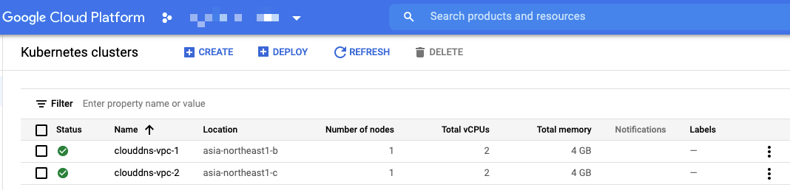
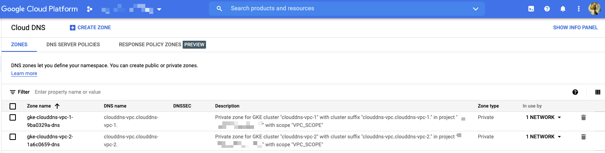
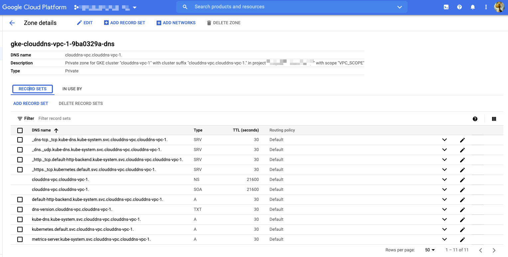

# VPC scope DNS

## アーキテクチャ

[](https://cloud.google.com/kubernetes-engine/images/gke-cloud-dns-vpc-scope.svg)

## やってみる

### 準備

+ GCP との認証

```
gcloud auth login -q
```

+ 環境変数

```
export _common='clouddns-vpc'
export _gcp_pj_id='Your GCP Project ID'
export _region='asia-northeast1'
export _sub_network_range='10.146.0.0/20'


export _gcp_pj_id='ca-igarashi-test-2021q3'
```

+ API の有効化

```
gcloud beta services enable compute.googleapis.com --project ${_gcp_pj_id}
gcloud beta services enable container.googleapis.com --project ${_gcp_pj_id}
gcloud beta services enable dns.googleapis.com --project ${_gcp_pj_id}
```

### GKE クラスタの作成

+ ネットワークを作成します

```
### VPC 作成
gcloud beta compute networks create ${_common}-network \
  --subnet-mode=custom \
  --project ${_gcp_pj_id}

### サブネット作成
gcloud beta compute networks subnets create ${_common}-subnets \
  --network ${_common}-network \
  --region ${_region} \
  --range ${_sub_network_range} \
  --project ${_gcp_pj_id}

### 内部通信はすべて許可
gcloud beta compute firewall-rules create ${_common}-allow-internal-all \
  --network ${_common}-network \
  --action ALLOW \
  --rules tcp:0-65535,udp:0-65535,icmp \
  --source-ranges ${_sub_network_range} \
  --target-tags ${_common}-allow-internal-all \
  --project ${_gcp_pj_id}
```

+ クラスタの新規作成します
  + Cloud DNS を使うオプションをつけます
    + `--cluster-dns clouddns --cluster-dns-scope vpc`
  + クラスタバージョンではなく、リリースチャンネルを指定します
    + `--release-channel "rapid"`
  + ドメインは `.local` は使えない
    + `clouddns-vpc.local-test`

```
gcloud beta container clusters create ${_common}-1 \
  --cluster-dns clouddns --cluster-dns-scope vpc \
  --cluster-dns-domain ${_common}.local-test \
  --zone ${_region}-b \
  --release-channel "rapid" \
  --enable-ip-alias \
  --network ${_common}-network \
  --subnetwork ${_common}-subnets \
  --cluster-ipv4-cidr "/17" \
  --services-ipv4-cidr "/22" \
  --num-nodes 1 \
  --project ${_gcp_pj_id}
```

---> Cloud DNS が出来ている

### Cloud DNS の確認

+ 分かること
  + DNS name は自分で設定したもの
  + Type `Private`
  + VPC network が予め設定してある







### pod を置く

+ GKE と認証します

```
gcloud beta container clusters get-credentials ${_common}-1 \
  --zone ${_region}-b \
  --project ${_gcp_pj_id}
```

+ Deployment と Service をデプロイ

```
kubectl apply -f test-pod-a.yaml
```

+ Service の IP アドレスを確認する

```
kubectl get svc
```
```
### 例

# kubectl get svc
NAME             TYPE        CLUSTER-IP   EXTERNAL-IP   PORT(S)   AGE
clouddns-vpc-a   ClusterIP   None         <none>        80/TCP    36s
```
```
kubectl get pod -o wide
```
```
### 例

# kubectl get pod -o wide
NAME                              READY   STATUS    RESTARTS   AGE    IP             NODE                                            NOMINATED NODE   READINESS GATES
clouddns-vpc-a-6c58b8d55b-d5czz   1/1     Running   0          118s   10.27.128.14   gke-clouddns-vpc-1-default-pool-ff8f9e72-w03j   <none>           <none>
clouddns-vpc-a-6c58b8d55b-zb6hb   1/1     Running   0          118s   10.27.128.13   gke-clouddns-vpc-1-default-pool-ff8f9e72-w03j   <none>           <none>
```

## 名前引きの確認

+ ドメインの命名規則

```
[Service の名前].[名前空間(Namespace)の名前].svc.[設定したドメイン名]
```
```
### 例

clouddns-vpc-a.default.svc.clouddns-vpc.local-test.
```

### Pod の中から Service を名前引きが出来るか確認する

+ Service の確認

```
kubectl run --rm -i check-name --image tutum/dnsutils --restart=Never -- dig clouddns-vpc-a.default.svc.clouddns-vpc.local-test.
```
```
# kubectl run --rm -i check
-name --image tutum/dnsutils --restart=Never -- dig clouddns-vpc-a.default.svc.clouddns-vpc.local-test.

; <<>> DiG 9.9.5-3ubuntu0.2-Ubuntu <<>> clouddns-vpc-a.default.svc.clouddns-vpc.local-test.
;; global options: +cmd
;; Got answer:
;; ->>HEADER<<- opcode: QUERY, status: NOERROR, id: 3347
;; flags: qr rd ra; QUERY: 1, ANSWER: 2, AUTHORITY: 0, ADDITIONAL: 1

;; OPT PSEUDOSECTION:
; EDNS: version: 0, flags:; udp: 512
;; QUESTION SECTION:
;clouddns-vpc-a.default.svc.clouddns-vpc.local-test. IN A

;; ANSWER SECTION:
clouddns-vpc-a.default.svc.clouddns-vpc.local-test. 30 IN A 10.27.128.14
clouddns-vpc-a.default.svc.clouddns-vpc.local-test. 30 IN A 10.27.128.13

;; Query time: 3 msec
;; SERVER: 169.254.169.254#53(169.254.169.254)
;; WHEN: Mon Aug 16 02:18:47 UTC 2021
;; MSG SIZE  rcvd: 111

pod "check-name" deleted
```

---> Service の IP アドレスは見えている

[絵]


### Pod の中から Pod を名前引きが出来るか確認する

+ Pod の確認

```
# kubectl get pod
NAME                              READY   STATUS    RESTARTS   AGE
clouddns-vpc-a-6c58b8d55b-d5czz   1/1     Running   0          31m
clouddns-vpc-a-6c58b8d55b-zb6hb   1/1     Running   0          31m
```

```
kubectl run --rm -i check-name --image tutum/dnsutils --restart=Never -- dig clouddns-vpc-a-6c58b8d55b-zb6hb.clouddns-vpc-a.default.svc.clouddns-vpc.local-test.
kubectl run --rm -i check-name --image tutum/dnsutils --restart=Never -- dig clouddns-vpc-a.default.svc.clouddns-vpc.local-test.
```


---> 出来ない

---> Cloud DNS に登録していない

## pod を再起動してみる

IP アドレスが変わるはずなのでその挙動を調べる

```
kubectl rollout restart deployment clouddns-vpc-a
```
```
# kubectl rollout restart deployment clouddns-vpc-a
deployment.apps/clouddns-vpc-a restarted
```

+ 確認

```
# kubectl run --rm -i check-name --image tutum/dnsutils --restart=Never -- dig clouddns-vpc-a.default.svc.clouddns-vpc.local-test.

; <<>> DiG 9.9.5-3ubuntu0.2-Ubuntu <<>> clouddns-vpc-a.default.svc.clouddns-vpc.local-test.
;; global options: +cmd
;; Got answer:
;; ->>HEADER<<- opcode: QUERY, status: NOERROR, id: 15222
;; flags: qr rd ra; QUERY: 1, ANSWER: 2, AUTHORITY: 0, ADDITIONAL: 1

;; OPT PSEUDOSECTION:
; EDNS: version: 0, flags:; udp: 512
;; QUESTION SECTION:
;clouddns-vpc-a.default.svc.clouddns-vpc.local-test. IN A

;; ANSWER SECTION:
clouddns-vpc-a.default.svc.clouddns-vpc.local-test. 30 IN A 10.27.128.25
clouddns-vpc-a.default.svc.clouddns-vpc.local-test. 30 IN A 10.27.128.24

;; Query time: 3 msec
;; SERVER: 169.254.169.254#53(169.254.169.254)
;; WHEN: Mon Aug 16 05:25:42 UTC 2021
;; MSG SIZE  rcvd: 111

pod "check-name" deleted
```

---> 確かに IP アドレスは変わっている

Cloud DNS 上も即時反映している

[絵]


## 同じ VPC ネットワーク上に作成した VM 上から疎通できるか確認

### 同じ VPC ネットワーク上に VM を作成

```
### IAP 用の FW を設定

gcloud beta compute firewall-rules create ${_common}-allow-ssh \
  --direction=INGRESS \
  --priority=1000 \
  --network ${_common}-network \
  --action ALLOW \
  --rules tcp:22,icmp \
  --source-ranges=35.235.240.0/20 \
  --target-tags ${_common}-allow-ssh \
  --project ${_gcp_pj_id}
```


+ 静的外部 IP アドレスが付いていない VM の作成

```
gcloud beta compute instances create ${_common}-vm \
  --zone ${_region}-a \
  --machine-type f1-micro \
  --subnet ${_common}-subnets \
  --no-address \
  --tags=${_common}-allow-internal,${_common}-allow-ssh \
  --image=ubuntu-minimal-2010-groovy-v20210223 \
  --image-project=ubuntu-os-cloud \
  --project ${_gcp_pj_id}
```

+ IAP を使用するための Role を付与

```
gcloud beta projects add-iam-policy-binding ${_gcp_pj_id} \
    --member=user:$(gcloud auth list --filter=status:ACTIVE --format="value(account)") \
    --role=roles/iap.tunnelResourceAccessor
```

+ Cloud NAT で使用する IP Address の予約

```
gcloud beta compute addresses create ${_common}-nat-ip \
    --region ${_region} \
    --project ${_gcp_pj_id}
```

+ Cloud NAT で使用する Cloud Router を作成

```
gcloud beta compute routers create ${_common}-router \
  --network ${_common}-network \
  --region ${_region} \
  --project ${_gcp_pj_id}
```

+ Cloud NAT の作成

```
gcloud beta compute routers nats create ${_common}-nat \
  --router-region ${_region} \
  --router ${_common}-router \
  --nat-all-subnet-ip-ranges \
  --nat-external-ip-pool ${_common}-nat-ip \
  --project ${_gcp_pj_id}
```


+ VM に SSH ログイン

```
gcloud beta compute ssh ${_common}-vm --zone ${_region}-a --project ${_gcp_pj_id}
```


```
# gcloud beta compute ssh ${_common}-vm --zone ${_region}-a --project ${_gcp_pj_id}

External IP address was not found; defaulting to using IAP tunneling.
Updating project ssh metadata...⠹Updated [https://www.googleapis.com/compute/beta/projects/ca-igarashi-test-2021q3].
Updating project ssh metadata...done.
Waiting for SSH key to propagate.
Warning: Permanently added 'compute.6602146399741298182' (ECDSA) to the list of known hosts.
Welcome to Ubuntu 20.10 (GNU/Linux 5.8.0-1023-gcp x86_64)

 * Documentation:  https://help.ubuntu.com
 * Management:     https://landscape.canonical.com
 * Support:        https://ubuntu.com/advantage


This system has been minimized by removing packages and content that are
not required on a system that users do not log into.

To restore this content, you can run the 'unminimize' command.

0 updates can be installed immediately.
0 of these updates are security updates.


The list of available updates is more than a week old.
To check for new updates run: sudo apt update
```

+ [VM上] pingなどをインストール

```
apt update
apt install -y dnsutils iputils-ping
```

+ 名前引き確認

```
dig clouddns-vpc-a.default.svc.clouddns-vpc.local-test.
```
```
# dig clouddns-vpc-a.default.svc.clouddns-vpc.local-test.

; <<>> DiG 9.16.6-Ubuntu <<>> clouddns-vpc-a.default.svc.clouddns-vpc.local-test.
;; global options: +cmd
;; Got answer:
;; ->>HEADER<<- opcode: QUERY, status: NOERROR, id: 19145
;; flags: qr rd ra; QUERY: 1, ANSWER: 2, AUTHORITY: 0, ADDITIONAL: 1

;; OPT PSEUDOSECTION:
; EDNS: version: 0, flags:; udp: 65494
;; QUESTION SECTION:
;clouddns-vpc-a.default.svc.clouddns-vpc.local-test. IN A

;; ANSWER SECTION:
clouddns-vpc-a.default.svc.clouddns-vpc.local-test. 30 IN A 10.27.128.24
clouddns-vpc-a.default.svc.clouddns-vpc.local-test. 30 IN A 10.27.128.25

;; Query time: 4 msec
;; SERVER: 127.0.0.53#53(127.0.0.53)
;; WHEN: Mon Aug 16 05:43:26 UTC 2021
;; MSG SIZE  rcvd: 111

```

```
# ping -c 3 8.8.8.8
PING 8.8.8.8 (8.8.8.8) 56(84) bytes of data.
64 bytes from 8.8.8.8: icmp_seq=1 ttl=122 time=1.67 ms
64 bytes from 8.8.8.8: icmp_seq=2 ttl=122 time=1.77 ms
64 bytes from 8.8.8.8: icmp_seq=3 ttl=122 time=1.62 ms

--- 8.8.8.8 ping statistics ---
3 packets transmitted, 3 received, 0% packet loss, time 2004ms
rtt min/avg/max/mdev = 1.621/1.686/1.765/0.059 ms
```

---> 出来た

+ ログアウト

```
exit
```


+ Cloud NAT を閉じる

```
gcloud beta compute routers nats delete ${_common}-nat \
  --router-region ${_region} \
  --router ${_common}-router \
  --project ${_gcp_pj_id} \
  -q
```


+ Cloud NAT で使用する Cloud Router を削除

```
gcloud beta compute routers delete ${_common}-router \
  --region ${_region} \
  --project ${_gcp_pj_id} \
  -q
```


+ Cloud NAT で使用する IP Address の削除

```
gcloud beta compute addresses delete ${_common}-nat-ip \
  --region ${_region} \
  --project ${_gcp_pj_id} \
  -q
```


+ VM に SSH ログイン

```
gcloud beta compute ssh ${_common}-vm --zone ${_region}-a --project ${_gcp_pj_id}
```

+ 外侮への疎通
  + 出来ない

```
# ping -c 3 8.8.8.8
PING 8.8.8.8 (8.8.8.8) 56(84) bytes of data.

--- 8.8.8.8 ping statistics ---
3 packets transmitted, 0 received, 100% packet loss, time 2032ms

```

+ 名前引き確認
  + 出来る

```
dig clouddns-vpc-a.default.svc.clouddns-vpc.local-test.
```
```
# dig clouddns-vpc-a.default.svc.clouddns-vpc.local-test.

; <<>> DiG 9.16.6-Ubuntu <<>> clouddns-vpc-a.default.svc.clouddns-vpc.local-test.
;; global options: +cmd
;; Got answer:
;; ->>HEADER<<- opcode: QUERY, status: NOERROR, id: 51109
;; flags: qr rd ra; QUERY: 1, ANSWER: 2, AUTHORITY: 0, ADDITIONAL: 1

;; OPT PSEUDOSECTION:
; EDNS: version: 0, flags:; udp: 65494
;; QUESTION SECTION:
;clouddns-vpc-a.default.svc.clouddns-vpc.local-test. IN A

;; ANSWER SECTION:
clouddns-vpc-a.default.svc.clouddns-vpc.local-test. 30 IN A 10.27.128.25
clouddns-vpc-a.default.svc.clouddns-vpc.local-test. 30 IN A 10.27.128.24

;; Query time: 4 msec
;; SERVER: 127.0.0.53#53(127.0.0.53)
;; WHEN: Mon Aug 16 05:51:07 UTC 2021
;; MSG SIZE  rcvd: 111

```


```
# kubectl run --rm -i check-name --image tutum/dnsutils --restart=Never -- nslookup clouddns-test-a
If you don't see a command prompt, try pressing enter.
Error attaching, falling back to logs: unable to upgrade connection: container check-name not found in pod check-name_default
Server:         169.254.169.254
Address:        169.254.169.254#53

Non-authoritative answer:
Name:   clouddns-test-a.default.svc.cluster.local
Address: 10.222.128.29

pod "check-name" deleted
```
```
# kubectl run --rm -i check-name --image tutum/dnsutils --restart=Never -- nslookup clouddns-test-a.default.svc.cluster.local
If you don't see a command prompt, try pressing enter.
Error attaching, falling back to logs: unable to upgrade connection: container check-name not found in pod check-name_default
Server:         169.254.169.254
Address:        169.254.169.254#53

Non-authoritative answer:
Name:   clouddns-test-a.default.svc.cluster.local
Address: 10.222.128.29

pod "check-name" deleted
```

+ Pod の確認

```
kubectl get pod -o wide
```
```
# kubectl get pod -o wide
NAME                               READY   STATUS    RESTARTS   AGE   IP            NODE                                             NOMINATED NODE   READINESS GATES
clouddns-test-a-7dd7fc5c47-pcvb2   1/1     Running   0          16m   10.222.0.14   gke-clouddns-test-1-default-pool-166aff35-7nwn   <none>           <none>
clouddns-test-a-7dd7fc5c47-sjqn4   1/1     Running   0          16m   10.222.0.13   gke-clouddns-test-1-default-pool-166aff35-7nwn   <none>           <none>
```


## リソースの削除

+ Pod の削除

```
kubectl delete -f test-pod-a.yaml
```

+ GKE クラスタの削除

```
gcloud beta container clusters delete ${_common}-1 \
  --zone ${_region}-b \
  --project ${_gcp_pj_id} \
  -q
```

+ ネットワークを削除します

```
gcloud beta compute firewall-rules delete ${_common}-allow-internal-all \
  --project ${_gcp_pj_id} \
  -q

gcloud beta compute networks subnets delete ${_common}-subnets \
  --region ${_region} \
  --project ${_gcp_pj_id} \
  -q

gcloud beta compute networks delete ${_common}-network \
  --project ${_gcp_pj_id} \
  -q
```


