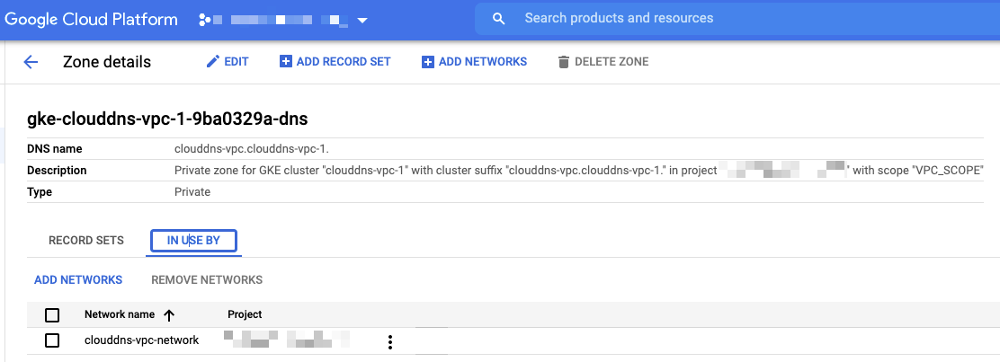
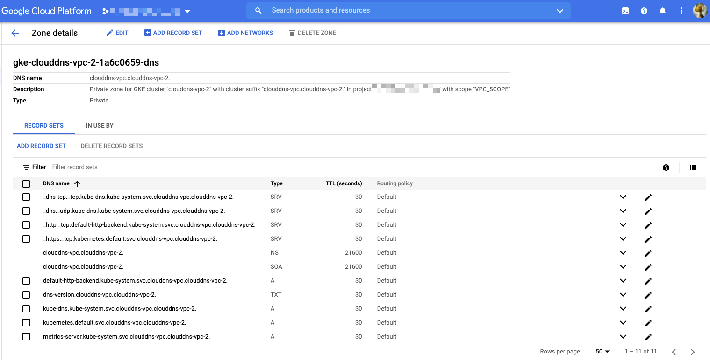
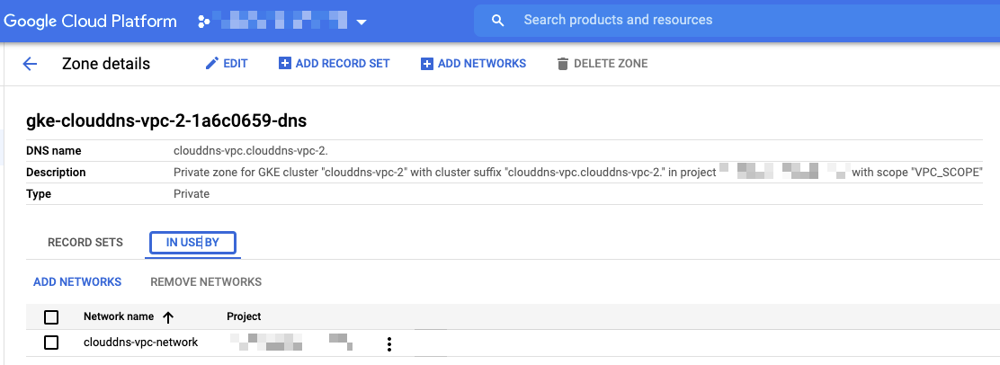

# VPC scope DNS

## アーキテクチャ


## やってみる

### 準備

+ GCP との認証

```
gcloud auth login -q
```

+ 環境変数

```
export _common='clouddns-vpc'
export _gcp_pj_id='Your GCP Project ID'
export _region='asia-northeast1'
export _sub_network_range='10.146.0.0/20'
```

+ API の有効化

```
gcloud beta services enable compute.googleapis.com --project ${_gcp_pj_id}
gcloud beta services enable container.googleapis.com --project ${_gcp_pj_id}
gcloud beta services enable dns.googleapis.com --project ${_gcp_pj_id}
```

### GKE クラスタの作成

+ ネットワークを作成します

```
### VPC 作成
gcloud beta compute networks create ${_common}-network \
  --subnet-mode=custom \
  --project ${_gcp_pj_id}

### サブネット作成
gcloud beta compute networks subnets create ${_common}-subnets \
  --network ${_common}-network \
  --region ${_region} \
  --range ${_sub_network_range} \
  --project ${_gcp_pj_id}

### 内部通信はすべて許可
gcloud beta compute firewall-rules create ${_common}-allow-internal-all \
  --network ${_common}-network \
  --action ALLOW \
  --rules tcp:0-65535,udp:0-65535,icmp \
  --source-ranges ${_sub_network_range} \
  --target-tags ${_common}-allow-internal-all \
  --project ${_gcp_pj_id}
```

+ クラスタの新規作成します
  + Cloud DNS を使うオプションをつけます
    + `--cluster-dns clouddns --cluster-dns-scope vpc`
  + クラスタバージョンではなく、リリースチャンネルを指定します
    + `--release-channel "rapid"`
  + ドメインは `.local` は使えない
    + `clouddns-vpc.local-test`

```
gcloud beta container clusters create ${_common}-1 \
  --cluster-dns clouddns \
  --cluster-dns-scope vpc \
  --cluster-dns-domain ${_common}.${_common}-1 \
  --zone ${_region}-b \
  --release-channel "rapid" \
  --enable-ip-alias \
  --network ${_common}-network \
  --subnetwork ${_common}-subnets \
  --cluster-ipv4-cidr "/17" \
  --services-ipv4-cidr "/22" \
  --num-nodes 1 \
  --project ${_gcp_pj_id}
```
```
gcloud beta container clusters create ${_common}-2 \
  --cluster-dns clouddns \
  --cluster-dns-scope vpc \
  --cluster-dns-domain ${_common}.${_common}-2 \
  --zone ${_region}-c \
  --release-channel "rapid" \
  --enable-ip-alias \
  --network ${_common}-network \
  --subnetwork ${_common}-subnets \
  --cluster-ipv4-cidr "/17" \
  --services-ipv4-cidr "/22" \
  --num-nodes 1 \
  --project ${_gcp_pj_id}
```

---> Cloud DNS が出来ている

### リソースの確認

+ 分かること
  + DNS name は自分で設定した `clouddns-vpc.clouddns-vpc-1.` `clouddns-vpc.clouddns-vpc-2.`
  + Type `Private`
  + VPC network が予め設定してある








### 一方の Cluster にのみ pod を置く

+ GKE と認証します

```
gcloud beta container clusters get-credentials ${_common}-1 \
  --zone ${_region}-b \
  --project ${_gcp_pj_id}
```

+ Deployment と Service をデプロイ

```
kubectl apply -f test-pod-a.yaml
```

+ Service の IP アドレスを確認します

```
kubectl get svc | grep clouddns-vpc-a
```
```
### 例

# kubectl get service
NAME             TYPE        CLUSTER-IP    EXTERNAL-IP   PORT(S)   AGE
clouddns-vpc-a   ClusterIP   10.28.1.177   <none>        80/TCP    5s
kubernetes       ClusterIP   10.28.0.1     <none>        443/TCP   6h14m
```

+ Pod の確認をします

```
kubectl get pod -o wide
```
```
### 例

# kubectl get pod -o wide
NAME                              READY   STATUS    RESTARTS   AGE   IP             NODE                                            NOMINATED NODE   READINESS GATES
clouddns-vpc-a-6c58b8d55b-hn5q9   1/1     Running   0          70s   10.27.128.11   gke-clouddns-vpc-1-default-pool-5649022f-gqd7   <none>           <none>
clouddns-vpc-a-6c58b8d55b-n2m9w   1/1     Running   0          70s   10.27.128.12   gke-clouddns-vpc-1-default-pool-5649022f-gqd7   <none>           <none>
```

## 名前引きの確認

+ ドメインの命名規則

```
[Service の名前].[名前空間(Namespace)の名前].svc.[設定したドメイン名]
```
```
### 今回

clouddns-vpc-a.default.svc.clouddns-vpc.clouddns-vpc-1.
```

### Service を置いていない Cluser の中から、 Service を置いた Cluster の Service を名前引きが出来るか確認する

+ Service を持っていない Cluster ( clouddns-vpc-2 ) と認証します

```
gcloud beta container clusters get-credentials ${_common}-2 \
  --zone ${_region}-c \
  --project ${_gcp_pj_id}
```

+ 自身の Cluster ( clouddns-vpc-2 ) の中の Pod の確認をします

```
# kubectl get pod
No resources found in default namespace.
```

+ Service を持っている Cluster ( clouddns-vpc-1 ) の Service の確認をします

```
kubectl run --rm -i check-name --image tutum/dnsutils --restart=Never -- dig clouddns-vpc-a.default.svc.clouddns-vpc.clouddns-vpc-1.
```
```
# kubectl run --rm -i check-name --image tutum/dnsutils --restart=Never -- dig clouddns-vpc-a
.default.svc.clouddns-vpc.clouddns-vpc-1.

; <<>> DiG 9.9.5-3ubuntu0.2-Ubuntu <<>> clouddns-vpc-a.default.svc.clouddns-vpc.clouddns-vpc-1.
;; global options: +cmd
;; Got answer:
;; ->>HEADER<<- opcode: QUERY, status: NOERROR, id: 9122
;; flags: qr rd ra; QUERY: 1, ANSWER: 2, AUTHORITY: 0, ADDITIONAL: 1

;; OPT PSEUDOSECTION:
; EDNS: version: 0, flags:; udp: 512
;; QUESTION SECTION:
;clouddns-vpc-a.default.svc.clouddns-vpc.clouddns-vpc-1.        IN A

;; ANSWER SECTION:
clouddns-vpc-a.default.svc.clouddns-vpc.clouddns-vpc-1. 30 IN A 10.27.128.11
clouddns-vpc-a.default.svc.clouddns-vpc.clouddns-vpc-1. 30 IN A 10.27.128.12

;; Query time: 6 msec
;; SERVER: 169.254.169.254#53(169.254.169.254)
;; WHEN: Sun Sep 05 05:15:40 UTC 2021
;; MSG SIZE  rcvd: 115

pod "check-name" deleted
```

---> Service の IP アドレスは見えていることが分かります :)

(ここにイメージ図があるとよい)

## リソースの削除

+ Pod の削除

```
kubectl delete -f test-pod-a.yaml
```

+ GKE クラスタの削除

```
gcloud beta container clusters delete ${_common}-1 \
  --zone ${_region}-b \
  --project ${_gcp_pj_id} \
  -q
```
```
gcloud beta container clusters delete ${_common}-2 \
  --zone ${_region}-c \
  --project ${_gcp_pj_id} \
  -q
```

+ ネットワークを削除します

```
gcloud beta compute firewall-rules delete ${_common}-allow-internal-all \
  --project ${_gcp_pj_id} \
  -q

gcloud beta compute networks subnets delete ${_common}-subnets \
  --region ${_region} \
  --project ${_gcp_pj_id} \
  -q

gcloud beta compute networks delete ${_common}-network \
  --project ${_gcp_pj_id} \
  -q
```
