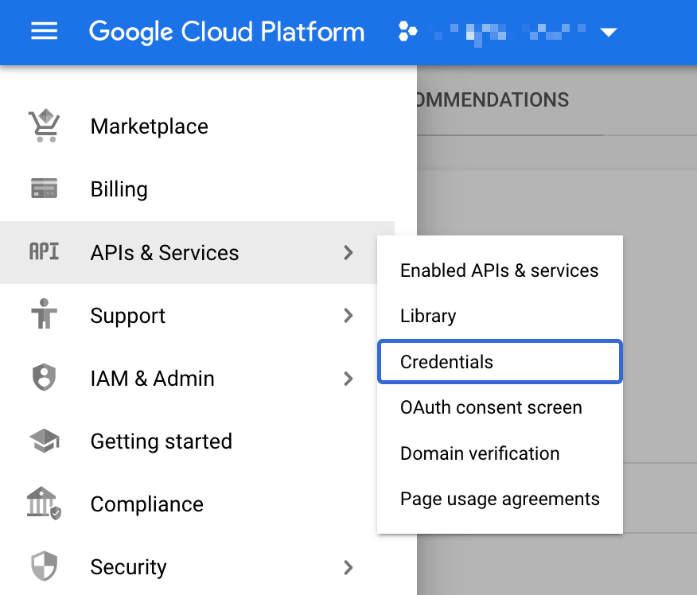
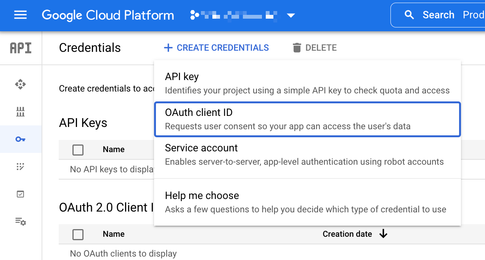
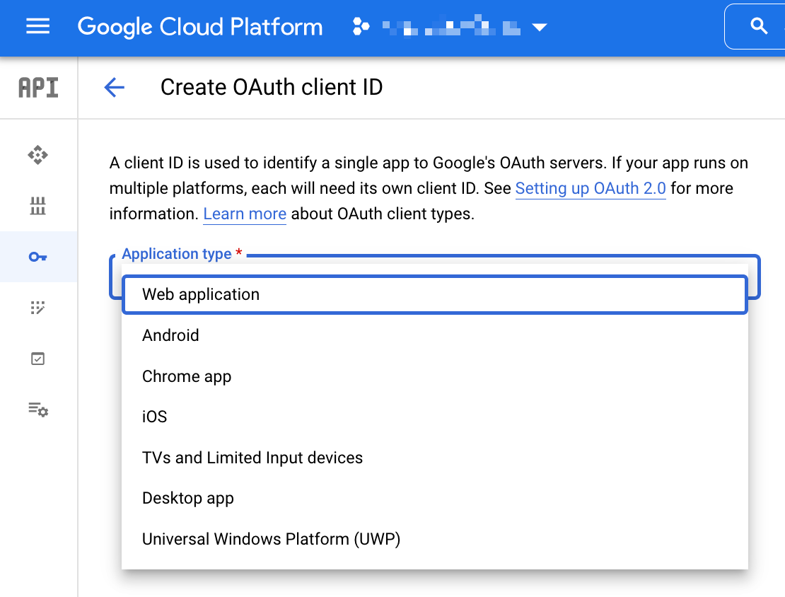
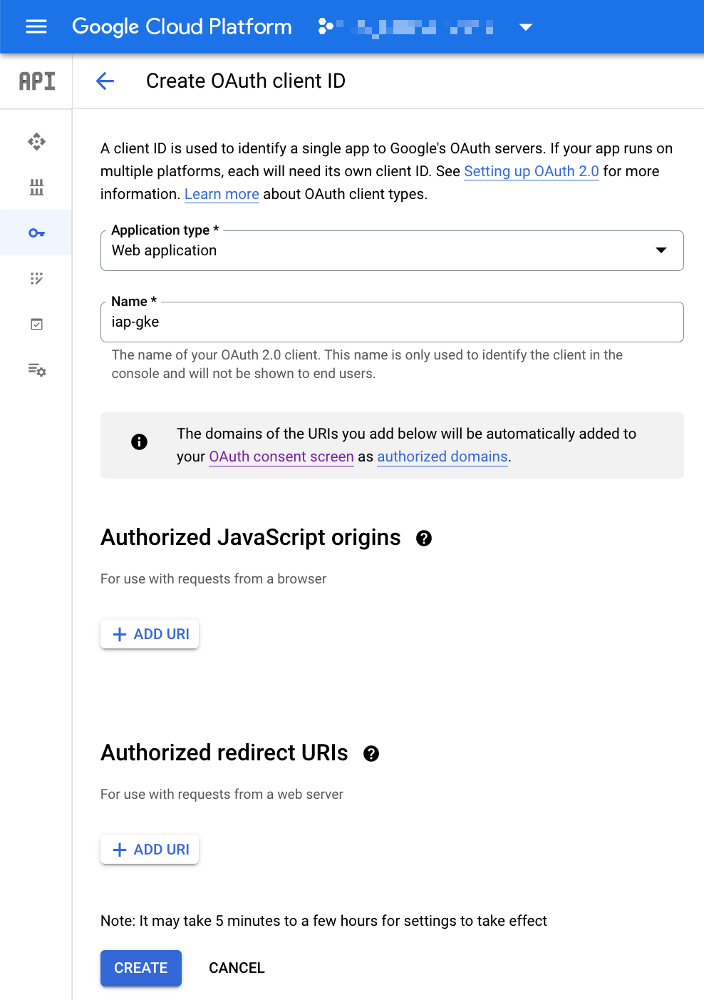
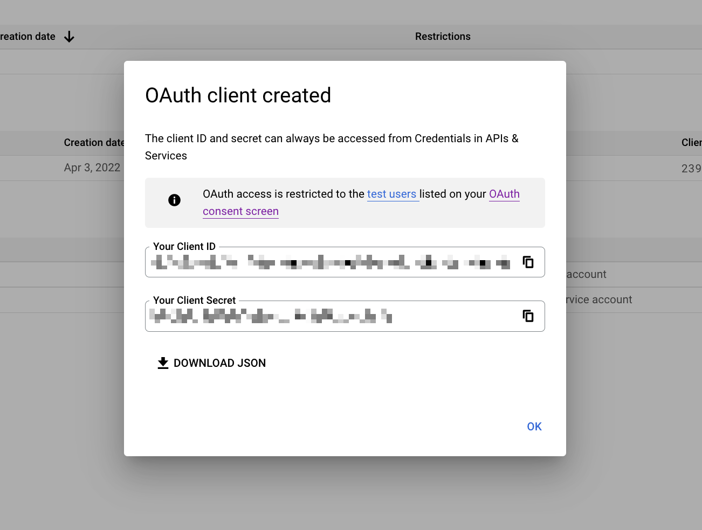
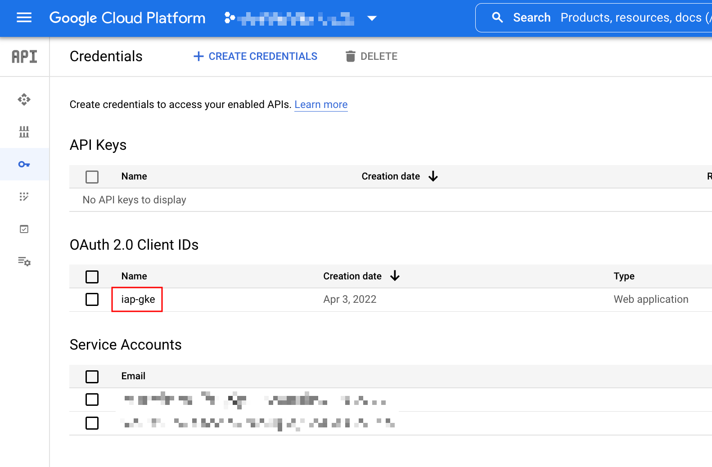
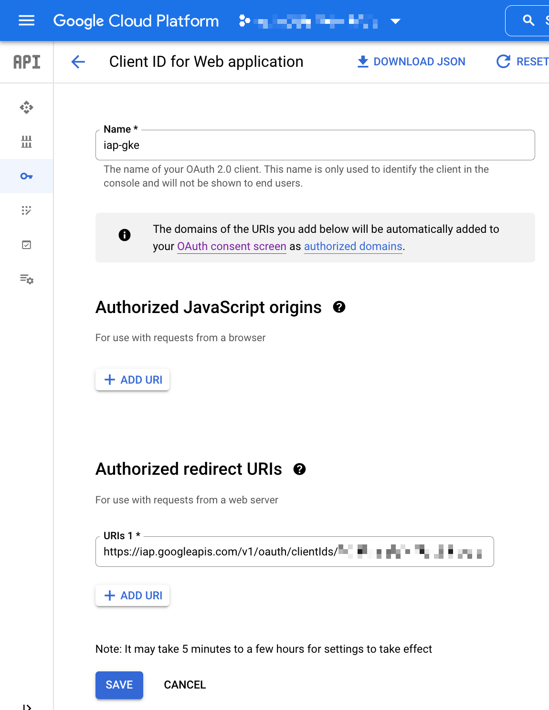
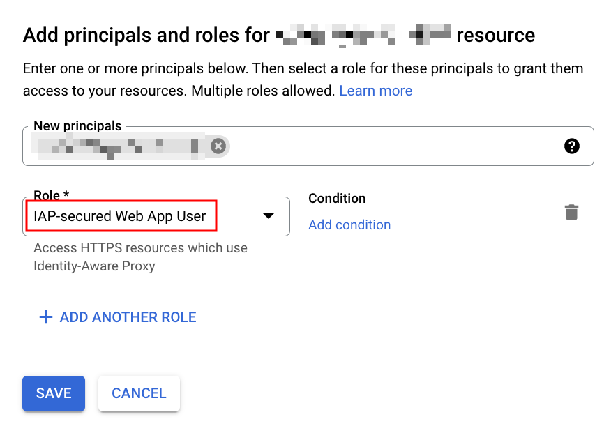
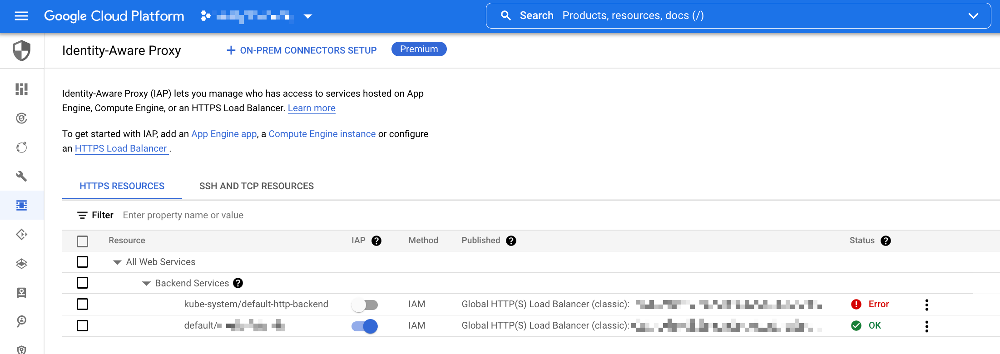
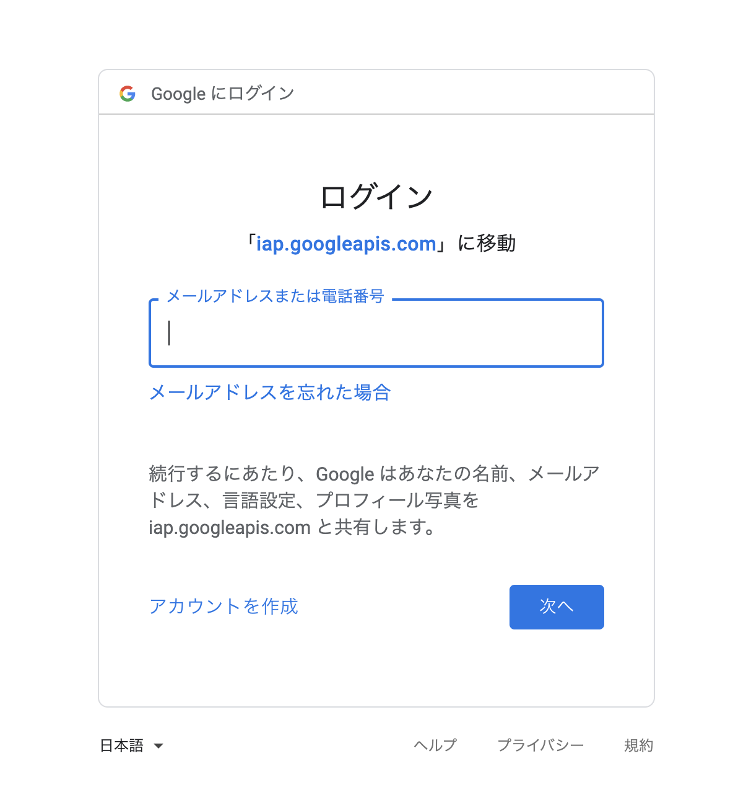

# GKE に IAP をつける

## 概要

GKE 上にデプロイしている Ingress に IAP( Identity-Aware Proxy ) をつける

```
Enabling IAP for GKE
https://cloud.google.com/iap/docs/enabling-kubernetes-howto
```

## 手順

### 0. 準備

GKE Cluster が作成されていて、その上に Ingress がデプロイされている前提

### 1. API の有効化

```
export _gcp_pj_id='Your GCP Project ID'
```
```
gcloud beta services enable iap.googleapis.com --project ${_gcp_pj_id}
```

### 2. OAuth consent screen の作成

WIP

### 3. OAuth credentials の作成

`iap-gke` という名前で作っていく


3-1. 左上のナビゲーションメニューから `API & Services` -> `Credentials` をクリック



3-2. `CREATE CREDENTIALS` -> `OAuth client ID` とクリック



3-3. `Application type` に `Web application` をクリック。追加で出てきた項目を埋めていき、作成する





3-4. `Client ID` と `Client Secret` が表示されるのでコピーしておく



+ コメント
  + Client ID は `hogehoge.apps.googleusercontent.com` の形
  + Client secret は `ランダムな文字列` の形

もしコピーし忘れても、 `OAuth 2.0 Client IDs` をクリックすれば確認できる

3-5. `OAuth 2.0 Client IDs` のところに先程作成した Client があるのでクリック



3-6. `Authorized redirect URIs` に以下のフォーマットで URI を入れて保存する

```
https://iap.googleapis.com/v1/oauth/clientIds/{Your Client ID}:handleRedirect
```

```
### 例
https://iap.googleapis.com/v1/oauth/clientIds/hogehoge.apps.googleusercontent.com:handleRedirect
```




### 4. IAM の設定

IAP & Admin にて ` IAP-secured Web App User` の Role を付与する



### 5. GKE にて Secret を設定する

+ GKE と認証をする

```
gcloud beta container clusters get-credentials { Your GKE Cluster's Name } \
  --region { Your GKE Cluster's Region } \
  --project ${_gcp_pj_id}
```

+ Secret の作成をする
  + 3-4 でコピーした `Client ID` と `Client secret` をいれた Secret を作る

```
kubectl create secret generic secret-iap-gke \
  --from-literal=client_id={Your Client ID} \
  --from-literal=client_secret={Your Client secret}
```

もしくは

```
export _client_id='Your Client ID'
export _client_secret='Your Client secret'
```
```
### Base64 化 ( -n は必須 )

echo -n ${_client_id} | base64
echo -n ${_client_secret} | base64

---> 改行して表示される場合は 1 行にする
```

```
cat << __EOF__ > secret-iap-gke.yaml
apiVersion: v1
kind: Secret
metadata:
  name: secret-iap-gke
  namespace: {Your Namespace}
data:
  client_id: {base64 化した Client ID}
  client_secret: {base64 化した Client secret}
__EOF__
```
```
### Apply する

kubectl apply -f secret-iap-gke.yaml
```

### 6. GKE に BackendConfig を設定する

+ `backendconfig-iap-gke.yaml` を作る

```
apiVersion: cloud.google.com/v1
kind: BackendConfig
metadata:
  name: backendconfig-iap-gke
  namespace: {Your Namespace}
spec:
  iap:
    enabled: true
    oauthclientCredentials:
      secretName: secret-iap-gke
```

### 7. Service に設定する

+ Service と Ingress のマニフェスト例

```
kind: Service
apiVersion: v1
metadata:
  name: service-iap-gke
  namespace: default
  annotations:
    beta.cloud.google.com/backend-config: '{
      "ports": {
        "80":"backendconfig-iap-gke"
      }
    }'
spec:
  type: NodePort
  ports:
  - name: http
    port: 80
    targetPort: 80

---
apiVersion: networking.k8s.io/v1
kind: Ingress
metadata:
  name: ingress-iap-gke

spec:
  rules:
  - host: "iap-gke.iganari.org"
    http:
      paths:
      - path: /*
        pathType: ImplementationSpecific
        backend:
          service:
            name: service-iap-gke
            port:
              number: 80
```






---> これで Ingres で作った GCLB に IAP ( Identity-Aware Proxy ) がつき、よりセキュアに運用することが出来るようになりました :)

## 注意点

一時的に IAP を無効にしたい場合は BackendConfig の `spec.iap.enabled` を false にして下さい
