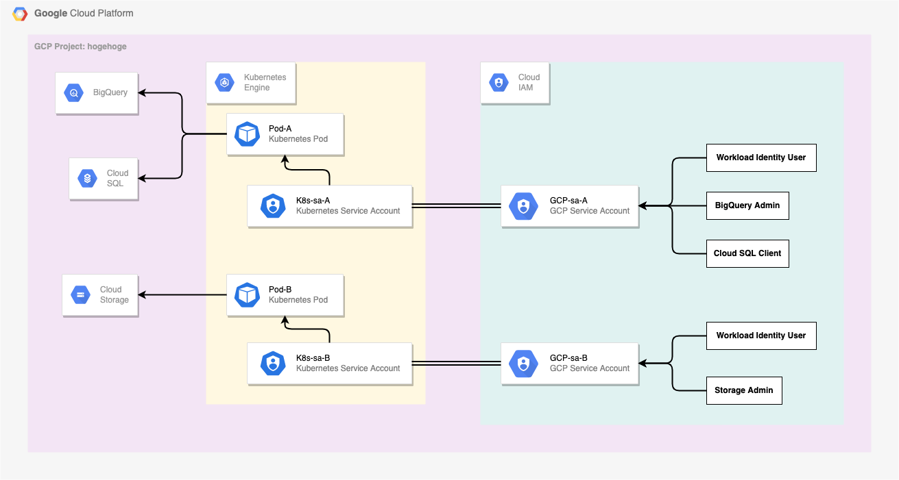

# Workload Identity を試す

## 概要

`Kubernetes の Service Account` と `GCP の Service Account` を紐付けることにより、 `GKE 上の Pod 内の GCP に対する権限を GKE 外の GCP の IAM にて制御可能にする`

これをすることにより、GCP に対する権限情報を K8s 内ではなく GCP 側で制御可能になるので、GCP リソースに対する権限管理をセキュアに行える



:point_right: GKE ではなく、 on-Prem や 他のパブリッククラウドで使用したい場合は [Workload identity federation](https://cloud.google.com/iam/docs/workload-identity-federation) が使えるか確認する


## やること

5 ステップある

+ [GKE で Workload Identity を有効にする](./README.md#gke-で-workload-identity-を有効にする)
+ [Kubernetes の Service Account を作成](./README.md#kubernetes-の-service-account-を作成)
+ [GCP の Service Account を作成](./README.md#gcp-の-service-account-を作成)
+ [GCP の Service Account に Workload Identity の role を付与する](./README.md#gcp-の-service-account-に-workload-identity-の-role-を付与する)
+ [Kubernetes の Service Account と GCP の Service Account を紐付ける](./README.md#kubernetes-の-service-account-と-gcp-の-service-account-を紐付ける)


## Workload Identity を有効にした GKE Cluster の作成

+ 環境変数

```
export _gcp_pj_id='Your GCP Project ID'
export _common='workload-identity-test'
export _region='asia-northeast1'
```

+ 新規クラスターを作る場合

```
gcloud beta container clusters create ${_common} \
    --workload-pool=${_gcp_pj_id}.svc.id.goog \
    --region ${_region} \
    --num-nodes "1" \
    --node-locations "asia-northeast1-a" \
    --project ${_gcp_pj_id}
```

+ 既存のクラスタで Workload Identity を有効にする場合
  + クラスタに適用した後に作成した node pool は Workload Identity が可能
  + :fire: クラスタに適用する前に作成した既存の node pool には適用されないので、適用コマンドを実行する必要がある

```
### GKE クラスタ に適用するコマンド
gcloud beta container clusters update {cluster name} \
    --workload-pool=${_gcp_pj_id}.svc.id.goog \
    --project ${_gcp_pj_id}
```
```
### 既存の node pool に適用するコマンド例
gcloud container node-pools update {node pool name} \
  --cluster {cluster name} \
  --region {cluster location} \
  --workload-metadata GKE_METADATA
```

+ GKE Cluster と認証をする

```
gcloud container clusters get-credentials ${_common} \
    --region ${_region} \
    --project ${_gcp_pj_id}
```

## Kubernetes の Service Account を作成

+ 環境変数

```
export _k8s_namespace='default'
export _k8s_sa_name='workload-identity-test-k8s'
```

+ 作成コマンド

```
kubectl create serviceaccount --namespace ${_k8s_namespace} ${_k8s_sa_name}
```

+ 確認コマンド

```
kubectl get serviceaccount | grep ${_k8s_sa_name}
```
```
### Ex

# kubectl get serviceaccount | grep ${_k8s_sa_name}
workload-identity-test-k8s   1         5m18s
```

## GCP の Service Account を作成

+ 環境変数

```
export _gcp_sa_name='workload-identity-test-gcp'
```

+ 作成コマンド

```
gcloud iam service-accounts create ${_gcp_sa_name} \
    --project ${_gcp_pj_id}
```

+ 確認コマンド

```
gcloud iam service-accounts list --project ${_gcp_pj_id} | grep ${_gcp_sa_name}
```

## GCP の Service Account に Workload Identity の role を付与する

+ 実行コマンド

```
gcloud iam service-accounts add-iam-policy-binding ${_gcp_sa_name}@${_gcp_pj_id}.iam.gserviceaccount.com \
    --role roles/iam.workloadIdentityUser \
    --member "serviceAccount:${_gcp_pj_id}.svc.id.goog[${_k8s_namespace}/${_k8s_sa_name}]" \
    --project ${_gcp_pj_id}
```

+ 確認コマンド

```
WIP
```

## Kubernetes の Service Account と GCP の Service Account を紐付ける

+ YAML の作成
    + `k8s-workload-identity-test-sa.yaml`

```
cat << __EOF__ > k8s-workload-identity-test-sa.yaml
apiVersion: v1
kind: ServiceAccount
metadata:
  annotations:
    iam.gke.io/gcp-service-account: ${_gcp_sa_name}@${_gcp_pj_id}.iam.gserviceaccount.com
  name: ${_k8s_sa_name}
  namespace: ${_k8s_namespace}
__EOF__
```

+ YAML を元にリソース作成

```
kubectl apply -f k8s-workload-identity-test-sa.yaml
```

## テストで使用する GCS のバケットを作成する

+ バケットの作成

```
gsutil mb -c standard -l asia-northeast1 -p ${_gcp_pj_id} gs://${_gcp_pj_id}-${_common}
```

+ バケットの確認

```
gsutil ls -p ${_gcp_pj_id} | grep ${_gcp_pj_id} | grep ${_common}
```

+ GCP のサービスアカウントに GCS バケットの閲覧権限を付ける

```
gcloud projects add-iam-policy-binding ${_gcp_pj_id} \
    --member "serviceAccount:${_gcp_sa_name}@${_gcp_pj_id}.iam.gserviceaccount.com" \
    --role roles/storage.admin
```

## 確認方法

+ gcloud コマンドが入っているコンテナの pod を作成
    + `k8s-workload-identity-test-pod.yaml`

```
cat << __EOF__ > k8s-workload-identity-test-pod.yaml
apiVersion: v1
kind: Pod
metadata:
  name: ${_common}-pod
  namespace: ${_k8s_namespace}
spec:
  containers:
  - image: google/cloud-sdk:slim
    name: ${_common}-pod
    command: ["sleep","infinity"]
  serviceAccountName: ${_k8s_sa_name}
  nodeSelector:
    iam.gke.io/gke-metadata-server-enabled: "true"
__EOF__
```

+ 作成

```
kubectl apply -f k8s-workload-identity-test-pod.yaml
```

+ Pod の確認

```
kubectl get pod | grep ${_common}
```

+ Pod にログイン

```
kubectl exec -it $(kubectl get pod | grep ${_common} | awk '{print $1}') /bin/bash
```

+ Pod の中の認証情報の確認
    + 自分で作成した GCP の Service Account( `${_gcp_sa_name}` ) が読み取れれば成功

```
gcloud auth list
```
```
### Ex.

# gcloud auth list
                               Credentialed Accounts
ACTIVE  ACCOUNT
*       workload-identity-test-gcp@{your-gcp-id}.iam.gserviceaccount.com
```

+ Pod の中から GCS のバケットの確認

```
gsutil ls
```
```
### Ex.

# gsutil ls
gs://{your-gcp-id}-workload-identity-test/
```

Pod の中から GCS のバケットを確認することが出来ました :)

## リソースの削除

+ GKE Cluster の削除

```
gcloud beta container clusters delete ${_common} \
    --region ${_region} \
    --project ${_gcp_pj_id} \
    -q
```

+ Service Account の削除

```
gcloud iam service-accounts delete ${_gcp_sa_name}@${_gcp_pj_id}.iam.gserviceaccount.com \
    --project ${_gcp_pj_id} \
    -q
```

+ GCS のバケットの削除

```
gsutil rm -r gs://${_gcp_pj_id}-${_common}
```

+ YAML ファイルの削除

```
rm -rfv k8s-workload-identity-test*
```

## 参考 URL

+ [公式] Using Workload Identity
  + https://cloud.google.com/kubernetes-engine/docs/how-to/workload-identity

+ Workload Identityを試す
  + https://qiita.com/atsumjp/items/9df1f4e18bea164f95fe
