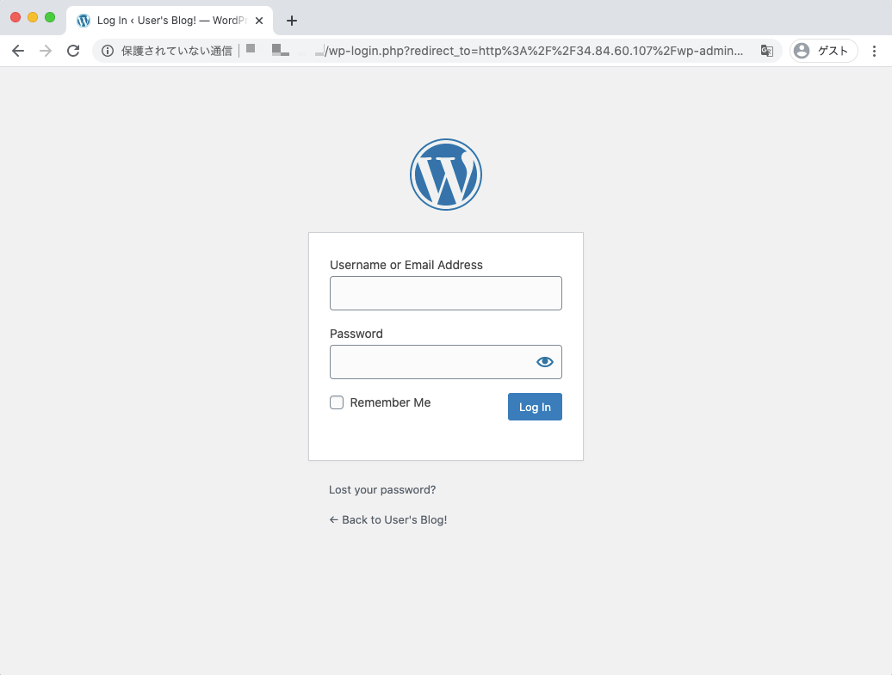
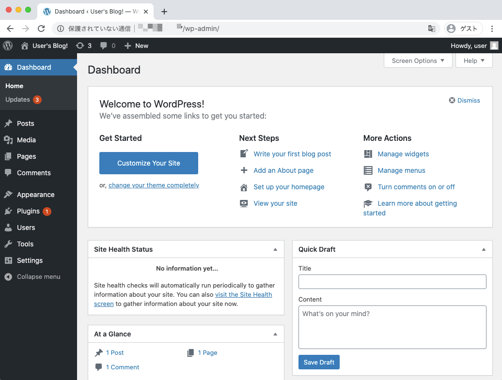

# WordPress

## Goal

Install Wordpress using Helm on GKE.

## Prepare GKE

+ GCP authentication.

```
gcloud auth login
```

+ Setting Env

```
export _pj_id='Your GCP Project ID'
```

+ Setting GCP Project.

```
gcloud config set project ${_pj_id}
```

+ Make VPC network and Subnets

```
export _common='helm-wordpress'
```
```
gcloud beta compute networks create ${_common}-network \
  --subnet-mode=custom
```
```
gcloud beta compute networks subnets create ${_common}-subnets \
  --network ${_common}-network \
  --region asia-northeast1 \
  --range 10.140.0.0/20
```

+ Make Firewall Rules

```
gcloud compute firewall-rules create ${_common}-allow-internal \
  --network ${_common}-network \
  --allow tcp:0-65535,udp:0-65535,icmp
```

+ Make (Zonal) GKE Cluster.

```
gcloud beta container clusters create "${_common}-cluster" \
  --project "${_pj_id}" \
  --zone "asia-northeast1-a"\
  --no-enable-basic-auth \
  --release-channel "regular" \
  --machine-type "n1-standard-1" \
  --image-type "COS" \
  --disk-type "pd-standard" \
  --disk-size "100" \
  --preemptible \
  --num-nodes "3" \
  --enable-stackdriver-kubernetes \
  --enable-ip-alias \
  --network "projects/${_pj_id}/global/networks/${_common}-network" \
  --subnetwork "projects/${_pj_id}/regions/asia-northeast1/subnetworks/${_common}-subnets" \
  --default-max-pods-per-node "110" \
  --enable-autoscaling \
  --min-nodes "0" \
  --max-nodes "3" \
  --no-enable-master-authorized-networks \
  --addons HorizontalPodAutoscaling,HttpLoadBalancing,Istio \
  --istio-config auth=MTLS_PERMISSIVE \
  --enable-autoupgrade \
  --enable-autorepair \
  --max-surge-upgrade 1 \
  --max-unavailable-upgrade 0
```

+ Make and Attach additional Node Pool
  + https://cloud.google.com/kubernetes-engine/docs/how-to/node-pools?hl=en

```
gcloud container node-pools create ${_common}-pool \
  --cluster "${_common}-cluster" \
  --zone "asia-northeast1-a" \
  --preemptible \
  --num-nodes "3" \
  --enable-autoscaling \
  --min-nodes "0" \
  --max-nodes "3" \
  --enable-autoupgrade \
  --enable-autorepair \
  --max-surge-upgrade 2 \
  --max-unavailable-upgrade 1
```

+ Check your Node of GKE.
  + You have Two Node Pools.

```
gcloud container node-pools list \
  --cluster ${_common}-cluster \
  --zone "asia-northeast1-a"
```

+ Delete default Node Pool

```
gcloud container node-pools delete default-pool \
  --cluster "${_common}-cluster" \
  --zone "asia-northeast1-a"
```

+ ReCheck your Node of GKE.
  + You have One Node Pool only!

```
gcloud container node-pools list \
  --cluster ${_common}-cluster \
  --zone "asia-northeast1-a"
```

+ GKE authentication.

```
gcloud container clusters get-credentials ${_common}-cluster \
  --zone "asia-northeast1-a"
```

## Prepare Helm

+ Download and Move helm binary

```
cd /usr/local/src
wget https://get.helm.sh/helm-v3.2.4-linux-amd64.tar.gz
tar -zxvf helm-v3.2.4-linux-amd64.tar.gz
mv linux-amd64/helm /usr/local/bin/
cd -
```

+ Check Helm.

```
helm version
```

## Install WordPress using Helm

+ Official Document
  + https://hub.helm.sh/charts/bitnami/wordpress

```
helm repo add bitnami https://charts.bitnami.com/bitnami
helm install my-release bitnami/wordpress
```
```
### Ex.

# helm install my-release bitnami/wordpress
NAME: my-release
LAST DEPLOYED: Wed Jun 17 04:21:19 2020
NAMESPACE: default
STATUS: deployed
REVISION: 1
NOTES:
** Please be patient while the chart is being deployed **

To access your WordPress site from outside the cluster follow the steps below:

1. Get the WordPress URL by running these commands:

  NOTE: It may take a few minutes for the LoadBalancer IP to be available.
        Watch the status with: 'kubectl get svc --namespace default -w my-release-wordpress'

   export SERVICE_IP=$(kubectl get svc --namespace default my-release-wordpress --template "{{ range (index .status.loadBalancer.ingress 0) }}{{.}}{{ end }}")
   echo "WordPress URL: http://$SERVICE_IP/"
   echo "WordPress Admin URL: http://$SERVICE_IP/admin"

2. Open a browser and access WordPress using the obtained URL.

3. Login with the following credentials below to see your blog:

  echo Username: user
  echo Password: $(kubectl get secret --namespace default my-release-wordpress -o jsonpath="{.data.wordpress-password}" | base64 --decode)
```
 
+ Check Your Web Browser





You did it!! :)

## delete

+ Delete  WordPress of Helm.

```
helm delete my-release
```

+ Delete GKE.

```
gcloud container node-pools delete ${_common}-pool \
  --cluster "${_common}-cluster" \
  --zone "asia-northeast1-a"
```
```
gcloud beta container clusters delete "${_common}-cluster" \
  --zone "asia-northeast1-a"
```

Now, All the work is done.
Thank you!! :)
 
