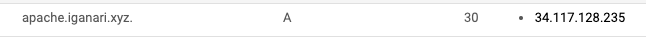
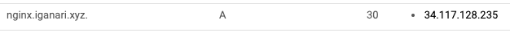
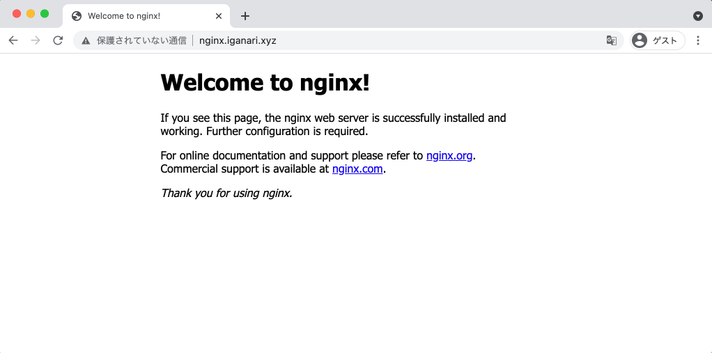
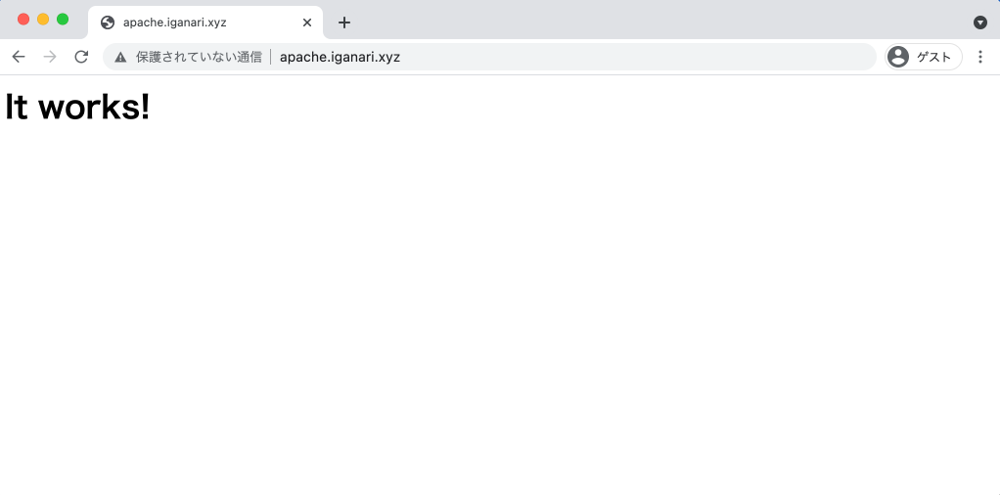

# Ingress: Multi Domain

## 概要

1 つの Ingress で複数のドメインをホスティングするやり方のサンプルです

## 準備

ドメインを用意しておく

```
### 例

iganari.xyz
```

+ 環境変数を設定しておきます

```
### Env

export _gcp_pj_id='Your GCP Project ID'
export _my_domain='Domains you own'
```

## GKE クラスタとリソースをデプロイする

+ 使用する環境変数

```
### Env

export _common='sslself'
export _gcp_pj_id='Your GCP Project ID'
export _region='asia-northeast1'
export _sub_network_range='10.146.0.0/20'
```

+ GKE クラスタを作成する
  + [Package GCP | Create Public Cluster of Standard mode](https://github.com/iganari/package-gcp/tree/main/kubernetes/about-cluster/standard-public-gcloud)

## IP Adress を予約

+ GCP と認証をします

```
gcloud auth login -q
```

+ External IP Address を予約します

```
gcloud beta compute addresses create multi-domain \
  --ip-version=IPV4 \
  --global \
  --project ${_gcp_pj_id}
```

## 予約した IP Address をドメインの A レコードとして登録する

+ イメージ図





## GKE Cluster 上にリソースをデプロイする

+ マニフェストをサンプルから作成します

```
cat main.yaml.template | sed -e "s/_YOUR_DOMAIN/${_my_domain}/g" > main.yaml
```

+ デプロイします

```
kubectl apply -f main.yaml
```

## Web ブラウザから確認する

+ http://nginx.iganari.xyz



+ http://apache.iganari.xyz



---> 1 つの Ingress で 異なる 2 個のドメインをホスティングすることが出来ました :)

## リソース削除

```
kubectl delete -f main.yaml
```
```
gcloud beta compute addresses delete multi-domain \
    --global \
    --project ${_gcp_pj_id}
```

## 参考

+ ハンズオン
  + https://github.com/iganari/handson-gke/tree/main/10_hello-world
+ 公式 | Google Cloud
  + https://kubernetes.io/ja/docs/tasks/access-application-cluster/ingress-minikube/
+ 公式 | Kubernetes
  + https://kubernetes.io/docs/concepts/services-networking/ingress/#name-based-virtual-hosting
