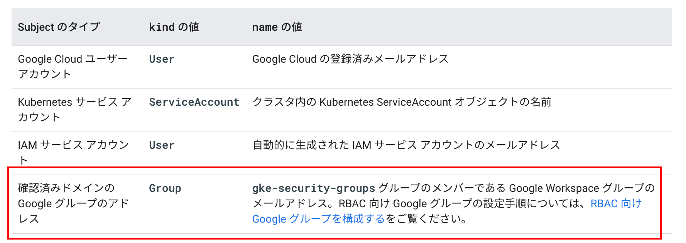
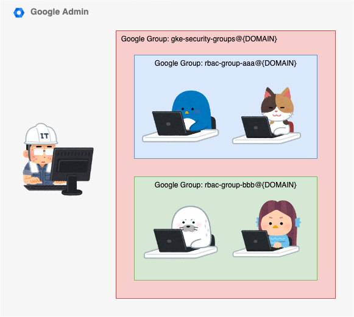
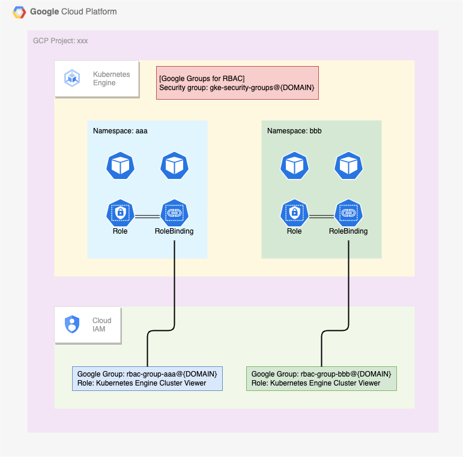
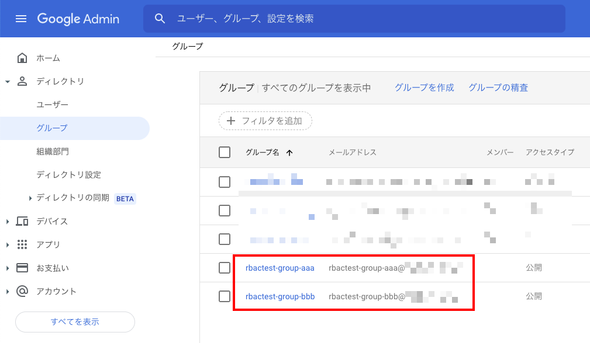
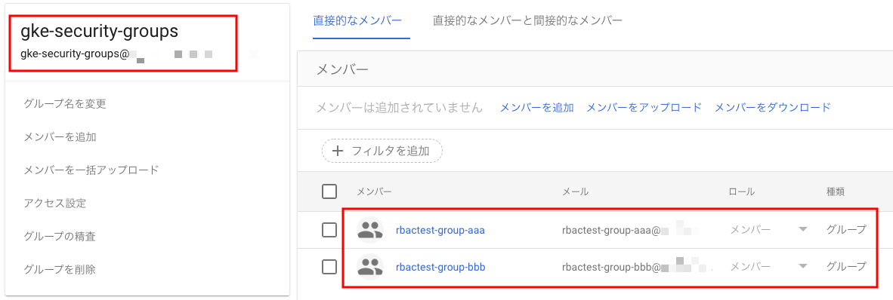
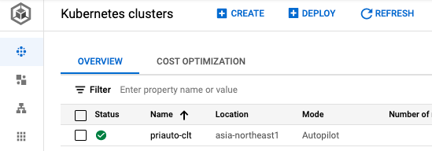
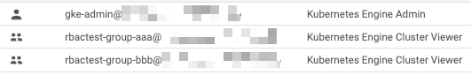
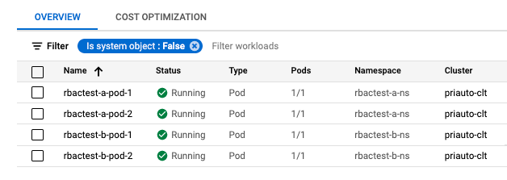
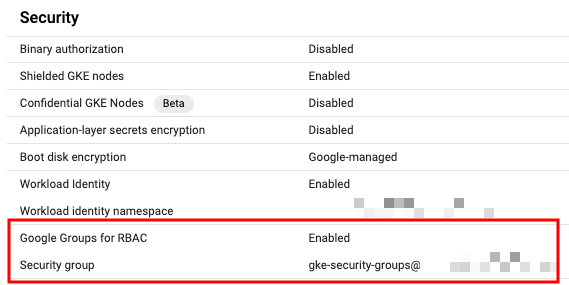

# Google Groups for RBAC を設定してみる

## 概要

Google Kubernetes Engine ( GKE ) において Google Groups for RBAC を使用すると、GKE クラスタ上のリソースに対しての操作権限を GCP 管理者や GKE 管理者ではなく、Google Workspace の管理者( つまり GCP の外部の管理者 ) がユーザーとグループを制御することが出来るようになります

GCP において、ユーザの管理は GCP ではなく Google Admin で管理することがベストプラクティスになるため、この Google Groups for RBAC を使いこなせると GCP をうまく使うことが出来るようになります

```
Configure Google Groups for RBAC ( RBAC 向け Google グループの構成 )
https://cloud.google.com/kubernetes-engine/docs/how-to/google-groups-rbac
```
```
Configure role-based access control ( ロールベースのアクセス制御を構成する )
https://cloud.google.com/kubernetes-engine/docs/how-to/role-based-access-control
```







## 注意

3 つの Google アカウントが出てきます

+ `gke-admin@{Your_Domain}`
+ `rbactest-user-xxx@{Your_Domain}`
+ `rbactest-user-yyy@{Your_Domain}`

3 つの Google グループが出てきます

+ `gke-security-group@{Your_Domain}`
+ `rbactest-group-aaa@{Your_Domain}`
+ `rbactest-group-bbb@{Your_Domain}`

## 1. 準備

### Google Admin で Google Group を作成

必要な Google Group を作成します

+ 今回は以下の Google Group を作成します
  + `rbactest-group-aaa@{Your_Domain}`
    + `rbactest-user-xxx@{Your_Domain}` が入っている
  + `rbactest-group-bbb@{Your_Domain}`
    + `rbactest-user-yyy@{Your_Domain}` が入っている



+ `gke-security-groups@{Your_Domain}` というグループを作成する
  + 先程作成した Google Group をいれる



### GKE Cluster の作成

+ GKE autopilot を作成します
  + 下記の URL を元に Autopilot mode の GKE Cluster を作成します
    + [Package GCP | Create Private Cluster of Autopilot mode](https://github.com/iganari/package-gcp/tree/main/kubernetes/cluster-overview/autopilot-private-gcloud)
    + GKE Cluster に認証するところまでやります

```
export _gcp_pj_id='Your GCP Project ID'

export _common='priauto'
export _region='asia-northeast1'
export _sub_network_range='10.146.0.0/20'
```



### IAM Role を付与

+ `gke-admin@{Your Domain}` に `Kubernetes Engine Admin ( roles/container.admin )` の Role を付与します

```
### gke-admin@{Your_Domain} に Role を付与
gcloud beta projects add-iam-policy-binding ${_gcp_pj_id} \
  --member='user:gke-admin@{Your_Domain}' \
  --role='roles/container.admin'
```

+ `rbactest-group-aaa@{Your_Domain}` と `rbactest-group-bbb@{Your_Domain}` に `Kubernetes Engine Cluster Viewer ( roles/container.clusterViewer )` の Role を付与します

```
### rbactest-group-aaa@{Your_Domain} に Role を付与
gcloud beta projects add-iam-policy-binding ${_gcp_pj_id} \
  --member='group:rbactest-group-aaa@{Your_Domain}' \
  --role='roles/container.clusterViewer'

### rbactest-group-bbb@{Your_Domain} に Role を付与
gcloud beta projects add-iam-policy-binding ${_gcp_pj_id} \
  --member='group:rbactest-group-bbb@{Your_Domain}' \
  --role='roles/container.clusterViewer'
```

+ IAM を確認します

```
gcloud beta projects get-iam-policy ${_gcp_pj_id}
```



## 2. Pod を配置

### Google アカウントを変更

+ gcloud auth を使って変更します
  + `gke-admin@{Your Domain}` でログインします

```
gcloud auth login --no-launch-browser -q
```

### Pod を配置

+ マニフェストを使用してデプロイします

```
kubectl apply -f test-pod.yaml
```

+ リソースを確認します

```
# kubectl get pod --namespace rbactest-a-ns
NAME               READY   STATUS    RESTARTS   AGE
rbactest-a-pod-1   1/1     Running   0          5h27m
rbactest-a-pod-2   1/1     Running   0          5h27m
```
```
# kubectl get pod --namespace rbactest-b-ns
NAME               READY   STATUS    RESTARTS   AGE
rbactest-b-pod-1   1/1     Running   0          5h28m
rbactest-b-pod-2   1/1     Running   0          5h28m
```



参考: [Package GCP | kind: Pod](https://github.com/iganari/package-gcp/tree/main/kubernetes/kind-pod)

### Configure Google Groups for RBAC の適用

+ 新しい GKE Cluster の作成時に適用します

```
### Standard mode
gcloud beta container clusters create ${_common}-clt \
  --region ${_region} \
  --security-group="gke-security-groups@DOMAIN" \
  --project ${_gcp_pj_id}

### Autopilot mode
gcloud beta container clusters create-auto ${_common}-clt \
  --region ${_region} \
  --security-group="gke-security-groups@DOMAIN" \
  --project ${_gcp_pj_id}
```

+ 既存の GKE Cluster の作成時に適用します

```
gcloud beta container clusters update ${_common}-clt \
  --region ${_region} \
  --security-group="gke-security-groups@DOMAIN" \
  --project ${_gcp_pj_id}
```



### Role と RoleBinding をデプロイ

+ マニフェストを作成します

```
kind: Role
apiVersion: rbac.authorization.k8s.io/v1
metadata:
  name: rbactest-a-pod-reader
  namespace: rbactest-a-ns
rules:
- apiGroups: [""]
  resources: ["pods"]
  verbs: ["*"]

---

kind: RoleBinding
apiVersion: rbac.authorization.k8s.io/v1
metadata:
  name: rbactest-a-pod-reader-binding
  namespace: rbactest-a-ns
roleRef:
  kind: Role
  apiGroup: rbac.authorization.k8s.io
  name: rbactest-a-pod-reader
subjects:
# Google Group
- kind: Group
  name: rbactest-group-aaa@{Your_Domain}

---

kind: Role
apiVersion: rbac.authorization.k8s.io/v1
metadata:
  name: rbactest-b-pod-reader
  namespace: rbactest-b-ns
rules:
- apiGroups: [""]
  resources: ["pods"]
  verbs: ["get", "watch", "list"]

---

kind: RoleBinding
apiVersion: rbac.authorization.k8s.io/v1
metadata:
  name: rbactest-b-pod-reader-binding
  namespace: rbactest-b-ns
roleRef:
  kind: Role
  apiGroup: rbac.authorization.k8s.io
  name: rbactest-b-pod-reader
subjects:
# Google Group
- kind: Group
  name: rbactest-group-bbb@{Your_Domain}
```

+ マニフェストを apply します

```
kubectl apply -f role-rolebinding.yaml
```

+ Role を確認します

```
# kubectl get role --namespace rbactest-a-ns
NAME                    CREATED AT
rbactest-a-pod-reader   2022-05-21T03:54:02Z
```
```
# kubectl get role --namespace rbactest-b-ns
NAME                    CREATED AT
rbactest-b-pod-reader   2022-05-21T04:27:17Z
```

+ RoleBinding を確認します

```
# kubectl get rolebinding --namespace rbactest-a-ns
NAME                            ROLE                         AGE
rbactest-a-pod-reader-binding   Role/rbactest-a-pod-reader   12h
```
```
# kubectl get rolebinding --namespace rbactest-a-ns
NAME                            ROLE                         AGE
rbactest-a-pod-reader-binding   Role/rbactest-a-pod-reader   12h
```

## 3-a. rbactest-user-xxx@{Your_Domain} で操作

### Google アカウントを変更

+ gcloud auth を使って変更します
  + `rbactest-user-xxx@{Your_Domain}` でログインします

```
gcloud auth login --no-launch-browser -q
```

### Namespace を確認

+ GKE と認証します

```
gcloud beta container clusters get-credentials ${_common}-clt \
  --region ${_region} \
  --project ${_gcp_pj_id}
```

+ Namespace を確認します

```
$ kubectl get namespace
Error from server (Forbidden): namespaces is forbidden: User "rbactest-user-xxx@{Your_Domain}" cannot list resource "namespaces" in API group "" at the cluster scope: requires one of ["container.namespaces.list"] permission(s).
```

+ Role がある Namespace にて Pod を確認します

```
$ kubectl get pod --namespace rbactest-a-ns
NAME               READY   STATUS    RESTARTS   AGE
rbactest-a-pod-1   1/1     Running   0          3h34m
rbactest-a-pod-2   1/1     Running   0          3h34m
```

+ Role が無い Namespace にて Pod を確認します

```
$ kubectl get pod --namespace rbactest-b-ns
Error from server (Forbidden): pods is forbidden: User "rbactest-user-xxx@{Your_Domain}" cannot list resource "pods" in API group "" in the namespace "rbactest-b-ns": requires one of ["container.pods.list"] permission(s).
```

## 3-b. rbactest-user-yyy@{Your_Domain} で操作

### Google アカウントを変更

+ gcloud auth を使って変更します
  + `rbactest-user-yyy@{Your_Domain}` でログインします

```
gcloud auth login --no-launch-browser -q
```

### Namespace を確認

+ GKE と認証します

```
gcloud beta container clusters get-credentials ${_common}-clt \
  --region ${_region} \
  --project ${_gcp_pj_id}
```

+ Namespace を確認します

```
$ kubectl get namespace
Error from server (Forbidden): namespaces is forbidden: User "rbactest-user-yyy@{Your_Domain}" cannot list resource "namespaces" in API group "" at the cluster scope: requires one of ["container.namespaces.list"] permission(s).
```

+ Role がある Namespace にて Pod を確認します

```
$ kubectl get pod --namespace rbactest-b-ns
NAME               READY   STATUS    RESTARTS   AGE
rbactest-b-pod-1   1/1     Running   0          3h34m
rbactest-b-pod-2   1/1     Running   0          3h34m
```

+ Role が無い Namespace にて Pod を確認します

```
$ kubectl get pod --namespace rbactest-a-ns
Error from server (Forbidden): pods is forbidden: User "rbactest-user-yyy@{Your_Domain}" cannot list resource "pods" in API group "" in the namespace "rbactest-a-ns": requires one of ["container.pods.list"] permission(s).
```

## まとめ

Google Groups for RBAC の動きが確認出来ました :)
