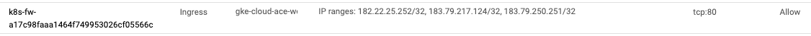

# Type LoadBalancer で許可 IP アドレス制限をしたい場合

## 概要

`spec.loadBalancerSourceRanges` で IP アドレスを許可した場合、 Firewall Rule にて Allow の設定が自動作成される


```
Configuring TCP/UDP load balancing | Load balancer source ranges
https://cloud.google.com/kubernetes-engine/docs/how-to/service-parameters#lb_source_ranges
```

## 実際にやってみる

+ マニフェストに IP アドレスを記載します
  + `spec.loadBalancerSourceRanges` に 許可したい IP アドレスのレンジを記載します

```
apiVersion: apps/v1
kind: Deployment
metadata:
  name: nginx
  labels:
    app: nginx
spec:
  replicas: 1
  selector:
    matchLabels:
      app: nginx
  template:
    metadata:
      labels:
        app: nginx
    spec:
      containers:
      - name: nginx
        image: nginx:1.21.6-alpine
        ports:
        - containerPort: 80

---

apiVersion: v1
kind: Service
metadata:
  name: nginx
  labels:
    app: nginx
spec:
  type: LoadBalancer
  loadBalancerSourceRanges:
  - "_YOUR_IP_ADDRESS_RANGES"     ## <---- ここに IP アドレスを入れる
  selector:
    app: nginx
  ports:
  - name: nginx
    port: 80
    targetPort: 80

```

+ もしくはサンプルのマニフェストを使います
  + `/` が今回は使えないので `@` で sed をする

```
export _allow_addr="xxx.xxx.xxx.xxx/32"

cat main.yaml.sample | sed s"@_YOUR_IP_ADDRESS_RANGES@${_allow_addr}"@g > main.yaml
```

+ GKE にデプロイします

```
kubectl apply -f main.yaml
```

+ Service を確認します

```
# kubectl get service
NAME    TYPE           CLUSTER-IP    EXTERNAL-IP    PORT(S)        AGE
nginx   LoadBalancer   10.48.3.143   34.84.54.208   80:32145/TCP   2m1s
```
## 確認する

### コマンドライン

+ 許可された IP アドレスから cURL で確認する

```
# curl -I 34.84.54.208
HTTP/1.1 200 OK
Server: nginx/1.21.6
Date: Thu, 03 Feb 2022 14:51:41 GMT
Content-Type: text/html
Content-Length: 615
Last-Modified: Tue, 25 Jan 2022 15:26:06 GMT
Connection: keep-alive
ETag: "61f0168e-267"
Accept-Ranges: bytes
```

+ 許可されていない IP アドレスから cURL で確認する

```
# curl -m 60 -I 34.84.54.208
curl: (28) Connection timed out after 60001 milliseconds
```

---> 挙動が確認出来ました :)

## Firewall の確認

試しに IP アドレス ( `182.22.25.252/32` `183.79.217.124/32` `183.79.250.251/32` ) を許可した場合のスクリーンショット



## リソースの削除

+ K8s のリソースを削除します

```
kubectl delete -f main.yaml
```
