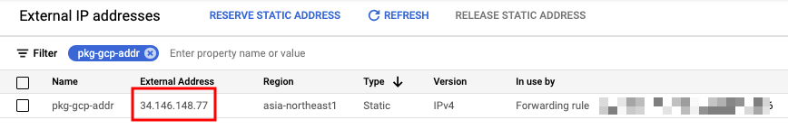
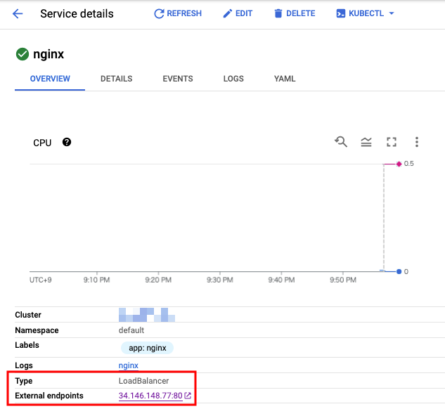
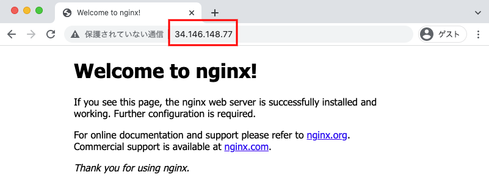

# Type LoadBalancer で 外部 IP アドレスを固定したい場合

## 概要

```
Configuring TCP/UDP load balancing | Load balancer source ranges
https://cloud.google.com/kubernetes-engine/docs/how-to/service-parameters#lb_source_ranges
```

## 実際にやってみる

+ GCP Project ID を環境変数に入れます

```
export _gcp_pj_id='Your GCP Project ID'
```

+ External IP Address の予約します
  + `Regional` で取得します

```
gcloud beta compute addresses create pkg-gcp-addr \
  --region asia-northeast1 \
  --project ${_gcp_pj_id}
```

+ IP アドレスを確認します

```
gcloud beta compute addresses list --project ${_gcp_pj_id}
```
```
# gcloud beta compute addresses list --project ${_gcp_pj_id}
NAME          ADDRESS/RANGE  TYPE      PURPOSE      NETWORK  REGION           SUBNET  STATUS
pkg-gcp-addr  34.146.148.77  EXTERNAL                        asia-northeast1          RESERVED
```

+ マニフェストに IP アドレスを記載します
  + `spec.loadBalancerIP` に IP アドレスを記載します

```
apiVersion: apps/v1
kind: Deployment
metadata:
  name: nginx
  labels:
    app: nginx
spec:
  replicas: 1
  selector:
    matchLabels:
      app: nginx
  template:
    metadata:
      labels:
        app: nginx
    spec:
      containers:
      - name: nginx
        image: nginx:1.21.6-alpine
        ports:
        - containerPort: 80

---

apiVersion: v1
kind: Service
metadata:
  name: nginx
  labels:
    app: nginx
spec:
  type: LoadBalancer
  loadBalancerIP: _YOUR_REGIONAL_IP_ADDRESS    <---- ここに IP アドレスを入れる
  selector:
    app: nginx
  ports:
  - name: nginx
    port: 80
    targetPort: 80

```

+ もしくはサンプルのマニフェストを使います

```
export _my_ip_addr=$(gcloud beta compute addresses list --project ${_gcp_pj_id} | grep pkg-gcp-addr | awk '{print $2}')

cat main.yaml.sample | sed s"/_YOUR_REGIONAL_IP_ADDRESS/${_my_ip_addr}"/g > main.yaml
```

+ GKE にデプロイします

```
kubectl apply -f main.yaml
```

+ Service を確認します

```
# kubectl get service
NAME    TYPE           CLUSTER-IP    EXTERNAL-IP     PORT(S)        AGE
nginx   LoadBalancer   10.48.3.172   34.146.148.77   80:32625/TCP   2m32s
```

## 確認する

### コマンドライン

+ cURL で確認します

```
# curl 34.146.148.77
<!DOCTYPE html>
<html>
<head>
<title>Welcome to nginx!</title>
<style>
html { color-scheme: light dark; }
body { width: 35em; margin: 0 auto;
font-family: Tahoma, Verdana, Arial, sans-serif; }
</style>
</head>
<body>
<h1>Welcome to nginx!</h1>
<p>If you see this page, the nginx web server is successfully installed and
working. Further configuration is required.</p>

<p>For online documentation and support please refer to
<a href="http://nginx.org/">nginx.org</a>.<br/>
Commercial support is available at
<a href="http://nginx.com/">nginx.com</a>.</p>

<p><em>Thank you for using nginx.</em></p>
</body>
</html>
```

### スクリーンショット

+ GCP コンソールで確認します






