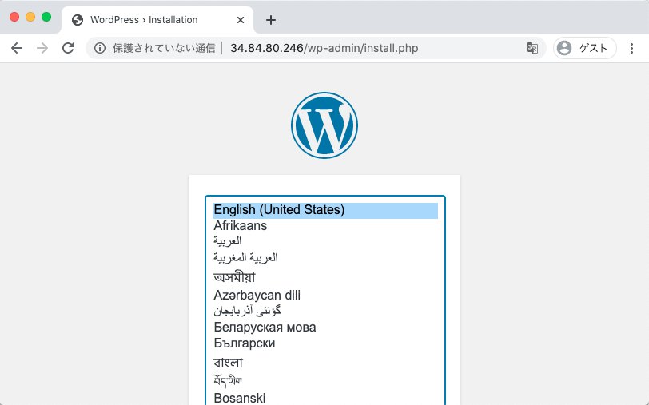

# GKE 上に Cloud SQL を使用した WordPress を作成する

本ドキュメント(英語)はこちら :) ---> [README.md](./README.md)

## Goal

公式 ドキュメントに沿って、WordPress + CloudSQL on GKE をやってみる

+ 公式ドキュメント
  + https://cloud.google.com/kubernetes-engine/docs/tutorials/persistent-disk?hl=en
+ 使用する GitHub
  + https://github.com/GoogleCloudPlatform/kubernetes-engine-samples/tree/master/wordpress-persistent-disks

## やってみる

+ [GKE を作成する](./README.md#create-gke)
  + [GKE で使用するネットワークの作成](./README.md#create-network)
  + [GKE Cluster の作成](./README.md#cerate-gke-cluster)
+ [CloudSQL を作成する](./README.md#create-cloud-sql)
+ [Service Account を作成する](./README.md#create-service-account)
+ [Kubernetes Resource を作成する](./README.md#create-kubernetes-resource)
  + [NameSpace を作成する](./README.md#create-namespace)
  + [Secret を作成する](./README.md#create-secret)
  + [PVC から PV を作成する](./README.md#create-pv-form-pvc)
  + [Deployment を作成する](./README.md#create-deployment)
  + [Service を作成する](./README.md#create-service)
  + [Web ブラウザで確認をする](./README.md#check-browser)
+ [Resource の削除](./README.md#delete-resource)

## Get Source

+ Get this Repository

```
git clone https://github.com/iganari/package-gcp.git
cd package-gcp/kubernetes/wordpress/with-cloudsql
```

## Create GKE

### Create Network

+ GCP と認証を行います

```
gcloud auth login -q
```

+ Setting GCP Project on Console.

```
### New Setting
export _pj_id='Your GCP Project ID'
```
```
gcloud config set project ${_pj_id}
```

+ Make VPC network and Subnets

```
### New Setting
export _common='wp-gke-cloudsql'
export _region='asia-northeast1'
```
```
gcloud beta compute networks create ${_common}-network \
  --subnet-mode=custom
```
```
gcloud beta compute networks subnets create ${_common}-subnets \
  --network ${_common}-network \
  --region ${_region} \
  --range 10.140.0.0/20
```

+ Make Firewall Rules

```
gcloud compute firewall-rules create ${_common}-allow-internal \
  --network ${_common}-network \
  --allow tcp:0-65535,udp:0-65535,icmp
```

### Cerate GKE Cluster

+ (Zonal) GKE Cluster を gcloud コマンドを使って作成します

```
gcloud beta container clusters create "${_common}-cluster" \
  --project "${_pj_id}" \
  --zone "${_region}-a"\
  --no-enable-basic-auth \
  --release-channel "regular" \
  --machine-type "n1-standard-1" \
  --image-type "COS" \
  --disk-type "pd-standard" \
  --disk-size "100" \
  --preemptible \
  --num-nodes "3" \
  --enable-stackdriver-kubernetes \
  --enable-ip-alias \
  --network "projects/${_pj_id}/global/networks/${_common}-network" \
  --subnetwork "projects/${_pj_id}/regions/${_region}/subnetworks/${_common}-subnets" \
  --default-max-pods-per-node "110" \
  --enable-autoscaling \
  --min-nodes "0" \
  --max-nodes "3" \
  --no-enable-master-authorized-networks \
  --addons HorizontalPodAutoscaling,HttpLoadBalancing,Istio \
  --istio-config auth=MTLS_PERMISSIVE \
  --enable-autoupgrade \
  --enable-autorepair \
  --max-surge-upgrade 1 \
  --max-unavailable-upgrade 0
```

+ Create and Attach additional Node Pool
  + https://cloud.google.com/kubernetes-engine/docs/how-to/node-pools?hl=en

```
gcloud container node-pools create ${_common}-pool \
  --cluster "${_common}-cluster" \
  --zone "${_region}-a" \
  --preemptible \
  --num-nodes "3" \
  --enable-autoscaling \
  --min-nodes "0" \
  --max-nodes "3" \
  --enable-autoupgrade \
  --enable-autorepair \
  --max-surge-upgrade 2 \
  --max-unavailable-upgrade 1
```

+ Check your Node of GKE.
  + You have Two Node Pools.

```
gcloud container node-pools list \
  --cluster ${_common}-cluster \
  --zone "${_region}-a"
```

+ Delete default Node Pool

```
gcloud container node-pools delete default-pool \
  --cluster "${_common}-cluster" \
  --zone "${_region}-a"
```

+ ReCheck your Node of GKE.
  + You have One Node Pool only!

```
gcloud container node-pools list \
  --cluster ${_common}-cluster \
  --zone "${_region}-a"
```

+ GKE authentication.

```
gcloud container clusters get-credentials ${_common}-cluster \
  --zone "${_region}-a"
```

## Create Cloud SQL

+ Create Cloud SQL instance

```
### Existing Settings
echo ${_common}
echo ${_region}

### New Setting
export _db_instance_type='db-f1-micro'
export _db_root_password='DB Root Password'
export _rand='Your Random Number'
```
```
gcloud beta sql instances create ${_common}-instance-${_rand} \
  --database-version=MYSQL_5_7 \
  --tier=${_db_instance_type} \
  --zone=${_region}-a \
  --root-password=${_db_root_password}
```

+ Check Instance

```
gcloud beta sql instances list | grep ${_common}-instance-
```

+ Create DB user / password

```
### New Setting
export CLOUD_SQL_USER='wordpress-admin'
export CLOUD_SQL_PASSWORD='wordpress-admin-password'
```
```
gcloud beta sql users create ${CLOUD_SQL_USER} \
  --instance=${_common}-instance-${_rand} \
  --host="%" \
  --password ${CLOUD_SQL_PASSWORD}
```

+ Check Cloud SQL Connection Name
  + 後で使います

```
### New Setting
export __INSTANCE_CONNECTION_NAME=$(gcloud sql instances describe ${_common}-instance-${_rand} --format='value(connectionName)')
echo ${__INSTANCE_CONNECTION_NAME}
```

## Create Service Account

+ GKE から Cloud SQL に繋ぐ、Service Account (と Key) を作る

```
### New Setting
export _sa_name=${_common}-gke
echo ${_sa_name}
```
```
gcloud beta iam service-accounts create ${_sa_name} --display-name ${_sa_name}
```

+ 作成した Service Account に、 CloudSQL の client 権限を付与します

```
### New Setting
export _sa_email=$(gcloud iam service-accounts list --filter=displayName:${_sa_name} --format='value(email)')
echo ${_sa_email}
```
```
gcloud projects add-iam-policy-binding ${_pj_id} \
  --role roles/cloudsql.client \
  --member serviceAccount:${_sa_email}
```

+ Service Account に紐づく Key の作成
  + Kubernetes の Secret に使います

```
gcloud iam service-accounts keys create ./serviceAccount-${_sa_name}-key.json \
  --iam-account ${_sa_email}
```
```
ls ./serviceAccount-${_sa_name}-key.json
```

## Create Kubernetes Resource

### Create NameSpace

+ GKE との認証

```
gcloud container clusters get-credentials ${_common}-cluster \
  --zone "${_region}-a"
```

+ Create NameSpace

```
kubectl create -f namespace.yaml
```

### Create Secret

+ K8s のシークレットを 2 個作る
  + Secret of DB username and password 
  + Secret of ServiceAccount

```
### New Setting
export _namespace_name=$(cat namespace.yaml | grep 'name:' | awk '{print $2}')
echo ${_namespace_name}
```
```
### Existing Settings
echo ${CLOUD_SQL_USER}
echo ${CLOUD_SQL_PASSWORD}
```

```
kubectl create secret generic cloudsql-db-credentials \
  --from-literal username=${CLOUD_SQL_USER} \
  --from-literal password=${CLOUD_SQL_PASSWORD} \
  --namespace ${_namespace_name}
```
```
kubectl create secret generic cloudsql-instance-credentials \
  --from-file ./serviceAccount-${_sa_name}-key.json \
  --namespace ${_namespace_name}
```

+ Check Secret

```
kubectl get secret --namespace ${_namespace_name} | grep cloudsql-
```
```
### Ex.

# kubectl get secret --namespace ${_namespace_name} | grep cloudsql-
cloudsql-db-credentials         Opaque                                2      92s
cloudsql-instance-credentials   Opaque                                1      86s
```


### Create PV form PVC

+ PV と PVC を作成する

```
kubectl create -f wordpress-volumeclaim.yaml
```

+ 確認

```
kubectl get pvc --namespace ${_namespace_name}
```
```
### EX.

# kubectl get pvc --namespace ${_namespace_name}
NAME                    STATUS   VOLUME                                     CAPACITY   ACCESS MODES   STORAGECLASS   AGE
wordpress-volumeclaim   Bound    pvc-5ee024d3-a246-4aed-8202-8c7203f9843f   200Gi      RWO            standard       64s
```

+ Cloud SQL for MySQL インスタンスを作成する

```
### Existing Settings
echo ${__INSTANCE_CONNECTION_NAME}
echo ${_sa_name}
```
```
### New Setting
export __SA_KEY_NAME=$(echo serviceAccount-${_sa_name}-key.json)
echo ${__SA_KEY_NAME}
```
```
cat wordpress-cloudsql.yaml.template | sed "s/__INSTANCE_CONNECTION_NAME/${__INSTANCE_CONNECTION_NAME}/g" | sed "s/__SA_KEY_NAME/${__SA_KEY_NAME}/g" > wordpress-cloudsql.yaml
```

+ Create Deployment Resource

```
kubectl create -f wordpress-cloudsql.yaml
```

+ Check Pod

```
watch -n1 kubectl get pod -l app=wordpress --namespace ${_namespace_name}
```

+ Create Service

```
kubectl create -f wordpress-service.yaml
```

+ Check External IP Address
  + `EXTERNAL-IP` が割り当てられることを確認する

```
watch -n1 kubectl get service --namespace ${_namespace_name}
```

+ debug
  + Pod の中に複数のコンテナがある場合(今回はCloudSQLのコンテナがサイドカーとしている)

```
export _pod_name=$(kubectl get pod --namespace ${_namespace_name} | grep wordpress- | awk '{print $1}')
echo ${_pod_name}
```
```
kubectl exec -it ${_pod_name} --namespace ${_namespace_name} -c wordpress -- /bin/bash
kubectl exec -it ${_pod_name} --namespace ${_namespace_name} -c cloudsql-proxy -- /bin/ash
```


+ Web ブラウザで確認する

```
### EXTERNAL-IP の確認
kubectl get service --namespace ${_namespace_name} | grep wordpress | awk '{print $4}'
```
```
### Ex.
# kubectl get service --namespace ${_namespace_name} | grep wordpress | awk '{print $4}'
34.84.80.246


---> http://34.84.80.246 にアクセスする
```




## Delete Resource

+ Kubernetes Resource  を削除

```
kubectl delete -f wordpress-service.yaml && \
kubectl delete -f wordpress-cloudsql.yaml && \
kubectl delete -f wordpress-volumeclaim.yaml
```

+ Permission を削除

```
gcloud projects remove-iam-policy-binding ${_pj_id} \
  --role roles/cloudsql.client \
  --member serviceAccount:${_sa_email}
```


+ ServiceAccount を削除

```
gcloud beta iam service-accounts delete ${_sa_email} \
  --project "${_pj_id}"
```

+ GKE Cluster を削除

```
gcloud beta container clusters delete "${_common}-cluster" \
  --project "${_pj_id}" \
  --zone "${_region}-a"
```

+ CloudSQL を削除

```
gcloud beta sql instances delete ${_common}-instance-${_rand}
```

+ Firewall Rule を削除

```
gcloud compute firewall-rules delete ${_common}-allow-internal
```

+ Network を削除

```
gcloud beta compute networks subnets delete ${_common}-subnets \
  --region ${_region}
```
```
gcloud beta compute networks delete ${_common}-network
```

End.

## closing

公式ドキュメントからすこしアレンジを加えた WordPress on GKE with CloudSQL を体験しました。

まだ経験出来ていない機能はたくさんあるので、引き続き学んでいきましょう

Have Fan :)
