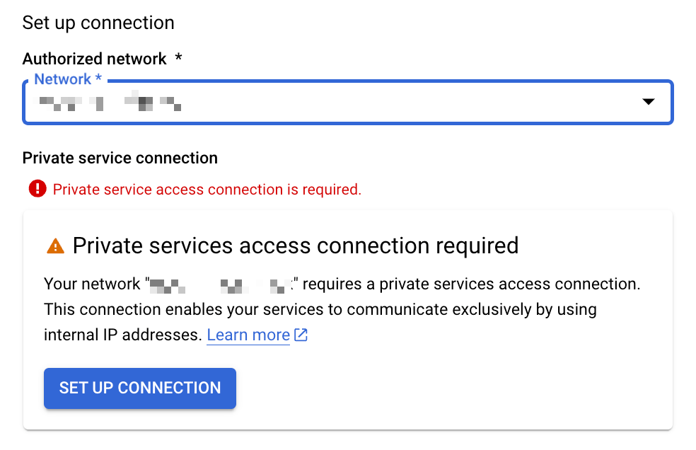

# 基本的な構築方法

## 準備

環境変数を設定しておく

```
export _gc_pj_id='Your Google Cloud Project ID'

export _common='pkg-gcp-memcached'
```

## Network の作成

参考 ---> TBD

+ VPC Network の作成

```
gcloud beta compute networks create ${_common}-network \
  --subnet-mode=custom \
  --project ${_gc_pj_id}
```

+ Private Services Access の設定
  + https://cloud.google.com/vpc/docs/configure-private-services-access?hl=en#procedure
  + `Prefix Length` は自動にするため指定しない

```
gcloud beta compute addresses create ${_common}-psa \
  --global \
  --network ${_common}-network \
  --purpose VPC_PEERING \
  --prefix-length 16 \
  --project ${_gc_pj_id}
```

+ Private Connection の作成

```
gcloud beta services vpc-peerings connect \
  --network ${_common}-network \
  --ranges ${_common}-psa \
  --service servicenetworking.googleapis.com \
  --project ${_gc_pj_id}
```

+ Private Connnection の確認

```
gcloud beta services vpc-peerings list \
  --network ${_common}-network \
  --project ${_gc_pj_id}
```

## Memcached Instance の作成

+ 環境変数を設定しておく
  + ここで MemCached の基本的なスペックを指定する

```
export _mem_node_region='asia-northeast1'
export _mem_node_count='1'    ## 1 ~ 20
export _mem_node_cpu='1'      ## vCPU
export _mem_node_mem='1024'   ## MB
export _mem_ver='1.6.15'      ## 1.5 or 1.6.15
```

+ Memorystore for Memcached のインスタンスの作成

```
gcloud beta memcache instances create ${_common}-memcached \
  --node-count ${_mem_node_count} \
  --node-cpu ${_mem_node_cpu} \
  --node-memory ${_mem_node_mem} \
  --memcached-version ${_mem_ver} \
  --region ${_mem_node_region} \
  --authorized-network=projects/${_gc_pj_id}/global/networks/${_common}-network \
  --reserved-ip-range-id ${_common}-psa \
  --project ${_gc_pj_id}
```

+ Memorystore for Memcached のインスタンスの確認

```
gcloud beta memcache instances list --region ${_mem_node_region} --project ${_gc_pj_id}

または

gcloud beta memcache instances describe ${_common}-memcached --region ${_mem_node_region} --project ${_gc_pj_id} --format json
```

## 注意点

紐づける VPC ネットワーク にて **Private Services Access が必要** になる

[公式ドキュメント | Private services access](https://cloud.google.com/vpc/docs/private-services-access?hl=en)

<details>
<summary>スクショ</summary>



</details>
