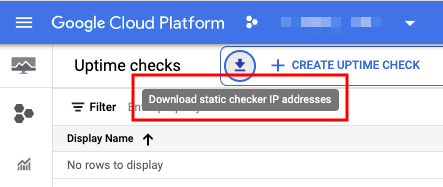

# Uptime Check


## [プライベートなエンドポイントを外形監視する](./private-checks/)

内部 LB や 外部 IP アドレスがついていない VM の外形監視をしたい場合

## WIP

WIP

## Tips

### ID について

+ 作成時に指定するのは `display name`
+ 識別子である `id` は自動に作られ、以下のような法則性がある
  + https://cloud.google.com/monitoring/uptime-checks?hl=en#uptime-check-ids

```
projects/[PROJECT_ID]/uptimeCheckConfigs/[UPTIME_CHECK_ID]
```

現状だと、この `id` を gcloud コマンドで探すことは出来ない ??

Terraform で import などをする際に `id` が必要になるので注意

+ google_monitoring_uptime_check_config / Import
  + https://www.terraform.io/docs/providers/google/r/monitoring_uptime_check_config.html#import

## Uptime Check の時の拠点の IP アドレス

いくつかの手法で IP アドレスのレンジを取得できる

[Reviewing uptime checks | Getting uptime-check IP addresses](https://cloud.google.com/monitoring/uptime-checks/using-uptime-checks#get-ips)

Cloud Console の Monitoring の Uptime Check のページから TEXT の形式で取得できる



IP アドレスの過去のリスト -> [Uptime-check IP addresses](./uptime-check-ip-addresses)

### 上記を jq コマンドを使ってソートしてみる


```
export source_url='https://raw.githubusercontent.com/iganari/package-gcp/main/monitoring/uptime/uptime-check-ip-addresses/uptime-source-ips-2021-12-15.txt'
```

+ `ASIA_PACIFIC`

```
curl ${source_url} | jq '.[] | select(.region == "ASIA_PACIFIC")'
curl ${source_url} | jq '.[] | select(.region == "ASIA_PACIFIC") | .ipAddress'
```

+ `SOUTH_AMERICA`

```
curl ${source_url} | jq '.[] | select(.region == "SOUTH_AMERICA")'
curl ${source_url} | jq '.[] | select(.region == "SOUTH_AMERICA") | .ipAddress'
```

+ `USA`

```
curl ${source_url} | jq '.[] | select(.region == "USA")'
curl ${source_url} | jq '.[] | select(.region == "USA") | .ipAddress'
```

+ `EUROPE`

```
curl ${source_url} | jq '.[] | select(.region == "EUROPE")'
curl ${source_url} | jq '.[] | select(.region == "EUROPE") | .ipAddress'
```
