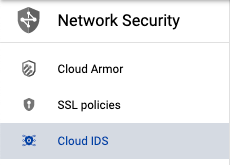
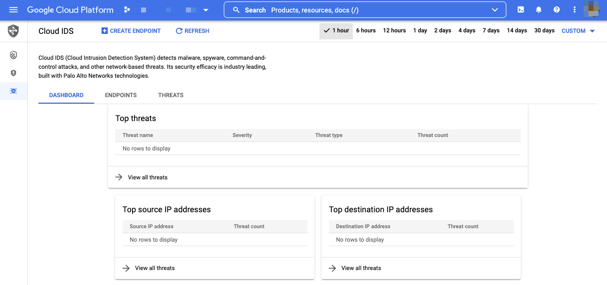

# Cloud IDS

## 概要

WIP

### YouTube

### 公式ブログ

+ [Google の信頼できるクラウドの拡張: Cloud IDS の導入でネットワークベースの脅威を検出](https://cloud.google.com/blog/ja/products/identity-security/detect-complex-network-threats-with-cloud-ids)
+ [高度なネットワーク脅威検出に Cloud IDS を最大限活用](https://cloud.google.com/blog/ja/products/identity-security/how-google-cloud-ids-helps-detect-advanced-network-threats)
+ [ネットワークベースの脅威を検出する Google Cloud IDS の一般提供を開始](https://cloud.google.com/blog/ja/products/identity-security/announcing-general-availability-of-google-cloud-ids)
+ [Google Cloud IDS のシグネチャの更新による Apache Log4j の脆弱性 CVE-2021-44228、CVE-2021-45046、CVE-2021-4104、CVE-2021-45105、CVE-2021-44832 の検出](https://cloud.google.com/blog/ja/products/identity-security/cloud-ids-to-help-detect-cve-2021-44228-apache-log4j-vulnerability)

### Web コンソール

WIP
