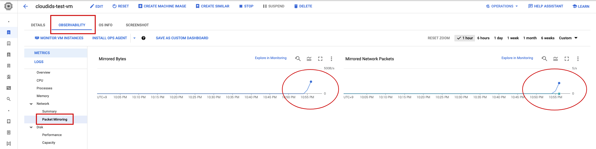
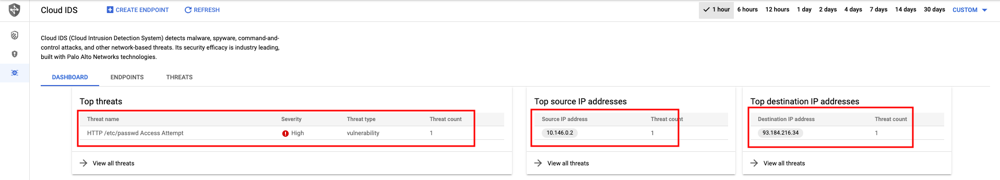
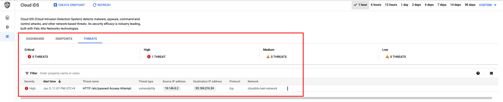
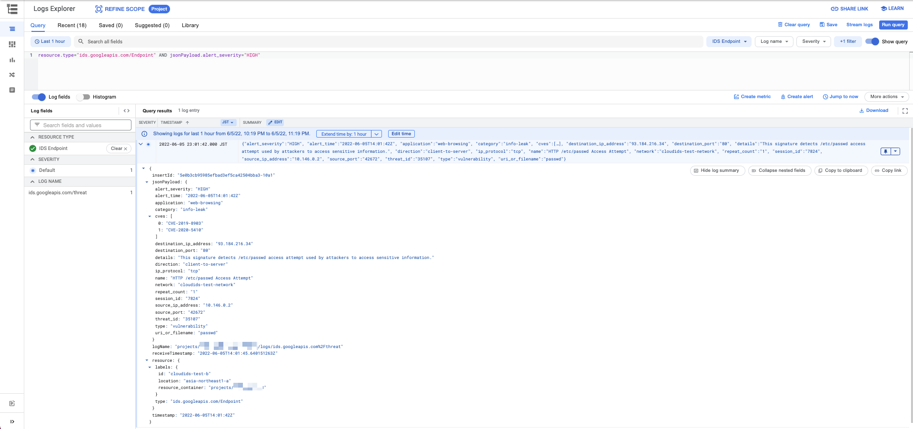

# Quick Start

## やってみる

```
Configure Cloud IDS
https://cloud.google.com/intrusion-detection-system/docs/configuring-ids
```

## 準備

```
export _gcp_pj_id='Your GCP Project ID'
```

+ API の有効化

```
gcloud beta services enable ids.googleapis.com --project ${_gcp_pj_id}


gcloud beta services enable servicenetworking.googleapis.com --project ${_gcp_pj_id}
```

## 適用するネットワーク

`Private Google Access` を有効にしている Subnets が必要

## Create Instance

---> 参考 [外部 IP アドレスがついていない VM instance](https://github.com/iganari/package-gcp/tree/main/compute/instances/no-external-ip)

+ Setting env

```
export _common='cloudids-test'
export _region='asia-northeast1'
export _sub_network_range='10.146.0.0/20'
export _reserved_range='192.168.0.0'
export _reserved_range_prefix='16'
```

+ VPC Network の作成します

```
gcloud beta compute networks create ${_common}-network \
  --subnet-mode=custom \
  --project ${_gcp_pj_id}
```

+ Subnet の作成します

```
gcloud beta compute networks subnets create ${_common}-subnets \
  --network ${_common}-network \
  --region ${_region} \
  --range ${_sub_network_range} \
  --enable-private-ip-google-access \
  --project ${_gcp_pj_id}
```

+ Private service access を作成します
  + `addresses` = `Google に払い出す CIDR のネットワークアドレス`
  + `prefix-length` = `Googleに払い出す CIDR のサブネットマスク`

```
gcloud beta compute addresses create ${_common}-pricon \
  --global \
  --network ${_common}-network \
  --purpose VPC_PEERING \
  --addresses ${_reserved_range} \
  --prefix-length ${_reserved_range_prefix} \
  --project ${_gcp_pj_id}
```

+ VPC Peeringを作成します

```
gcloud beta services vpc-peerings connect \
  --service servicenetworking.googleapis.com \
  --ranges ${_common}-pricon \
  --network ${_common}-network \
  --project ${_gcp_pj_id}
```

## Endpoint の作成

severity = ( `INFORMATIONAL` | `LOW` | `MEDIUM` | `HIGH` | `CRITICAL` )

```
export _severity='LOW'

gcloud beta ids endpoints create ${_common}-b \
  --network ${_common}-network \
  --zone ${_region}-a \
  --severity ${_severity} \
  --enable-traffic-logs \
  --project ${_gcp_pj_id}
```

+ 確認

```
gcloud beta ids endpoints describe ${_common}-b --zone ${_region}-a --project ${_gcp_pj_id}
```
```
### 例

$ gcloud beta ids endpoints describe ${_common}-b --zone ${_region}-a --project ${_gcp_pj_id}
createTime: '2022-06-05T10:10:50.094796744Z'
endpointForwardingRule: https://www.googleapis.com/compute/v1/projects/s7537f8a1da7eca1cp-tp/regions/asia-northeast1/forwardingRules/ids-fr-cloudi-jqb4afmbcoxtdmka
endpointIp: 192.168.0.75
name: projects/ca-igarashi-test-2022q1/locations/asia-northeast1-a/endpoints/cloudids-test-b
network: cloudids-test-network
severity: LOW
state: READY
trafficLogs: true
updateTime: '2022-06-05T10:25:35.645788527Z'
```

## Packet Mirroring policy の作成

```
export _ENDPOINT_FORWARDING_RULE=`gcloud beta ids endpoints describe ${_common}-b --zone ${_region}-a --project ${_gcp_pj_id} --format json | jq -r .endpointForwardingRule`

echo ${_ENDPOINT_FORWARDING_RULE}
```

+ Policy の作成をします

```
gcloud beta compute packet-mirrorings create ${_common}-policy \
  --network ${_common}-network \
  --mirrored-subnets ${_common}-subnets \
  --region ${_region} \
  --collector-ilb ${_ENDPOINT_FORWARDING_RULE} \
  --project ${_gcp_pj_id}
```

+ Policy の確認します

```
gcloud beta compute packet-mirrorings list --project ${_gcp_pj_id}
```

+ Policy を作成後に VM の OBSERVABILITY を見ると、ミラーリングしているっぽいのがわかる



## VM を建ててテストする

今回作成した VPC ネットワークの中にテスト VM を建てる

参考 -> [外部 IP アドレスがついた VM instance](https://github.com/iganari/package-gcp/tree/main/compute/instances/external-ip)

### Network の作成

```
export _my_ip='Your Home IP Address'
```

+ 既に出来ている
  + Create VPC Network
  + Create Subnet

### Firewall Rules の作成

```
### 内部通信
gcloud beta compute firewall-rules create ${_common}-allow-internal-all \
  --network ${_common}-network \
  --action ALLOW \
  --rules tcp:0-65535,udp:0-65535,icmp \
  --source-ranges ${_sub_network_range} \
  --target-tags ${_common}-allow-internal-all \
  --project ${_gcp_pj_id}

### SSH
gcloud beta compute firewall-rules create ${_common}-allow-ssh \
  --network ${_common}-network \
  --action ALLOW \
  --rules tcp:22,icmp \
  --source-ranges ${_my_ip},${_other_ip} \
  --target-tags ${_common}-allow-ssh \
  --project ${_gcp_pj_id}
```

### IP Address の予約

```
gcloud beta compute addresses create ${_common}-ip \
  --region ${_region} \
  --project ${_gcp_pj_id}
```

### VM Instance　の作成

+ VM Instance を CLI で作成する

```
export _os_project='ubuntu-os-cloud'
export _os_image='ubuntu-minimal-2104-hirsute-v20220119'
```
```
gcloud beta compute instances create ${_common}-vm \
  --zone ${_region}-b \
  --machine-type e2-small \
  --subnet ${_common}-subnets \
  --address ${_common}-ip \
  --tags=${_common}-allow-internal-all,${_common}-allow-ssh \
  --image-project ${_os_project} \
  --image ${_os_image} \
  --boot-disk-size 30GB \
  --project ${_gcp_pj_id}
```

+ VM Instance に SSH ログインする

```
gcloud auth list --filter=status:ACTIVE --format="value(account)"

export _account=$(gcloud auth list --filter=status:ACTIVE --format="value(account)" | awk -F\@ '{print $1}')
echo ${_account}
```
```
gcloud beta compute ssh ${_account}@${_common}-vm --zone ${_region}-b --project ${_gcp_pj_id}
```

+ [VM Instance 内] Internal IP Address を確認する

```
$ ip a
1: lo: <LOOPBACK,UP,LOWER_UP> mtu 65536 qdisc noqueue state UNKNOWN group default qlen 1000
    link/loopback 00:00:00:00:00:00 brd 00:00:00:00:00:00
    inet 127.0.0.1/8 scope host lo
       valid_lft forever preferred_lft forever
    inet6 ::1/128 scope host
       valid_lft forever preferred_lft forever
2: ens4: <BROADCAST,MULTICAST,UP,LOWER_UP> mtu 1460 qdisc mq state UP group default qlen 1000
    link/ether 42:01:0a:92:00:02 brd ff:ff:ff:ff:ff:ff
    altname enp0s4
    inet 10.146.0.2/32 scope global dynamic ens4
       valid_lft 81458sec preferred_lft 81458sec
    inet6 fe80::4001:aff:fe92:2/64 scope link
       valid_lft forever preferred_lft forever
```

+ [VM Instance 内] Policy に引っかかるコマンドを実行する

```
curl http://example.com/cgi-bin/../../../..//bin/cat%%20/etc/passwd
```

```
### 例

$ curl http://example.com/cgi-bin/../../../..//bin/cat%%20/etc/passwd
<!doctype html>
<html>
<head>
    <title>Example Domain</title>

    <meta charset="utf-8" />
    <meta http-equiv="Content-type" content="text/html; charset=utf-8" />
    <meta name="viewport" content="width=device-width, initial-scale=1" />
    <style type="text/css">
    body {
        background-color: #f0f0f2;
        margin: 0;
        padding: 0;
        font-family: -apple-system, system-ui, BlinkMacSystemFont, "Segoe UI", "Open Sans", "Helvetica Neue", Helvetica, Arial, sans-serif;

    }
    div {
        width: 600px;
        margin: 5em auto;
        padding: 2em;
        background-color: #fdfdff;
        border-radius: 0.5em;
        box-shadow: 2px 3px 7px 2px rgba(0,0,0,0.02);
    }
    a:link, a:visited {
        color: #38488f;
        text-decoration: none;
    }
    @media (max-width: 700px) {
        div {
            margin: 0 auto;
            width: auto;
        }
    }
    </style>
</head>

<body>
<div>
    <h1>Example Domain</h1>
    <p>This domain is for use in illustrative examples in documents. You may use this
    domain in literature without prior coordination or asking for permission.</p>
    <p><a href="https://www.iana.org/domains/example">More information...</a></p>
</div>
</body>
</html>
```

+ [VM Instance 内] ログアウトする

```
exit
```

## Cloud IDS の画面





## Cloud Logging の画面

+ Cloud Logging で以下のクエリを実行する
  + `jsonPayload.alert_severity` は Cloud IDS で検知した Severity を指定する

```
resource.type="ids.googleapis.com/Endpoint" AND jsonPayload.alert_severity="HIGH"
```



## リソースの削除

:fire: WIP

+ VM の削除

```
WIP
```

+ IDS の削除

```
WIP
```

+ ネットワークの削除

```
WIP
```