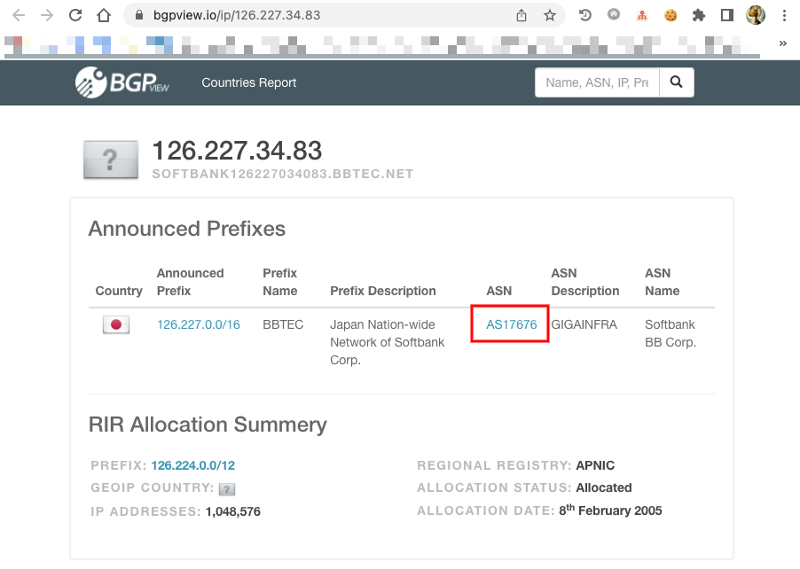

# Mode について

## 2 つの Mode がある

+ Basic mode (IP addresses/ranges only)
+ Advanced mode

設定出来る詳しい値は以下のページを参照

[公式ドキュメント | Google Cloud Armor カスタムルールの言語リファレンス](https://cloud.google.com/armor/docs/rules-language-reference)

## Basic mode

WIP

## Advanced mode

WIP

+ [ASN で許可/拒否する]

### ASN で許可/拒否する

+ ASN は https://bgpview.io/ で調べることが出来る
  + 上記から、サーチするか、URL の PATH で入れると調べてくれる
  + https://bgpview.io/ip/126.227.34.83



+ ASN が分かったら、 Cloud Armor の Rule で origin.asn で指定する
  + 頭文字の AS は抜く

```
### 単一の場合
origin.asn == 133165
```
```
### 複数の ASN があり、どれかに該当する場合
origin.asn == 133165 || origin.asn == 135340 || origin.asn == 14061
```


