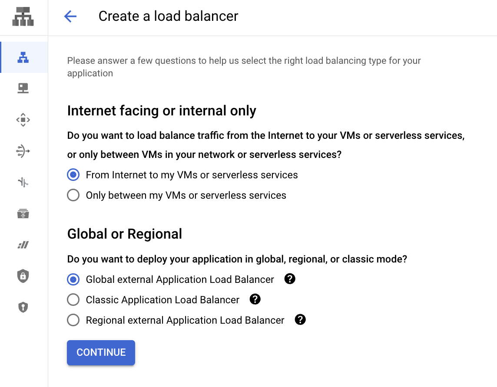
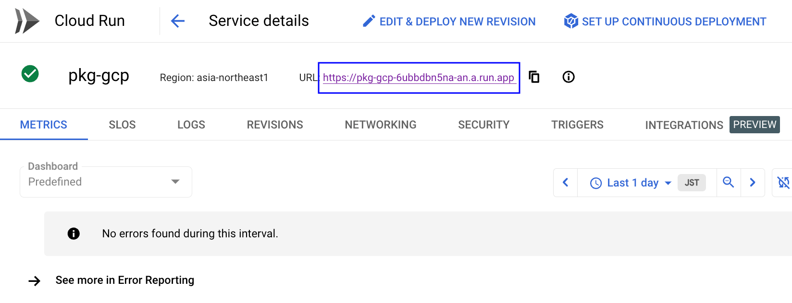
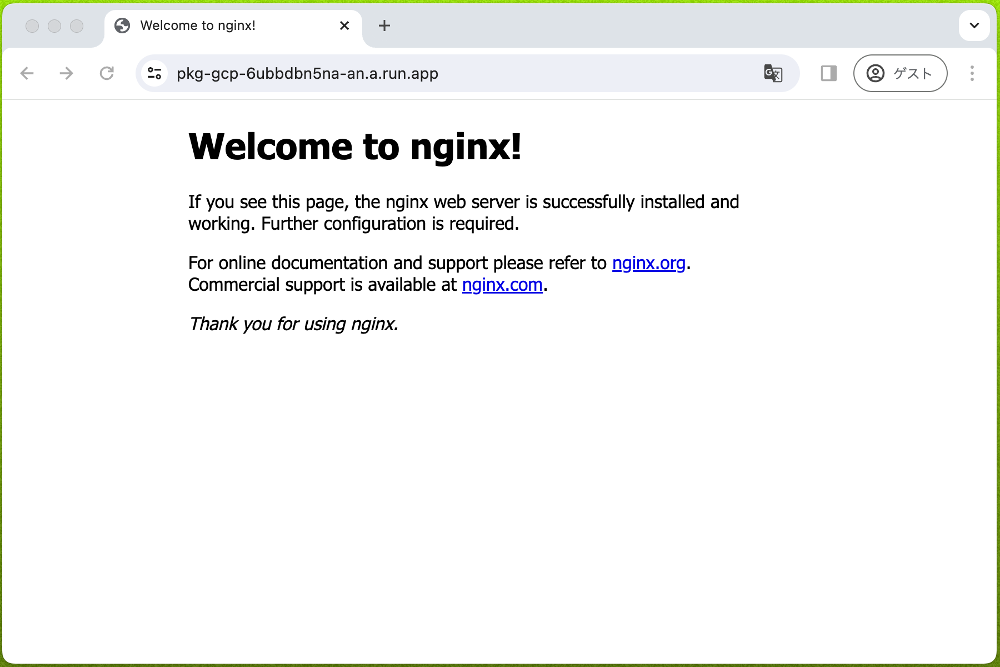
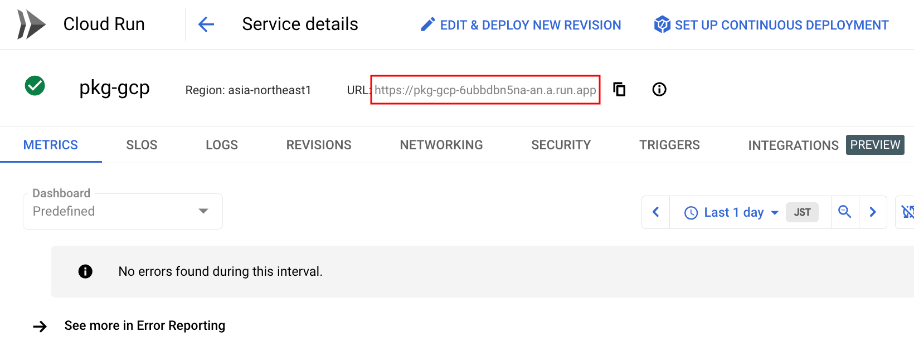
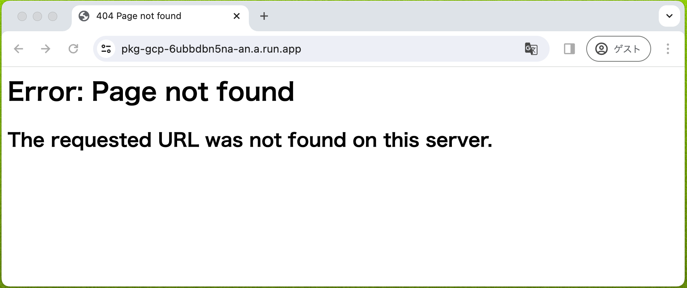
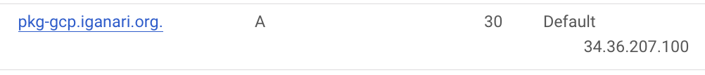
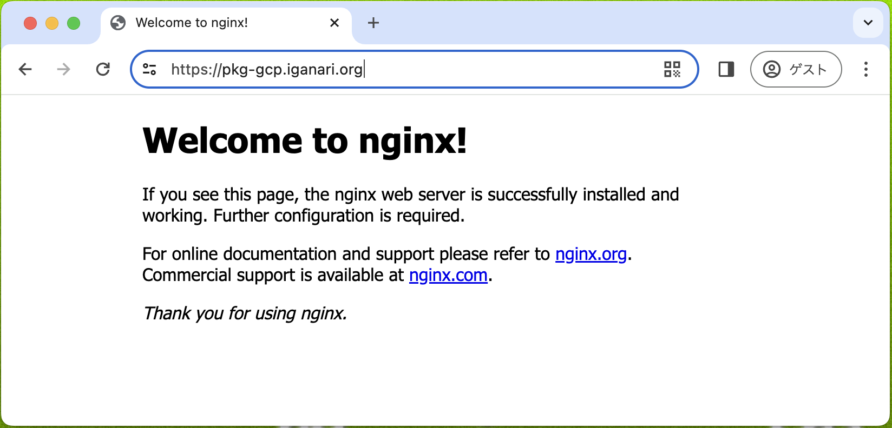

# Global external Application Load Balancer

## 概要

Global external Application Load Balancer を CLI で作成する



公式ドキュメント

+ https://cloud.google.com/iap/docs/load-balancer-howto#gcloud
+ https://cloud.google.com/load-balancing/docs/https/setup-global-ext-https-serverless#gcloud:-cloud-run

## 0. 準備

+ 環境変数を設定しておく

```
export _gc_pj_id='Your Google Cloud Project ID'   ## 自分の利用可能な Google Cloud のプロジェクト ID を登録して下さい

export _common='pkg-gcp'
export _region='asia-northeast1'

export _my_domain='Your Domain'   ## 自分の利用可能なドメインを登録して下さい
```

## 1. Cloud Run の準備

Docker Hub の nginx のサービスを使います

+ Cloud Run のデプロイ
  + まずは認証は **無し** で作成

```
gcloud beta run deploy ${_common} \
  --image nginx \
  --port=80 \
  --region ${_region} \
  --allow-unauthenticated \
  --project ${_gc_pj_id}
```

+ Web ブラウザで確認





+ 認証を設定
  + Internal と Load Balancer からのみトラフィックを許可

```
gcloud beta run services update ${_common} \
  --region ${_region} \
  --ingress internal-and-cloud-load-balancing \
  --project ${_gc_pj_id}
```

+ Web ブラウザで確認





## ネットワークの作成

+ 外部 IP アドレスの予約
  + Global を使用

```
gcloud beta compute addresses create ${_common}-alb \
  --global \
  --network-tier PREMIUM \
  --project ${_gc_pj_id}
```

+ ドメインを設定



+ Cloud Run 用の Serverless NEG を作成
  + regional を指定

```
gcloud beta compute network-endpoint-groups create ${_common}-neg \
  --region ${_region} \
  --network-endpoint-type SERVERLESS \
  --cloud-run-service ${_common} \
  --project ${_gc_pj_id}
```

+ Backend Service を作成
  + Global を指定

```
gcloud beta compute backend-services create ${_common}-bs \
  --load-balancing-scheme EXTERNAL_MANAGED \
  --global \
  --project ${_gc_pj_id}
```

+ Backend Service の Backend に Serverless NEG を追加

```
gcloud beta compute backend-services add-backend ${_common}-bs \
  --global \
  --network-endpoint-group ${_common}-neg \
  --network-endpoint-group-region ${_region} \
  --project ${_gc_pj_id}
```

<details>
<summary>[必要な場合のみ] Cloud Logging を設定</summary>

```
gcloud beta compute backend-services update ${_common}-bs \
  --global \
  --enable-logging \
  --logging-sample-rate=1.0 \
  --project ${_gc_pj_id}
```

</details>

<details>
<summary>[必要な場合のみ] Cloud CDN を設定</summary>

```
gcloud beta compute backend-services update ${_common}-bs \
  --global \
  --enable-cdn \
  --project ${_gc_pj_id}
```

</details>

<details>
<summary>[必要な場合のみ] Session affinity を設定</summary>

設定がたくさんある ---> https://cloud.google.com/sdk/gcloud/reference/compute/backend-services/update#--session-affinity


```
### CLIENT_IP を設定する例

gcloud beta compute backend-services update ${_common}-bs \
  --global \
  --session-affinity CLIENT_IP \
  --project ${_gc_pj_id}
```

</details>

+ URL map の作成
  + gloabl で設定

```
gcloud beta compute url-maps create ${_common}-url-map \
  --global \
  --default-service ${_common}-bs \
  --project ${_gc_pj_id}
```

+ Google-managed SSL certificates の作成

```
gcloud beta compute ssl-certificates create ${_common}-cert \
  --domains ${_my_domain} \
  --project ${_gc_pj_id}
```

+ Target HTTPS Proxy の作成

```
gcloud beta compute target-https-proxies create ${_common}-https-proxy \
  --ssl-certificates ${_common}-cert \
  --url-map ${_common}-url-map \
  --project ${_gc_pj_id}
```

+ Load Balancer の Forwarding Rule を作成
  + https://cloud.google.com/iap/docs/load-balancer-howto#gcloud

```
gcloud beta compute forwarding-rules create ${_common}-https-content-rule \
  --global \
  --load-balancing-scheme EXTERNAL_MANAGED \
  --address ${_common}-alb \
  --network-tier PREMIUM \
  --target-https-proxy ${_common}-https-proxy \
  --ports 443 \
  --project ${_gc_pj_id}
```

+ Web ブラウザで確認



---> これで作成完了です :)

## 99. クリーンアップ

<details>
<summary>99-01. Delete Forwarding Rule of Load Balancer</summary>

```
gcloud beta compute forwarding-rules delete ${_common}-https-content-rule \
  --global \
  --project ${_gc_pj_id}
```

</details>

<details>
<summary>99-02. Delete Target HTTPS Proxy</summary>

```
gcloud beta compute target-https-proxies delete ${_common}-https-proxy \
  --project ${_gc_pj_id}
```

</details>

<details>
<summary>99-03. Delete Managed SSL Certificate</summary>

```
gcloud beta compute ssl-certificates delete ${_common}-cert \
  --project ${_gc_pj_id}
```

</details>

<details>
<summary>99-04. Delete a URL map</summary>

```
gcloud beta compute url-maps delete ${_common}-url-map \
  --global \
  --project ${_gc_pj_id}
```

</details>

<details>
<summary>99-05. Delete Backend Services</summary>

```
gcloud beta compute backend-services delete ${_common}-bs \
  --global \
  --project ${_gc_pj_id}
```

</details>

<details>
<summary>99-06. Delete Cloud Run's Serverless NEG.</summary>

```
gcloud beta compute network-endpoint-groups delete ${_common}-neg \
  --region ${_region} \
  --project ${_gc_pj_id}
```

</details>

<details>
<summary>99-07. Release IP アドレス</summary>

```
gcloud beta compute addresses delete ${_common}-alb \
  --global \
  --project ${_gc_pj_id}
```

</details>

<details>
<summary>99-08. Delete Cloud Run</summary>

```
gcloud beta run services delete ${_common} \
  --region ${_region} \
  --project ${_gc_pj_id}
```

</details>
