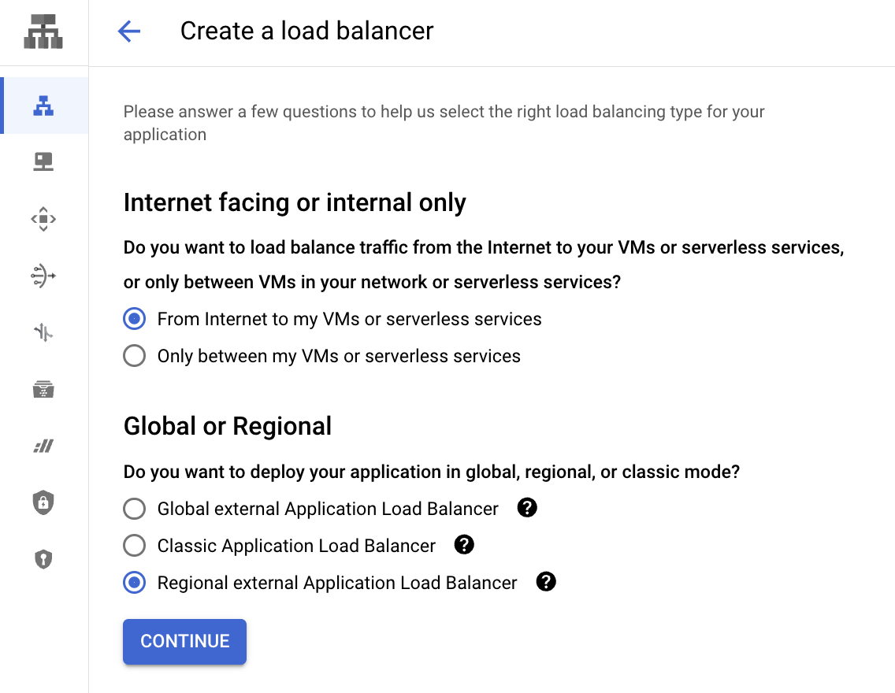
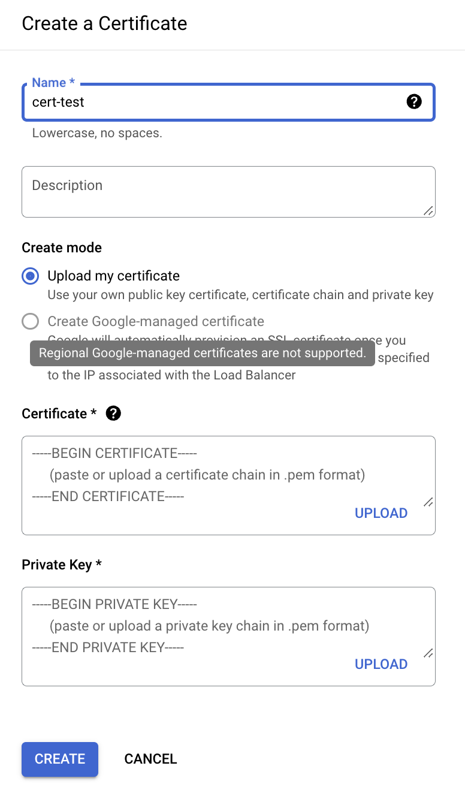

# Regional external Application Load Balancer

## 概要

Regional external Application Load Balancer を CLI で作成する



公式ドキュメント

+ https://cloud.google.com/iap/docs/load-balancer-howto#gcloud
+ https://cloud.google.com/load-balancing/docs/https/setting-up-reg-ext-https-lb#gcloud
+ https://cloud.google.com/load-balancing/docs/https/setting-up-reg-ext-https-serverless#gcloud
+ https://cloud.google.com/load-balancing/docs/https/setup-regional-ext-https-external-backend#gcloud

## 制約

Google-managed certificate が使えない ?

```
Regional Google-managed certificates are not supported.
```



---> 詳しくは SSL のページ
