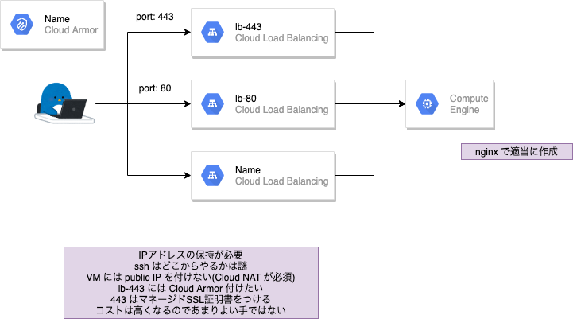

# [WIP] share-one-ip-address-with-multiple-load-balancers




## cmd

+ ip addr 予約
  + lb用
  + nat用
+ network 作成
+ firewall
  + lb からの通信許可
  + bastion からの通信許可
+ 

## 要旨

+ GCP にログイン
+ ネットワークの作成

## GCP にログイン

```
gcloud auth login -q
```

+ 環境変数に入れておく

```
export _gcp_pj_id='Your GCP Project ID'
export _common='oneipsharelb'
export _region='asia-northeast1'
```

## ネットワークの作成

+ パブリック用の VPC ネットワークとサブネットの作成

```
gcloud beta compute networks create ${_common}-public-network \
    --subnet-mode custom \
    --project ${_gcp_pj_id}

gcloud beta compute networks subnets create ${_common}-public-subnets \
    --network ${_common}-public-network \
    --region ${_region} \
    --range 172.16.0.0/12 \
    --project ${_gcp_pj_id}
```

+ プライベート用の VPC ネットワークとサブネットの作成

```
gcloud beta compute networks create ${_common}-private-network \
    --subnet-mode custom \
    --project ${_gcp_pj_id}

gcloud beta compute networks subnets create ${_common}-private-subnets \
    --network ${_common}-private-network \
    --region ${_region} \
    --range 172.16.0.0/12 \
    --project ${_gcp_pj_id}
```

+ パブリックIPアドレスの予約

```
### Cloud NAT で使用する ---> a①
gcloud beta compute addresses create ${_common}-private-ip-nat \
    --region ${_region} \
    --project ${_gcp_pj_id}


### Bastion VM で使用する ---> a②
gcloud beta compute addresses create ${_common}-private-ip-vm-bastion \
    --region ${_region} \
    --project ${_gcp_pj_id}


### GCLB で使用する ---> a③
gcloud beta compute addresses create ${_common}-ip-lb \
    --ip-version=IPV4 \
    --global \
    --project ${_gcp_pj_id}
```

+ Cloud Router の作成

```
gcloud beta compute routers create ${_common}-private-router \
    --network ${_common}-private-network \
    --region ${_region} \
    --project ${_gcp_pj_id}
```

+ Cloud NAT の作成
    + a① を使用します

```
gcloud beta compute routers nats create ${_common}-private-nat \
    --router-region ${_region} \
    --router ${_common}-private-router \
    --nat-all-subnet-ip-ranges \
    --nat-external-ip-pool ${_common}-private-ip-nat \
    --project ${_gcp_pj_id}
```

+ Firewall の作成
    + https://cloud.google.com/load-balancing/docs/https/?hl=en#firewall_rules
    + https://cloud.google.com/load-balancing/docs/health-check-concepts#ip-ranges
    + :warning: range などがまだちゃんと精査出来ていない

```
### 同 VPC ネットワーク内はすべて許可
gcloud beta compute firewall-rules create ${_common}-public-allow-internal-all \
    --network ${_common}-public-network \
    --allow tcp:0-65535,udp:0-65535,icmp \
    --source-ranges="10.0.0.0/8" \
    --project ${_gcp_pj_id}


gcloud beta compute firewall-rules create ${_common}-private-allow-internal-all \
    --network ${_common}-private-network \
    --allow tcp:0-65535,udp:0-65535,icmp \
    --source-ranges="10.0.0.0/8" \
    --project ${_gcp_pj_id}


### GCP の LB の IP アドレスからの通信を許可
gcloud beta compute firewall-rules create ${_common}-private-allow-gclb \
    --network ${_common}-private-network \
    --allow tcp:80,tcp:22,icmp \
    --source-ranges="130.211.0.0/22,35.191.0.0/16" \
    --project ${_gcp_pj_id}


gcloud beta compute firewall-rules create ${_common}-private-allow-gclb \
    --network ${_common}-private-network \
    --allow tcp:80,tcp:22,icmp \
    --source-ranges="130.211.0.0/22,35.191.0.0/16" \
    --project ${_gcp_pj_id}


### Bastion Server へ SSH の許可
gcloud beta compute firewall-rules create ${_common}-public-allow-ssh-all \
    --network ${_common}-public-network \
    --allow tcp:22 \
    --source-ranges="0.0.0.0/0" \
    --project ${_gcp_pj_id}
```

## [WIP] VM を作成

+ Bastion VM の作成
    + a② を使用します

```
gcloud beta compute instances create ${_common}-vm-bastion \
    --zone ${_region}-b \
    --machine-type f1-micro \
    --subnet ${_common}-subnets \
    --address ${_common}-ip-vm-bastion \
    --scopes=https://www.googleapis.com/auth/cloud-platform \
    --image=ubuntu-2004-focal-v20210119a \
    --image-project=ubuntu-os-cloud \
    --boot-disk-size=10GB \
    --boot-disk-type=pd-standard \
    --no-shielded-secure-boot \
    --preemptible \
    --project ${_gcp_pj_id}


```

+ web VM の作成
    + Ubuntu を使用

```
gcloud beta compute instances create ${_common}-vm-web \
    --zone ${_region}-b \
    --machine-type f1-micro \
    --subnet ${_common}-subnets \
    --no-address \
    --scopes https://www.googleapis.com/auth/cloud-platform \
    --image ubuntu-2004-focal-v20210119a \
    --image-project=ubuntu-os-cloud \
    --boot-disk-size 10GB \
    --boot-disk-type=pd-standard \
    --no-shielded-secure-boot \
    --preemptible \
    --project ${_gcp_pj_id}
```

## web VM を設定

+ VM Instance に SSH ログイン

```
gcloud beta compute ssh oneipsharelb-vm-web \
    --zone asia-northeast1-b \
    --project ${_gcp_pj_id}
```

+ nginx をいれる

```
apt update && \
apt install -y nginx
```

+ nginx を起動
    + インストール時に起動しているが、念の為

```
systemctl start nginx
```

+ curl で確認

```
curl localhost
```
```
# curl localhost
<!DOCTYPE html>
<html>
<head>
<title>Welcome to nginx!</title>
<style>
    body {
        width: 35em;
        margin: 0 auto;
        font-family: Tahoma, Verdana, Arial, sans-serif;
    }
</style>
</head>
<body>
<h1>Welcome to nginx!</h1>
<p>If you see this page, the nginx web server is successfully installed and
working. Further configuration is required.</p>

<p>For online documentation and support please refer to
<a href="http://nginx.org/">nginx.org</a>.<br/>
Commercial support is available at
<a href="http://nginx.com/">nginx.com</a>.</p>

<p><em>Thank you for using nginx.</em></p>
</body>
</html>
```

## Instance Groups を作る

LB のバックエンドに登録するため

+ 非マネージドインスタンスグループの作成

```
gcloud beta compute instance-groups unmanaged create ${_common}-unmng-grp \
    --zone ${_region}-b \
    --project ${_gcp_pj_id}
```

+ 非マネージドインスタンスグループに VM Instance を組み入れる

```
gcloud beta compute instance-groups unmanaged add-instances ${_common}-unmng-grp \
    --zone ${_region}-b \
    --instances oneipsharelb-vm-web \
    --project ${_gcp_pj_id}
```

## LB 作成

なんか色々作る

IP アドレスが共通で使えるとこをやりたい

+ 参考
    + https://cloud.google.com/load-balancing/docs/https/setting-up-https#gcloud

+ ヘルスチェックを作成

```
gcloud beta compute health-checks create http ${_common}-health-chk \
    --global \
    --port 80 \
    --project ${_gcp_pj_id}
```

+ バックエンド サービスを作成

```
gcloud beta compute backend-services create ${_common}-backend-service \
    --global-health-checks \
    --protocol HTTP \
    --port-name=http \
    --health-checks ${_common}-health-chk \
    --global \
    --project ${_gcp_pj_id}
```


```
gcloud beta compute backend-services list --project ${_gcp_pj_id}
```


## LB でマネージドSSLを設定

```
WIP
```

## Cloud Armor をつける

+ L7 の LB にはつけられる

```
WIP
```

## 確認

GCP 外から確認しよう

複数のLBから来ていることをログから確認しよう


## 疑問点

+ GCLB と TCPLB で IP address の共有は出来るのか?


## 削除コマンド

+ [WIP] バックエンド サービスを作成

```
gcloud beta compute backend-services delete ${_common}-backend-service \
    --global \
    --project ${_gcp_pj_id} \
    -q
```

+ [WIP] ヘルスチェックを削除

```
gcloud beta compute health-checks delete ${_common}-health-chk \
    --project ${_gcp_pj_id} \
    -q
```

+ [WIP] Instance Groups の削除

```
gcloud beta compute instance-groups unmanaged delete ${_common}-unmng-grp \
    --zone ${_region}-b \
    --project ${_gcp_pj_id} \
    -q
```

+ [WIP] VM instance

```
gcloud beta compute instances delete ${_common}-vm-bastion \
    --zone=${_region}-b \
    --project ${_gcp_pj_id} \
    -q

gcloud beta compute instances delete ${_common}-vm-web \
    --zone=${_region}-b \
    --project ${_gcp_pj_id} \
    -q
```


+ ネットワーク系の削除

```
### FireWall Rule
gcloud beta compute firewall-rules delete ${_common}-private-allow-internal-all \
    --project ${_gcp_pj_id} \
    -q

gcloud beta compute firewall-rules delete ${_common}-public-allow-internal-all \
    --project ${_gcp_pj_id} \
    -q

gcloud beta compute firewall-rules delete ${_common}-private-allow-gclb \
    --project ${_gcp_pj_id} \
    -q

gcloud beta compute firewall-rules delete ${_common}-public-allow-ssh-all \
    --project ${_gcp_pj_id} \
    -q


### Cloud NAT
gcloud beta compute routers nats delete ${_common}-private-nat \
    --router-region ${_region} \
    --router ${_common}-private-router \
    --project ${_gcp_pj_id} \
    -q


### Cloud Router
gcloud beta compute routers delete ${_common}-private-router \
    --region ${_region} \
    --project ${_gcp_pj_id} \
    -q

### External IP Address
gcloud beta compute addresses delete ${_common}-private-ip-nat \
    --region ${_region} \
    --project ${_gcp_pj_id} \
    -q

gcloud beta compute addresses delete ${_common}-private-ip-vm-bastion \
    --region ${_region} \
    --project ${_gcp_pj_id} \
    -q

gcloud beta compute addresses delete ${_common}-ip-lb \
    --global \
    --project ${_gcp_pj_id} \
    -q

### Subnet
gcloud beta compute networks subnets delete ${_common}-private-subnets \
    --region ${_region} \
    --project ${_gcp_pj_id} \
    -q

gcloud beta compute networks subnets delete ${_common}-public-subnets \
    --region ${_region} \
    --project ${_gcp_pj_id} \
    -q


### VPC Network
gcloud beta compute networks delete ${_common}-private-network \
    --project ${_gcp_pj_id} \
    -q

gcloud beta compute networks delete ${_common}-public-network \
    --project ${_gcp_pj_id} \
    -q
```


## おわり

:)


