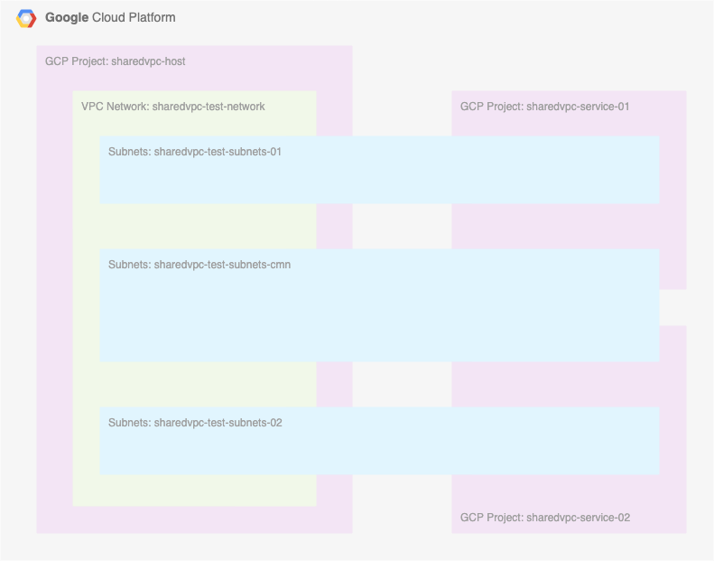

# Quick Start


## 概要


```
Provisioning Shared VPC
https://cloud.google.com/vpc/docs/provisioning-shared-vpc
```

## 準備

作業者は以下の 権限 が必要


+ `compute.organizations.enableXpnHost`
  + Compute Shared VPC Admin ( roles/compute.xpnAdmin ) などに入っている


## やること

+ 各 PJ の作成
+ 共有 VPC の有効化
+ サービス プロジェクトをホストプロジェクトに接続する
+ サービス プロジェクトからホストプロジェクトを使えるようにする


## やってみる

host pj にて

```
export _common='sharedvpc-test'

export _sharedvpc_host_id='iganari-sharedvpc-host'
export _sharedvpc_svr_01_id='iganari-sharedvpc-service-01'
export _sharedvpc_svr_02_id='iganari-sharedvpc-service-02'
```

+ ホスト プロジェクトにする必要のあるプロジェクトに対して、共有 VPC を有効にします


```
gcloud beta compute shared-vpc enable ${_sharedvpc_host_id}
```

+ サービス プロジェクトの管理者が共有 VPC を使用するには、サービス プロジェクトがホスト プロジェクトに接続されている必要があります。共有 VPC 管理者は、以下の手順で接続を完了する必要があります。

サービス プロジェクトは 1 つのホスト プロジェクトにのみ接続できますが、ホスト プロジェクトは複数のサービス プロジェクトの接続をサポートしています。詳細については、VPC 割り当てページの共有 VPC に固有の上限をご覧ください。


```
gcloud beta compute shared-vpc associated-projects add ${_sharedvpc_svr_01_id} \
    --host-project ${_sharedvpc_host_id}

gcloud beta compute shared-vpc associated-projects add ${_sharedvpc_svr_02_id} \
    --host-project ${_sharedvpc_host_id}
```

## host でネットワーク作成

+ 環境変数

```
### Env

export _region='asia-northeast1'
export _sub_network_range_cmn='172.16.0.0/12'
export _sub_network_range_01='172.32.0.0/12'
export _sub_network_range_02='172.48.0.0/12'

export _my_ip='Your Home IP Address'
export _other_ip='Your other IP Address'
```


+ VPC Network の作成

```
gcloud beta compute networks create ${_common}-network \
  --subnet-mode=custom \
  --project ${_sharedvpc_host_id}
```

+ サブネットの作成
  + 3種類作る ( 01用, 02用、共有用 )

```
gcloud beta compute networks subnets create ${_common}-subnets-cmn \
  --network ${_common}-network \
  --region ${_region} \
  --range ${_sub_network_range_cmn} \
  --enable-private-ip-google-access \
  --project ${_sharedvpc_host_id}
```
```
gcloud beta compute networks subnets create ${_common}-subnets-01 \
  --network ${_common}-network \
  --region ${_region} \
  --range ${_sub_network_range_01} \
  --enable-private-ip-google-access \
  --project ${_sharedvpc_host_id}
```
```
gcloud beta compute networks subnets create ${_common}-subnets-02 \
  --network ${_common}-network \
  --region ${_region} \
  --range ${_sub_network_range_02} \
  --enable-private-ip-google-access \
  --project ${_sharedvpc_host_id}
```

+ Firewall

```
### 内部通信
gcloud beta compute firewall-rules create ${_common}-cmn-allow-internal-all \
  --network ${_common}-network \
  --action ALLOW \
  --rules tcp:0-65535,udp:0-65535,icmp \
  --source-ranges ${_sub_network_range_cmn} \
  --target-tags ${_common}-cmn-allow-internal-all \
  --project ${_sharedvpc_host_id}

gcloud beta compute firewall-rules create ${_common}-01-allow-internal-all \
  --network ${_common}-network \
  --action ALLOW \
  --rules tcp:0-65535,udp:0-65535,icmp \
  --source-ranges ${_sub_network_range_01} \
  --target-tags ${_common}-01-allow-internal-all \
  --project ${_sharedvpc_host_id}

gcloud beta compute firewall-rules create ${_common}-02-allow-internal-all \
  --network ${_common}-network \
  --action ALLOW \
  --rules tcp:0-65535,udp:0-65535,icmp \
  --source-ranges ${_sub_network_range_01} \
  --target-tags ${_common}-02-allow-internal-all \
  --project ${_sharedvpc_host_id}


# ### SSH
# gcloud beta compute firewall-rules create ${_common}-allow-ssh \
#   --network ${_common}-network \
#   --action ALLOW \
#   --rules tcp:22,icmp \
#   --source-ranges ${_my_ip},${_other_ip} \
#   --target-tags ${_common}-allow-ssh \
#   --project ${_gcp_pj_id}
```

## 共有 VPC として登録ができる状態にあるか確認する

+ 確認

```
gcloud beta compute shared-vpc list-associated-resources ${_sharedvpc_host_id}
```
```
### 例

$ gcloud beta compute shared-vpc list-associated-resources ${_sharedvpc_host_id}
RESOURCE_ID                   RESOURCE_TYPE
iganari-sharedvpc-service-01  PROJECT
iganari-sharedvpc-service-02  PROJECT
```

---> うまく表示されない場合は `共有 VPC を有効` を再度やってみる


## サービス プロジェクトからホストプロジェクトを使えるようにする

+ [推奨] ホストプロジェクトの特定のサブネットのみをサービスプロジェクトに共有する
+ ホストプロジェクトの全てのサブネットのみをサービスプロジェクトに共有する

## [推奨] ホストプロジェクトの特定のサブネットのみをサービスプロジェクトに共有する

+ 先に以下の情報を調べておく

```
# Google APIs service account == SERVICE_PROJECT_NUMBER@cloudservices.gserviceaccount.com の形

export _service_pj_01_sa='Service Project 01 の Google APIs service account'
export _service_pj_02_sa='Service Project 02 の Google APIs service account'
```

### 01

+ 01 の現在の IAM ポリシーを JSON 形式で取得

```
gcloud beta compute networks subnets get-iam-policy ${_common}-subnets-01 \
  --region ${_region} \
  --project ${_sharedvpc_host_id} \
  --format json
```
```
$ gcloud beta compute networks subnets get-iam-policy ${_common}-subnets-01 \
  --region ${_region} \
  --project ${_sharedvpc_host_id} \
  --format json
{
  "etag": "ACAB"
}
```

+ 01 の現在の IAM ポリシーを JSON 形式で保存

```
gcloud beta compute networks subnets get-iam-policy ${_common}-subnets-01 \
  --region ${_region} \
  --project ${_sharedvpc_host_id} \
  --format json > subnet-policy-01.json
```
```
cat << __EOF__ > subnet-policy-01.json
{
  "bindings": [
  {
     "members": [
           "serviceAccount:${_service_pj_01_sa}"
        ],
        "role": "roles/compute.networkUser"
  }
  ],
  "etag": "ACAB"
}
__EOF__
```

+ subnet-policy-01.json を使用して、サブネットのポリシー バインディングを更新

```
gcloud beta compute networks subnets set-iam-policy ${_common}-subnets-01 subnet-policy-01.json \
  --region ${_region} \
  --project ${_sharedvpc_host_id}
```

### 02

+ 02 の現在の IAM ポリシーを JSON 形式で取得

```
gcloud beta compute networks subnets get-iam-policy ${_common}-subnets-02 \
  --region ${_region} \
  --project ${_sharedvpc_host_id} \
  --format json
```
```
$ gcloud beta compute networks subnets get-iam-policy ${_common}-subnets-02 \
  --region ${_region} \
  --project ${_sharedvpc_host_id} \
  --format json
{
  "etag": "ACAB"
}
```

+ 01 の現在の IAM ポリシーを JSON 形式で保存

```
gcloud beta compute networks subnets get-iam-policy ${_common}-subnets-02 \
  --region ${_region} \
  --project ${_sharedvpc_host_id} \
  --format json > subnet-policy-02.json
```
```
cat << __EOF__ > subnet-policy-02.json
{
  "bindings": [
  {
     "members": [
           "serviceAccount:${_service_pj_02_sa}"
        ],
        "role": "roles/compute.networkUser"
  }
  ],
  "etag": "ACAB"
}
__EOF__
```

+ subnet-policy-02.json を使用して、サブネットのポリシー バインディングを更新

```
gcloud beta compute networks subnets set-iam-policy ${_common}-subnets-02 subnet-policy-02.json \
  --region ${_region} \
  --project ${_sharedvpc_host_id}
```

### cmn

+ cmn の現在の IAM ポリシーを JSON 形式で取得

```
gcloud beta compute networks subnets get-iam-policy ${_common}-subnets-cmn \
  --region ${_region} \
  --project ${_sharedvpc_host_id} \
  --format json
```
```
$ gcloud beta compute networks subnets get-iam-policy ${_common}-subnets-cmn \
  --region ${_region} \
  --project ${_sharedvpc_host_id} \
  --format json
{
  "etag": "ACAB"
}
```

+ 01 の現在の IAM ポリシーを JSON 形式で保存

```
gcloud beta compute networks subnets get-iam-policy ${_common}-subnets-cmn \
  --region ${_region} \
  --project ${_sharedvpc_host_id} \
  --format json > subnet-policy-cmn.json
```
```
cat << __EOF__ > subnet-policy-cmn.json
{
  "bindings": [
  {
     "members": [
           "serviceAccount:${_service_pj_01_sa}",
           "serviceAccount:${_service_pj_02_sa}"
        ],
        "role": "roles/compute.networkUser"
  }
  ],
  "etag": "ACAB"
}
__EOF__
```

+ subnet-policy-cmn.json を使用して、サブネットのポリシー バインディングを更新

```
gcloud beta compute networks subnets set-iam-policy ${_common}-subnets-cmn subnet-policy-cmn.json \
  --region ${_region} \
  --project ${_sharedvpc_host_id}
```


